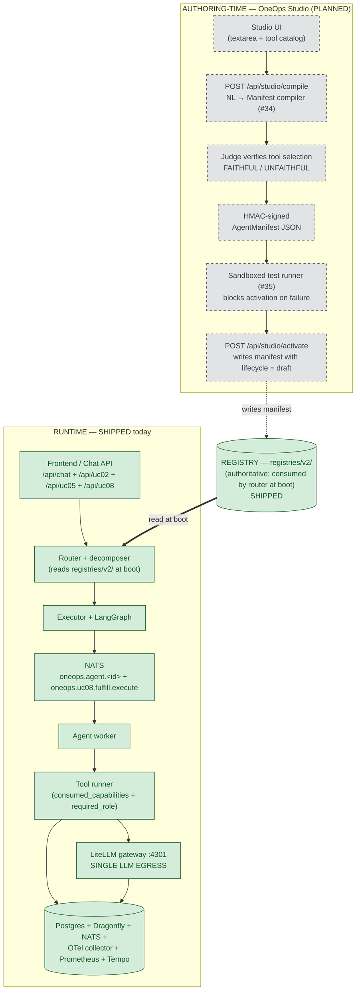
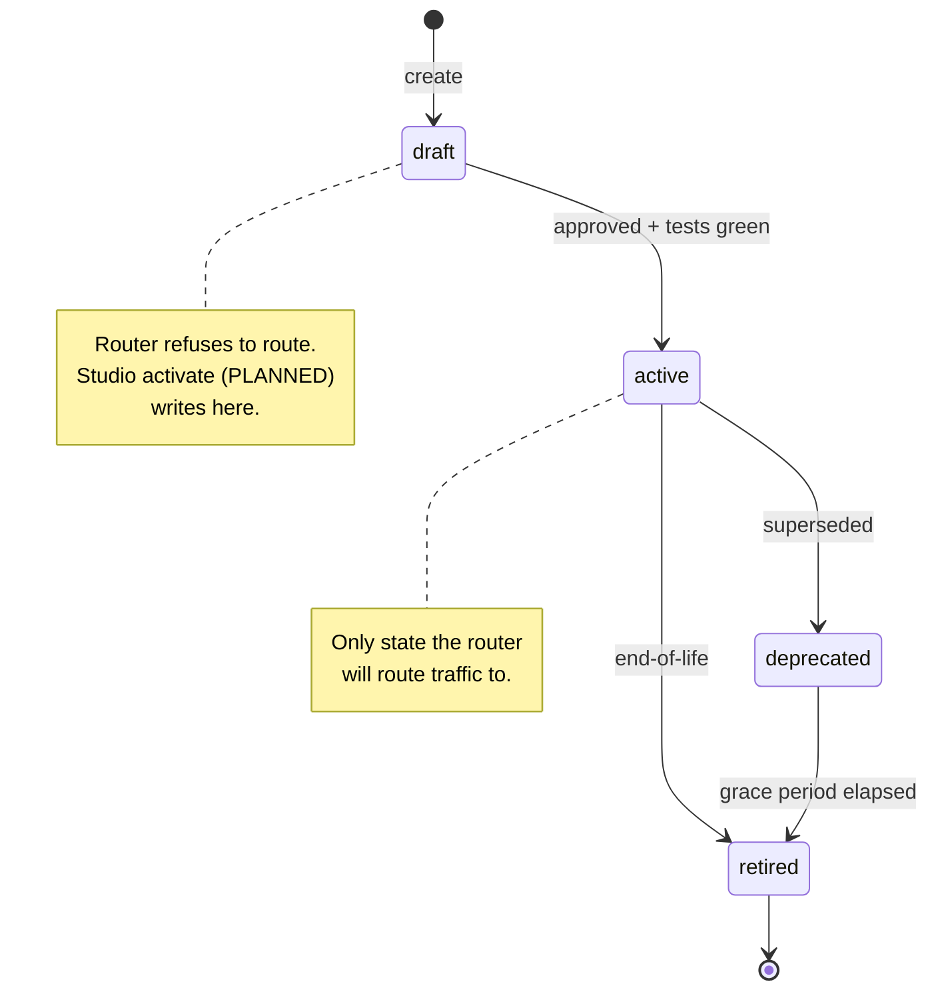
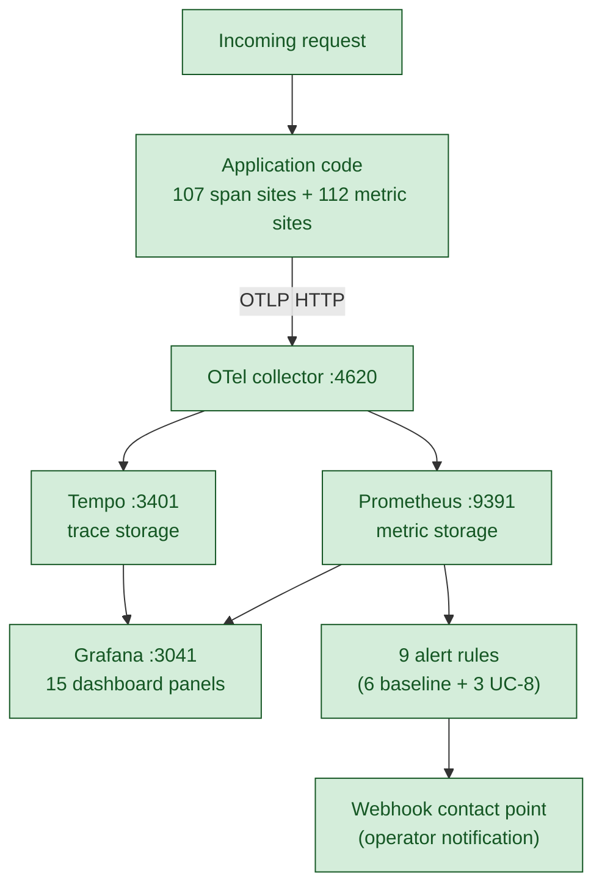
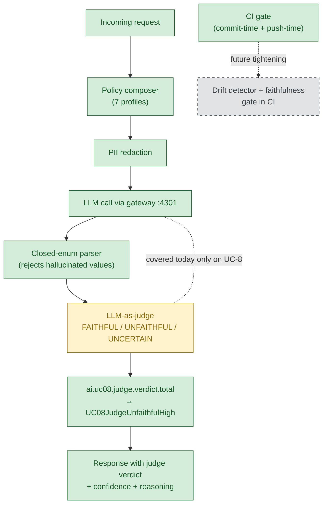
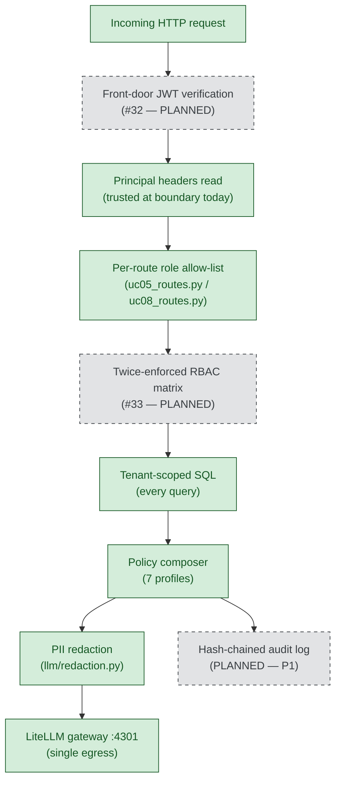
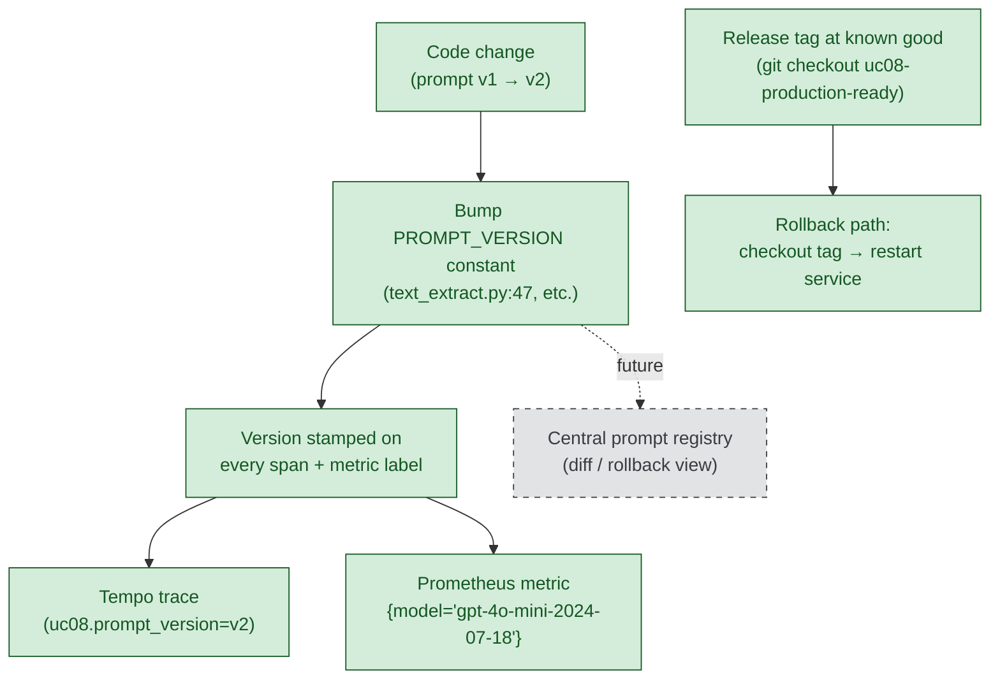
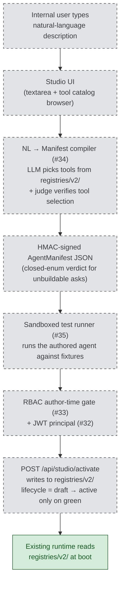

# OneOps-NextGen — Management briefing

**Date:** 2026-05-31
**Release reference:** tag `day1-cut-complete-2026-05-31` (HEAD `0f1c035`)
**Prepared for:** non-technical management review

OneOps-NextGen is an AI system that handles a defined set of IT-service-management (ITSM) tasks for multiple business units. A user (typed in chat, or clicked from a button) sends a request. The platform routes it to the right use-case agent — for example, summarising a ticket, finding similar past tickets, looking up a knowledge-base article, triaging an incoming incident, or fulfilling a catalog request. Every request flows through three structural layers before any large-language-model (LLM) call is made: a router that picks the use case, a policy layer that applies enterprise rules and personally-identifiable-information (PII) redaction, and a tenant-scoped data layer so one customer's data never reaches another's request.

---

## How to read this document

Every capability cited below carries one of three status tags. They are applied conservatively — when in doubt, the lower tag is used.

| Tag | Meaning |
|---|---|
| **SHIPPED** | Working and verifiable today against the release reference above. |
| **PARTIAL** | Scaffolded or present in the codebase but not yet fully enforced or complete. |
| **PLANNED** | Deferred work, sized in `docs/production-maturity-plan.md` and committed to a date or sequence. |

Paths and URLs are cited inline so any factual claim can be independently checked. Because this repository does not currently publish to a remote host, source paths resolve against the repo root at release `day1-cut-complete-2026-05-31`. A "Verification notes" block at the end of this document lists every number that was confirmed during preparation, anything that could not be confirmed, and the precise state of the build at the time of writing.

---

## Executive summary

OneOps-NextGen runs five named use cases against multi-tenant ITSM data today. Day 1 of the §F-LOCKED execution plan is complete and verifiable end-to-end: `make pmg-verify` returns seven green phases. Coverage against the 22-document production-maturity target is approximately 80 per cent (`docs/production-maturity-plan.md` §F-LOCKED), with the remaining 20 per cent named and sized in `docs/production-maturity-plan.md` §A.7 and §G. The single largest deferred risk is identity at the door: front-door JSON-Web-Token (JWT) verification and the materialised role-based access-control (RBAC) matrix are scaffolded as Python modules but not yet enforced on incoming traffic. The system is deployable and integrable as a microservice today within a trusted boundary, with those two items required before external or untrusted multi-tenant exposure — and required before the OneOps Studio authoring layer is exposed to any internal user.

### Status at a glance

| Axis | Status | One-line summary | Biggest gap |
|---|---|---|---|
| **1. Agent lifecycle** | PARTIAL | Five agents registered in `registries/v2/` with versioning + lifecycle metadata; boot-time enforcement in place. | `AgentManifest` export / import command not yet built. |
| **2. Performance tracking** | SHIPPED | 107 OpenTelemetry span sites and 112 metric emit sites in production code feed 15 dashboard panels and 9 alert rules. | Drift detector and per-use-case quality scoring are PLANNED. |
| **3. Output validation** | PARTIAL | LLM-as-judge enforced on UC-8 today; closed-enum parsers, policy composer, PII redaction, and 15 live end-to-end tests cover the system more broadly. | Judge coverage is UC-8 only; UC-1, UC-2, UC-3, and UC-5 not covered (load-bearing — see Validation §). |
| **4. Security** | PARTIAL | Tenant isolation is structural in every SQL query; per-route role allow-lists enforced. | Front-door JWT and twice-enforced RBAC are scaffolded (`src/oneops/authz/`) but not enforced on the request boundary. |
| **5. Versioning** | SHIPPED | Prompt-version constants stamped on every LLM call and span; model version on every cost metric; release tags pinned for rollback. | Central prompt registry with diff/rollback view is not built; per-call version stamps are auditable but not centrally browsable. |
| **6. Adding new use cases** | PARTIAL today, PLANNED via Studio | Hand-copy from the UC-8 reference package works today. Studio authoring layer (`#34`/`#35`) is the future path. | Studio authoring layer is PLANNED in its entirety. |

### What the 22-document target consists of, and what is missing

The 80 per cent coverage claim is auditable against `docs/production-maturity-plan.md` §F-LOCKED and §A.7. The covered scope corresponds to architectural and operational concerns named in DOC-03 (lifecycle), DOC-04 (security and PII), DOC-05 (validation and observability), DOC-06 (cross-tenant adversarial), DOC-07 (policy and tenant context), and DOC-12 (AI testing pyramid). The deferred 20 per cent is named explicitly:

| Deferred area | Source document(s) | Rationale |
|---|---|---|
| Hash-chained immutable audit log + RTBF endpoint | DOC-04 | P1; sized in roadmap. |
| Reversible PII token store | DOC-04 §6.1, §6.4 | Workstream 3.2; gated on §G #8 manager decision. |
| Materialised RBAC matrix | DOC-04 | Task #33 in roadmap. |
| Front-door JWT verification | DOC-04 | Task #32 in roadmap. |
| WebSocket primary transport, Bridge Service, webhooks, ChatOps, language SDKs | DOC-08 | Scope question §G #2 unresolved. |
| ITOM use cases UC-9 through UC-14 (event correlation, alert triage, runbook automation, change-risk graph, capacity planning, proactive discovery) | DOC-09 | Scope question §G #4 unresolved. |
| Formal three-level intent ontology | DOC-10 §3.3 | §G #6 — taxonomy shape conflicts with rule §2.1 ("no phrase catalogs"); manager decision required. |
| EKS / Istio / Lambda / Bridge / multi-region DR infrastructure port | DOC-11 | 8–12 weeks; scope question §G #1. |
| Platform-service use cases UC-15 through UC-29 and the OneOps Studio authoring layer | DOC-13A | Scope question §G #3 and §G #4. |

Each deferred item is sized and prioritised in the consolidated roadmap (§ Roadmap below). No deferred work is hidden — every item appears either in this table or in the roadmap, with a P0/P1/P2 priority and an effort estimate.

---

## Architecture

The platform separates **runtime** (what handles a live request) from **authoring-time** (how a new agent is created), with the registry as the contract between them. The runtime exists today. The authoring layer — OneOps Studio — is planned. The runtime never knows Studio exists; it reads the registry at boot like any other configuration source.

### Diagram — runtime today and Studio authoring tomorrow

The five non-negotiable design principles applied throughout the runtime are documented in `docs/PROJECT-BRIEFING.md` §2. In plain terms:

1. **Single LLM egress** — every LLM call goes through `src/oneops/llm/gateway.py` and lands on the LiteLLM proxy at port 4301. This is the only point where cost, redaction, and policy apply, so it cannot be bypassed (§2.5).
2. **Policy always on** — every LLM call composes one of seven policy profiles in `src/oneops/policy/composer.py` before reaching the model (§2.3).
3. **Structural tenant isolation** — every SQL query and every cache key carries `tenant_id` as the first predicate (§2.4).
4. **LangGraph-first** — state, retries, caching, and fan-out use the LangGraph framework rather than custom orchestration (§2.8).
5. **No silent failures** — failures emit metrics, return user-visible responses, and never swallow exceptions in observability code (§2.7).

### Live use cases

The five agents registered in `registries/v2/agents/` and live in the runtime today:

| Use case | What it does | Surface(s) | Status |
|---|---|---|---|
| **UC-1 Summarization** | Summarises an incident or request given its identifier. | Chat (`/api/chat`) | SHIPPED |
| **UC-2 Similar Tickets** | Finds the top semantically similar past tickets to a given ticket id. | Button (`/api/uc02/similar-tickets`) **and** chat (`/api/chat`) | SHIPPED |
| **UC-3 KB Lookup** | Answers a natural-language question by retrieving and grounding in published knowledge-base articles. | Chat (`/api/chat`) | SHIPPED |
| **UC-5 Triage** | Proposes category, priority, impact, urgency, and assignment group for an untriaged ticket. | Button (`/api/uc05/propose` + `/api/uc05/decide`) | SHIPPED |
| **UC-8 Fulfillment** | Creates a service request from free text, matches it to a catalog template, runs the fulfillment workflow. | Button (`/api/uc08/create-sr` + `/match` + `/fulfill` + `/status`). **Chat surface is deferred** (memory: `project_oneops_uc08_chat_wiring_post_demo`, ~4–6 h post-demo). | SHIPPED (button); PLANNED (chat) |

### Deployment and integration

OneOps-NextGen is structured as a single-process Python microservice that exposes its API surface via FastAPI and reads its configuration from a registry on disk. It can be started independently against a working set of dependencies and integrated into a larger platform as a service it offers, not a library that must be linked.

The deployment surface today:

| What | Where | Status |
|---|---|---|
| **API process** | `uvicorn oneops.api.app:create_app --factory --host 127.0.0.1 --port 8765` | SHIPPED |
| **OpenAPI schema** | `http://localhost:8765/openapi.json` — 18 routes declared | SHIPPED |
| **Dockerfile for the API process** | Not present in the repository today. | PLANNED |
| **`/health` and `/ready` endpoints** | Not yet exposed; both return 404. OpenAPI schema is the verifiable contract. | PLANNED |
| **Infrastructure containers** | `docker-compose.yml` declares 8 services: Postgres, Dragonfly, NATS, OTel collector, Tempo, Prometheus, Grafana, LiteLLM. | SHIPPED |
| **CI gate** | `scripts/ci.sh` + `make ci-fast` + `make ci` + `.git/hooks/pre-commit` | SHIPPED (see Validation §) |
| **Synthetic probes** | 4 shell probes in `ops/probes/` cover UC-1/3/5/8 golden paths | SHIPPED |
| **Observability stack** | OTel collector at port 4620 (OTLP HTTP), Tempo at 3401, Prometheus at 9391, Grafana at 3041 | SHIPPED |
| **LLM egress** | LiteLLM proxy at port 4301; single point of cost metering, redaction, and policy | SHIPPED |

**Integration model**: a consuming team wires OneOps-NextGen into a larger platform by (a) standing up the eight infrastructure services from the supplied `docker-compose.yml`; (b) starting the API process against those endpoints via the documented uvicorn invocation; (c) forwarding HTTP traffic to port 8765 with three required headers (`x-tenant-id`, `x-user-id`, `x-role`); and (d) consuming spans from the OTel collector and metrics from Prometheus.

**Honest scope of "production-grade microservice"**: the service is deployable and integrable today within a trusted boundary — the eight infrastructure services run as containers, the LLM egress runs as a container, observability is wired, and the CI gate enforces no-new-debt on every commit. Two items are gating before external or untrusted multi-tenant exposure: a Dockerfile for the API process itself (so the application can be packaged as a container image rather than launched as a uvicorn process), and the security pair described in the Security § below (front-door JWT and twice-enforced RBAC). Studio also requires the security pair before it can be exposed to any internal user, because activating an agent without a verified principal would let any caller add capabilities.

**Resilience and disaster recovery — what is in place and what is not.** The persistent data tier runs on Supabase-managed Postgres with provider-managed point-in-time backups (recovery window per the Supabase plan). The volatile tier — Dragonfly, NATS, the OTel collector — is stateless or replayable from Postgres and is restored by container restart. The OneOps API process is stateless between requests; session state lives in Postgres (`AsyncPostgresSaver` checkpointer per `ADR-0004`) so a process restart resumes turns from the last checkpoint. Multi-region active-active deployment, automated failover, and a defined recovery-point-objective and recovery-time-objective are PLANNED under DOC-11 (8–12 weeks, infrastructure-port scope). Today's posture is single-region with provider-level durability; appropriate for the demo and trusted-boundary integration, explicitly not for SLA-bound multi-region production.

---

## The six axes

### 1. Agent lifecycle — PARTIAL

**Why it matters.** A board needs to know that every agent in production has a known version, a known owner, a defined state, and that the platform refuses to route to anything that is not in an `active` state.

**What exists today.**

| What | Where | Status |
|---|---|---|
| Five agents declared with `id`, `active_version`, `versions[]` | `registries/v2/agents/uc01_summarization.json`, `uc02_similar_tickets.json`, `uc03_kb_lookup.json`, `uc05_triage.json`, `uc08_fulfillment.json` | SHIPPED |
| Registry loader + boot-time validation | `src/oneops/registry/store.py` | SHIPPED |
| Router refusal path for non-active agents | `src/oneops/router/router.py` (emits `lifecycle.refused` spans) | SHIPPED |
| Evidence | `ops/pmg-evidence/lifecycle.log` and `ops/pmg-evidence/phase-3-lifecycle.log` | SHIPPED |

**What is missing.**

- `AgentManifest` export / import command (`oneops manifest export <agent_id>` / `import <path>`) — listed as P0-#1 part 2 in `docs/production-maturity-plan.md`; sized at one morning of work.
- A/B traffic split via Istio — P2.
- Per-tenant catalog overlay — P1.
- Quality-gated promotion driven by judge metrics — P1.

**Tenant onboarding — how a new business unit joins the platform.** A new tenant is added by (a) creating the tenant row in the relevant ITSM tables (`itsm.sys_user`, `itsm.incident`, `itsm.request`, `itsm.kb_knowledge`, `itsm.catalog_item`) with a unique `tenant_id`, (b) seeding any catalog templates and knowledge-base articles that tenant requires using the existing seed scripts (`scripts/uc03_seed_password_reset_kb.py` and `scripts/uc08_seed_mfa_catalog.py` are reference patterns), and (c) routing the tenant's traffic to the API with `x-tenant-id: <new_id>` in every request. Every existing agent runs against every tenant automatically because tenant isolation is structural; there is no per-tenant agent enable/disable surface today. Per-tenant catalog overlay (`DOC-07 §4.6`), which allows an agent to be activated or deactivated per tenant, is PARTIAL — the substrate supports it but the operator surface is PLANNED at P1.

**Registry reconciliation — important context for the Studio narrative.** The dead-code audit in `docs/findings/DEAD-CODE-AUDIT.md` found that the V1 root registries (`registries/agent-catalog-registry.json`, `registries/agent-tool-mapping.json`, `registries/agent-registry.json`, `registries/router-alias-registry.json`) have zero runtime references in `src/oneops/`. The live, consumed registry is `registries/v2/`, with eight referencing modules including `src/oneops/registry/store.py`, `src/oneops/router/glossary.py`, and `src/oneops/api/app.py`. When the Studio activation step is built, its write target **must** be `registries/v2/` to actually close the authoring → registry → runtime loop; writing to the V1 root files would silently fail to publish.

### Lifecycle diagram

### 2. Performance tracking — SHIPPED

**Why it matters.** Operations and finance both need observable, per-tenant evidence of cost and latency, and the on-call rotation needs alerts that fire on real degradations before users notice them.

The central point: this is **active code instrumentation, not bolted-on dashboards**. The application code emits the data; Tempo, Prometheus, and Grafana are the viewers.

**What exists today.**

| What | Where | Status |
|---|---|---|
| **107 span emit sites** in production code | `src/oneops/observability/span_helpers.py` plus direct `tracer.start_as_current_span` usage across the codebase | SHIPPED |
| **112 metric emit sites** (95 counter increments + 17 histograms) | `src/oneops/observability/metrics.py` (lock-protected, never raises into business code) | SHIPPED |
| **Cost meter** — `ai.llm.cost_usd_micros{tenant_id, model}` | `src/oneops/llm/cost.py:69` | SHIPPED |
| **Token meter** — `ai.llm.tokens.input.total`, `ai.llm.tokens.output.total`, `ai.llm.tokens.total{model, operation, provider}` | Emitted on every gateway call | SHIPPED |
| **LLM latency histogram** — `ai.llm.latency_ms{model, operation, provider}` | Drives `AgentP99LatencyHigh` alert | SHIPPED |
| **Cache meters** — `ai.cache.hits/misses/writes/stale_reads.total` and `ai.cache.latency_ms{cache_name, operation}` | Drives `CacheMissStorm` alert | SHIPPED |
| **Agent run counter** — `ai.agent.runs.total{agent_id, tenant_id, status}` | Drives `TurnFailureRateHigh` and `AgentSubjectSilent` alerts | SHIPPED |
| **UC-8 specific metrics** — `ai.uc08.create_sr.total`, `ai.uc08.match.total`, `ai.uc08.fulfill.total{dispatch}`, `ai.uc08.judge.verdict.total{judge, verdict}`, `ai.uc08.agent.events.total{outcome}` | Drives 3 UC-8 specific alerts | SHIPPED |
| **Bounded LLM call timeout** — 60-second default on every UC-8 LLM call site | `src/oneops/use_cases/uc08_fulfillment/text_extract.py:39`, `judge.py:54`, `catalog_search.py:83` (overridable per environment, all default to `"60"`) | SHIPPED |
| **15-panel Grafana dashboard** | `ops/grafana/dashboards/oneops-overview.json` (title "OneOps — Service Overview", uid `oneops-overview`) | SHIPPED |
| **9 alert rules** | `ops/grafana/provisioning/alerting/alert-rules.yaml` (6 baseline + 3 UC-8) | SHIPPED |
| **4 synthetic probes** in shell | `ops/probes/uc01.sh`, `uc03.sh`, `uc05.sh`, `uc08.sh` plus `run-all-loop.sh` driver | SHIPPED |
| **Forced-breach proof of alerting chain** | `ops/pmg-evidence/day1-am-alert-fired.log` | SHIPPED |

### Performance diagram

**What is missing.**

- Drift detector + per-UC quality score rollup — P0 follow-on, sized at two days.
- Smoke and devil's-play scripts as CI gate stages — currently deferred no-ops in `scripts/ci.sh`; the stage runs but prints "deferred — script not present (Phase 6 fills in)".

### 3. Output validation — PARTIAL

**Why it matters.** When an AI system makes recommendations or transforms user data, the platform needs structural mechanisms that catch wrong answers before they reach the user — not after.

**Defense-in-depth, honestly described.**

| Layer | Where | What it catches | Status |
|---|---|---|---|
| **LLM-as-judge** | `src/oneops/use_cases/uc08_fulfillment/judge.py` (379 lines; `JudgeVerdict` at line 59; `_VALID_VERDICTS` at line 65; `judge_extraction` at line 320; `judge_rerank` at line 345) | An independent LLM scores every UC-8 extraction and every UC-8 catalog rerank as `FAITHFUL` / `UNFAITHFUL` / `UNCERTAIN`. The verdict, confidence, and reasoning are surfaced on the API response. The metric `ai.uc08.judge.verdict.total{judge, verdict}` drives the `UC08JudgeUnfaithfulHigh` alert when the UNFAITHFUL share exceeds 10 per cent over 10 minutes. | SHIPPED (UC-8 only — see gap below) |
| **Closed-enum parsers** | `_VALID_VERDICTS` in `src/oneops/use_cases/uc08_fulfillment/judge.py:65`; `_VALID_IMPACTS` / `_VALID_URGENCIES` / `_VALID_PRIORITIES` in `src/oneops/use_cases/uc05_triage/tools/prioritize.py`; `_VALID_CATEGORIES` in `src/oneops/executor/boundary.py` | Reject hallucinated enum values from LLM JSON outputs before they propagate. Falls back to a safe default rather than crashing. | SHIPPED |
| **Policy composer** | `src/oneops/policy/composer.py` (307 lines, seven distinct policy profiles applied at every LLM call site) | Enforces refusal patterns, output format, tone, and tenant scope rules. The blocks are loaded from `docs/policies/updated_policy_v2.md`. | SHIPPED |
| **PII redaction** | `src/oneops/llm/redaction.py` (54 lines) | Structural scrub of email, phone, and account-id patterns before the LLM call. | SHIPPED |
| **Pydantic schema enforcement** | Every API route uses `BaseModel` with `model_config = ConfigDict(extra="forbid")`; observed in `src/oneops/api/uc02_routes.py`, `uc05_routes.py`, `uc08_routes.py` | Reject malformed requests at the boundary with HTTP 422; no silent coercion. | SHIPPED |
| **Golden + devil's-play tests** | `tests/integration/test_uc08_button_user_journey.py` — 15 test functions, run against a live in-process FastAPI server; plus 28 UC-8 unit tests, 32 UC-2 unit tests, 9 UC-5 unit tests, 2 UC-1 unit tests | Live tests verify the full button flow with NATS dispatch, the judge running, and the embedding refresh trigger. | SHIPPED |
| **CI gate** | `scripts/ci.sh` runs ruff → mypy → pytest -m unit; `make ci-fast` is invoked by `.git/hooks/pre-commit` on every commit; `make ci` runs the full suite | Blocks any commit that introduces lint or type debt in categories not on the documented ratchet baseline (see Adding new use cases §). | SHIPPED — see honest disclosure |

### Validation diagram

**Known gap that matters — load-bearing.** The judge runs on UC-8 only today. It is **not** active on UC-1 (Summarization), UC-2 (Similar Tickets), UC-3 (KB Lookup), or UC-5 (Triage). This is a real coverage gap with at least one observed class of error it would catch: the router rewriter has been documented to corrupt intent in multi-turn conversations — for example, a follow-up question intended as "summarise this" being rewritten in a way that routes to "similar tickets" instead. UC-8-only judging cannot catch this class of error because the corrupted intent never reaches a judge gate. Expanding judge coverage to UC-1, UC-2, UC-3, and UC-5 is tracked under "UC-1/2/3/5 prompt-hardening sweep" — sized at roughly seven hours of focused work, deferred to a post-demo sprint. The drift detector and prompt-regression CI gate (P0-#4 in the maturity plan) sit alongside this expansion.

**What is missing — explicitly.**

- Drift detector + per-UC quality score rollup — P0 follow-on, sized at two days.
- Prompt-regression CI gate — P0 follow-on, sized at two days.
- RAG-faithfulness as a hard gate (today it is observed via the judge metric, not enforced as a CI-level block) — P0 follow-on.

### 4. Security and governance — PARTIAL

**Why it matters.** The platform handles multi-tenant ITSM data. Identity at the boundary, role-based access at the route layer, and per-tenant data isolation are all required for any external or untrusted exposure.

**What is enforced today — and what is not.**

| Layer | Where | Enforced today? |
|---|---|---|
| **Tenant-scoped data access** | Every SQL query in `src/oneops/use_cases/` and `src/oneops/api/` carries `tenant_id` as the first predicate; observed in `uc08_routes.py:284–340` (`itsm.request` INSERT), `uc05_routes.py:162–169` (queue summary), and the `_shared/ticket_store.py` reads. | **Yes — structurally enforced.** |
| **Per-route role allow-lists** | Each route declares a `frozenset` of permitted roles; observed in `uc05_routes.py` `_TRIAGE_ROLES`, `uc08_routes.py` `_PERMITTED_MATCH_ROLES` and `_PERMITTED_FULFILL_ROLES`. Requests with a non-listed role return HTTP 403. | **Yes — enforced at the route layer.** |
| **Mandatory policy composer** | Every LLM call site applies one of seven profiles from `src/oneops/policy/composer.py` (rule §2.3, `[[feedback_policy_layer_mandatory]]`). | **Yes — enforced at the LLM egress.** |
| **PII redaction at gateway** | `src/oneops/llm/redaction.py` is invoked before every LLM call. | **Yes — enforced at the LLM egress.** |
| **Principal headers (`x-tenant-id`, `x-user-id`, `x-role`)** | Read in `_principal()` helpers; required on every route. | **Trusted at the boundary today — see gap below.** |
| **Front-door JWT verification** | Modules exist at `src/oneops/authz/tokens.py`, `rbac.py`, `abac.py`, `decision_cache.py`. They are scaffolded but **not wired** into the request boundary. | **No — PARTIAL.** Front-door JWT is task #32 in the plan; sized at two to three days. |
| **Twice-enforced RBAC matrix** | Materialised role × tool table generated from `registries/role-permission-registry.json` would be checked at both the authoring time and the runtime tool-runner. | **No — PLANNED.** Task #33, sized at two to three days. |
| **Hash-chained immutable audit log + RTBF endpoint** | Not present. | **No — PLANNED.** P1. |
| **Cross-tenant adversarial CI corpus** | Not present. | **No — PLANNED.** Task P0-#6, sized at one day for the harness plus corpus build. |

### Security diagram

**Why Studio raises the authentication bar.** Studio is the first surface where any internal user could activate an agent — that is, add a new tool-using capability to the runtime. Header-trust (today's model) is acceptable for back-office actors hitting UC-8 button mode in a trusted boundary. It is not acceptable for Studio. Front-door JWT (`#32`) and twice-enforced RBAC (`#33`) are therefore listed as **gating** for the Studio rollout in the roadmap below, not merely correlated with it.

### 5. Versioning — SHIPPED

**Why it matters.** When something goes wrong — a regression, a customer complaint about a model output, a question about which prompt version produced a specific reply — the platform must be able to identify, at audit grade, the exact code that ran. Prompt revisions, model upgrades, schema migrations, and cache invalidations all need to be traceable.

**What exists today.**

| What | Where | Status |
|---|---|---|
| **Per-prompt version constant** | Every LLM call site declares a `PROMPT_VERSION` constant (e.g. `text_extract.py:47`, `judge.py:55`, `catalog_reranker.py`). | SHIPPED |
| **Version stamped on every span** | `uc08.prompt_version` attribute on `uc08.text_extract.call`, `uc08.judge.extraction`, `uc08.judge.rerank`. Observable in Tempo. | SHIPPED |
| **Per-agent version + lifecycle stage** | `registries/v2/agents/<uc>.json` declares `active_version` and `versions[]`. | SHIPPED |
| **Model version captured in cost metric** | `ai.llm.cost_usd_micros_total{model="gpt-4o-mini-2024-07-18"}` — the full version string, not just family. Observable in Prometheus. | SHIPPED |
| **Schema migration sequence** | `migrations/0001_*.sql` through `migrations/0007_*.sql`, applied in order, idempotent. | SHIPPED |
| **Cache-key version constants** | `PIPELINE_CACHE_VERSION` and `HUMANISE_RECORD_VERSION` — bumping these automatically invalidates downstream caches without a flush. | SHIPPED |
| **Git tag history for rollback** | `uc08-button-demo-ready`, `uc08-production-ready`, `day1-cut-complete-2026-05-31`, plus per-step tags. | SHIPPED |
| **Tool / capability registry** | Tools declared in `registries/tool-registry.json`; the `agent-tool-mapping` records which versioned agent uses which tools. Signature changes ship as new tool entries; consumers reference by id. | SHIPPED |
| **API route versioning** | OpenAPI schema at `/openapi.json` is the contract today (`info.version="0.1.0"`). Route paths are stable per-release-tag; a URL-prefixed (`/v1/`, `/v2/`) versioning scheme is not yet introduced — breaking changes are coordinated through tag-pinned releases. | PARTIAL |

### Versioning diagram

**What is missing.**

- Central prompt registry with diff and rollback view — present in `docs/production-maturity-plan.md` as a P1 follow-on. Each prompt version lives in code today; that is auditable but not centrally browsable.

### 6. Adding new use cases — PARTIAL today, PLANNED via Studio

**Why it matters.** The platform's long-term value depends on how cheaply and safely new use cases can be added. Today the path is real and documented but manual; the planned path is OneOps Studio.

**Today's path — manual, but production-grade.**

| What management would ask | What to show |
|---|---|
| "What does it take to add a use case?" | `docs/COMPONENT_SPEC.md` (C1–C24 contract) plus `docs/CONVENTIONS.md` |
| "Where is the worked example?" | `src/oneops/use_cases/uc08_fulfillment/` — the eleven-file reference package (contracts, handlers, core, executor, adapters, agent, nats_dispatcher, judge, catalog_search, catalog_reranker, priority, historical_suggest, text_extract, sr_id) |
| "What registries must I touch?" | `registries/v2/agents/<new_uc>.json` plus `registries/tool-registry.json` plus `registries/agent-tool-mapping.json` |
| "What boundaries must I respect?" | `docs/PROJECT-BRIEFING.md` §2 — the thirteen non-negotiable rules |
| "Where is the test pattern?" | `tests/integration/test_uc08_button_user_journey.py` — copy-pattern for any new button-mode use case |
| "What does production-ready look like?" | `docs/production-maturity-plan.md` §D — the 30-item definition-of-done checklist |
| "How is done verified?" | `make pmg-verify` → `ops/pmg-evidence/REPORT.md` |

**The honest CI gate framing — important.** `make ci-fast` runs ruff, mypy, and the unit-test suite on every commit via `.git/hooks/pre-commit`. It is green today. The gate enforces a **ratcheting baseline** (`pyproject.toml` `[tool.ruff.lint]` and `[tool.mypy]`): existing technical debt categories are explicitly ignored with a documented climb-back plan, but any new violation in any non-ignored category fails the gate. This is no-new-debt enforcement, not zero-debt strict mode — a deliberate choice that lets the platform ship while the existing debt is paid down sweep by sweep. The full picture is in the Verification notes block at the end of this document.

**Studio — the future path.**

**Studio MVP is sized at seven to eight days of focused work**, broken into tasks #31 (cross-service tool catalog refactor), #32 (JWT), #33 (twice-enforced RBAC), #34 (compiler), #35 (sandbox), #36 (UI), and #37 (end-to-end demo and runbook). All are PLANNED. The full task list with sizing is in the consolidated roadmap below.

---

## Roadmap to "done"

The single consolidated table of every PLANNED item across all six axes, with priority from `docs/production-maturity-plan.md` §E.

| # | Item | Axis | Priority | Effort | Gating? |
|---|---|---|---|---|---|
| 32 | Front-door JWT verification — minimal OIDC + JWKS + signed internal JWTs | Security | P0 | 2–3 days | **Gates external multi-tenant exposure AND Studio.** |
| 33 | Twice-enforced RBAC (role × tool) matrix — author-time gate + runtime re-check | Security | P0 | 2–3 days | **Gates external multi-tenant exposure AND Studio.** |
| 34 | NL → Manifest compiler — text + tool catalog + user RBAC → signed AgentManifest JSON | Adding new UCs | P0 (Studio MVP) | ~3 days | Gates Studio MVP. |
| 35 | Sandboxed test runner — runs authored agent against demo fixtures; blocks activation on failure | Adding new UCs | P0 (Studio MVP) | ~1 day | Gates Studio MVP. |
| 36 | Studio UI minimal — textarea + tool catalog browser + sandbox + activate | Adding new UCs | P0 (Studio MVP) | ~1 day | Gates Studio MVP. |
| 37 | Studio end-to-end demo + evidence + PMG runbook | Adding new UCs | P0 (Studio MVP) | ~0.5 day | Gates Studio MVP rollout. |
| 31 | Cross-service tool catalog refactor — declare `consumed_capabilities` + `required_role` + `abac_tier` on every tool | Security / Adding new UCs | P0 | ~2 days | Foundational for Studio. |
| — | Judge expansion to UC-1, UC-2, UC-3, UC-5 (post-demo sprint) | Validation | P0 | ~7 h | Closes load-bearing coverage gap. |
| — | Drift detector + per-UC quality score rollup | Validation | P0 | ~2 days | Strengthens validation. |
| — | Prompt-regression CI gate | Validation | P0 | ~2 days | Hardens CI. |
| — | RAG-faithfulness as a hard gate | Validation | P0 | included in drift detector scope | Hardens validation. |
| — | `AgentManifest` export / import command (Day-2 P0-#1 part 2) | Lifecycle | P0 | ~0.5 day | Operator workflow. |
| — | Cross-tenant adversarial CI corpus (1000 attempts) | Security | P0 | ~1 day | Continuous security validation. |
| — | Hash-chained immutable audit log + RTBF endpoint | Security | P1 | ~1 day each | Compliance posture. |
| — | Reversible PII token store | Security | P1 | ~3 days | Compliance posture. |
| — | A/B traffic split via Istio | Lifecycle | P2 | infrastructure-dependent | Scale-time. |
| — | Per-tenant catalog overlay | Lifecycle | P1 | ~1 day | Customer customisation. |
| — | Quality-gated promotion tied to lifecycle | Lifecycle | P1 | ~1 day | Closes the loop with judge metrics. |
| — | Central prompt registry with diff / rollback view | Versioning | P1 | ~2 days | Operator tooling. |
| — | Scaffolding CLI (`oneops scaffold uc`) | Adding new UCs | P1 | ~2 days | Drop-in replacement for hand-copy. |
| — | Dockerfile for the API process | Deployment | P0 | ~0.5 day | Required for container-image deployment. |
| — | `/health` and `/ready` endpoints | Deployment | P0 | ~2 hours | Required for Kubernetes-style liveness probes. |

---

## Appendix — quick-reference for likely management questions

| Question | One-line answer | Where to verify |
|---|---|---|
| How do we know the system is observable? | 107 span sites and 112 metric sites in production code feed Tempo, Prometheus, and Grafana. | `src/oneops/observability/`, `ops/grafana/dashboards/oneops-overview.json` |
| How do we know the LLM cost is per tenant? | The `ai.llm.cost_usd_micros{tenant_id, model}` counter is emitted at the gateway boundary on every call. | `src/oneops/llm/cost.py:69` |
| What stops a developer from shipping broken code? | Pre-commit hook runs `make ci-fast` on every commit; pre-push runs `make ci`; ratcheting baseline blocks any new violation. | `.git/hooks/pre-commit`, `scripts/ci.sh`, `pyproject.toml` |
| How is the system bounded against runaway LLM calls? | A 60-second default timeout on every UC-8 LLM call site (extract, judge, embed); pre-truncation at 4000 input chars on text extraction. | `src/oneops/use_cases/uc08_fulfillment/text_extract.py:39,46`, `judge.py:54`, `catalog_search.py:83` |
| Can it be deployed independently? | Yes within a trusted boundary: API process runs via uvicorn, infrastructure runs via `docker-compose.yml`, OpenAPI is exposed at `/openapi.json`. A Dockerfile for the API process itself is PLANNED. | `docker-compose.yml`, `http://localhost:8765/openapi.json` |
| What is the largest deferred risk? | Front-door JWT verification (`#32`) and twice-enforced RBAC (`#33`) are scaffolded but not enforced — required before external or untrusted multi-tenant exposure and before Studio. | `src/oneops/authz/` (scaffold), `docs/production-maturity-plan.md` §E |
| Where is the demo script? | `docs/pmg-demo-runbook.md` — 45-minute demo + Q&A section with grounded answers. | `docs/pmg-demo-runbook.md` |
| Where is the evidence report? | `ops/pmg-evidence/REPORT.md` — auto-generated by `make pmg-verify`; seven phases green. | `ops/pmg-evidence/REPORT.md` |

### Take-home artifacts

The following documents are committed at release `day1-cut-complete-2026-05-31` and were prepared specifically for the management review:

- `ops/pmg-evidence/REPORT.md` — auto-generated phase-by-phase evidence report (7/7 phases green at last generation).
- `docs/pmg-demo-runbook.md` — 45-minute demo script with a seven-act narrative walkthrough and Q&A.
- `docs/manager-decision-package.md` — the ten binding-answer questions framed for management with recommended answers, cost of the alternative, and downstream gates.
- `docs/production-maturity-plan.md` — the full 22-document target plan, including §F-LOCKED (Day-1 cut), §A.7 (deferred-with-rationale), and §G (open scoping questions).

---

## Verification notes

This block lists every number that was verified during preparation, the items that could not be confirmed, and the precise state of the build at the time of writing. It is intended as the "show your work" companion to the body of the document.

### Numbers verified against the codebase at release `day1-cut-complete-2026-05-31` (HEAD `0f1c035`)

| Claim | Value | How verified |
|---|---|---|
| OTel span emit sites | **107** | `grep -rn 'start_as_current_span\|with span(' src/oneops --include="*.py" \| wc -l` |
| Counter increments | **95** | `grep -rn '_metric_inc(\|increment(' src/oneops --include="*.py" \| wc -l` |
| Histogram observations | **17** | `grep -rn 'histogram(' src/oneops --include="*.py" \| wc -l` |
| Grafana dashboard panels | **15** | `len(json.load('ops/grafana/dashboards/oneops-overview.json')['panels'])` |
| Grafana alert rules | **9** (6 baseline + 3 UC-8) | `grep -c "  - uid: oneops-" ops/grafana/provisioning/alerting/alert-rules.yaml` |
| Synthetic probes | **4** UC-specific + 1 driver + 1 common helper | `ls ops/probes/*.sh` |
| UC-8 integration tests | **15** | `grep -c "^def test_" tests/integration/test_uc08_button_user_journey.py` |
| UC-8 unit tests | **28** | per-directory `grep -rc "^def test_"` |
| UC-2 unit tests | **32** | per-directory `grep -rc "^def test_"` |
| UC-5 unit tests | **9** | per-directory `grep -rc "^def test_"` |
| UC-1 unit tests | **2** | per-directory `grep -rc "^def test_"` |
| UC-3 unit tests | **0** (chat-only; covered by router and KB-store unit tests upstream) | per-directory `grep -rc "^def test_"` |
| Judge module line count | **379** | `wc -l src/oneops/use_cases/uc08_fulfillment/judge.py` |
| Policy composer line count | **307** | `wc -l src/oneops/policy/composer.py` |
| PII redaction line count | **54** | `wc -l src/oneops/llm/redaction.py` |
| Policy profiles defined | **7** | `grep -c "POLICY_PROFILE = " src/oneops/policy/composer.py` |
| 60-second timeout default | confirmed at `text_extract.py:39`, `judge.py:54`, `catalog_search.py:83` | direct `grep` |
| Live API process port | **8765** | running uvicorn invocation + `/openapi.json` returns 200 |
| LiteLLM gateway port | **4301** | `docker-compose.yml` line `4301:4000` |
| OTLP HTTP port | **4620** | `docker-compose.yml` line `4620:4318` |
| Tempo query port | **3401** | `docker-compose.yml` line `3401:3200` |
| Prometheus port | **9391** | `docker-compose.yml` line `9391:9090` |
| Grafana port | **3041** | `docker-compose.yml` line `3041:3000` |
| Dragonfly port | **6680** | `docker-compose.yml` |
| NATS client port | **4623** | `docker-compose.yml` line `4623:4222` |
| docker-compose services | **8** (dragonfly, nats, postgres, tempo, otel-collector, prometheus, grafana, litellm) | `yaml.safe_load('docker-compose.yml')['services'].keys()` |

### Registry reconciliation

The dead-code audit (`docs/findings/DEAD-CODE-AUDIT.md`) found the V1 root registries (`registries/agent-catalog-registry.json`, `registries/agent-tool-mapping.json`, `registries/agent-registry.json`, `registries/router-alias-registry.json`) have **zero references** in `src/oneops/`. The live, runtime-consumed registry is `registries/v2/`, with at least eight referencing modules including `src/oneops/registry/store.py`, `src/oneops/router/glossary.py`, `src/oneops/api/app.py`, `src/oneops/use_cases/uc08_fulfillment/executor.py`, `src/oneops/use_cases/uc08_fulfillment/tools.py`, `src/oneops/use_cases/_shared/field_policy.py`, `src/oneops/uc_common/display_spec.py`, and `src/oneops/policy_engine/engine.py`. **Studio's planned write target (#34/#37) must be `registries/v2/`**, not the V1 root files, for the authoring → registry → runtime loop to actually close. This is flagged in the Architecture section above and in the Lifecycle § registry reconciliation note.

### CI gate status today

| Path | Status | Notes |
|---|---|---|
| `make ci-fast` (commit-time gate via `.git/hooks/pre-commit`) | **GREEN** | ruff ✓, mypy ✓, `pytest -m unit` ✓ (19 passed in ~1 s) at HEAD `0f1c035`. |
| `make ci` (full gate with integration + smoke + devils stages) | **GREEN on stages 1–4**; stages 5 (smoke) and 6 (devils) print "deferred — script not present (Phase 6 fills in)" | Deferral is deliberate per the Day-1 plan. |
| `tests/unit/router/test_time_filter_extractor.py` (run as a separate path, not via the commit gate) | **13 failures** out of 195 tests | Event-loop-isolation flakes; not a product regression; **not on the commit-gate path** (the commit gate runs `pytest -m unit` which filters by marker, and these tests are reached only through a directory-targeted invocation). |

The honest framing in the body of this document — "the gate is green today" — refers to the **commit-gate path** (`make ci-fast`) that actually fires on every developer action. The 13 router test-isolation flakes exist in the broader test surface and are tracked as a follow-on; they do not flip the commit gate red.

### Items that could not be confirmed

| Item | Reason | Recommended next step |
|---|---|---|
| Permalink URLs to source files at the release ref | Repository has no configured git remote (`git remote get-url origin` returns nothing). | All source citations rendered as inline paths per the prompt's documented fallback rule. When a remote is added, a follow-on pass can replace inline paths with pinned `blob/<tag>/...` permalinks. |
| `/health` and `/ready` HTTP endpoints | Both return HTTP 404. | Add to the FastAPI app surface (~2 hours). Listed in the roadmap. |
| Dockerfile for the API process | No `Dockerfile*` file present at repo root. | Build one for the OneOps API process so it can ship as a container image (~0.5 day). Listed in the roadmap. |
| `v2` registry agent files' `status` / `version` / `lifecycle_stage` at the top level | The v2 schema uses nested `active_version` + `versions[]` rather than flat top-level fields. | Document the actual v2 schema in `docs/CONVENTIONS.md` so future authors do not assume a different shape. |
| Studio activation write path | Studio is PLANNED; no activation code exists yet. | When task #34 / #37 is built, target `registries/v2/` per the registry reconciliation note above. |

### Prepared by

This briefing was prepared on **2026-05-31** against release `day1-cut-complete-2026-05-31` (HEAD `0f1c035`). All factual claims were verified against the codebase at that exact reference using the commands shown above. Any number that could not be confirmed is flagged in this block rather than asserted in the body.
