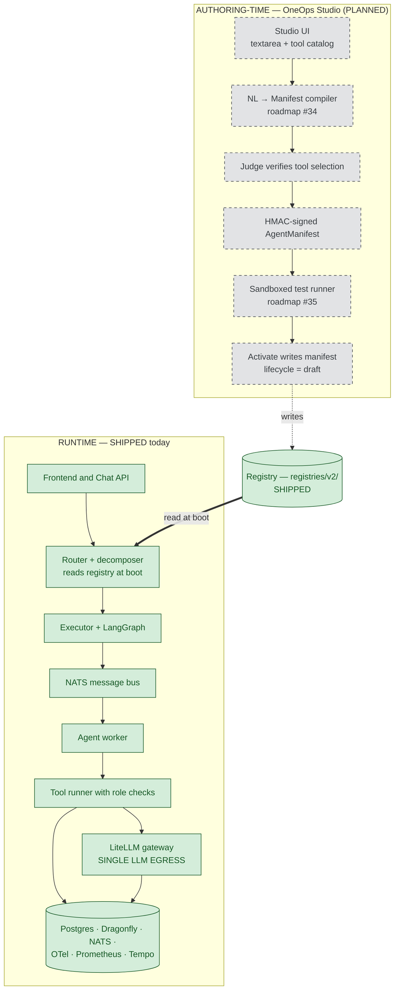
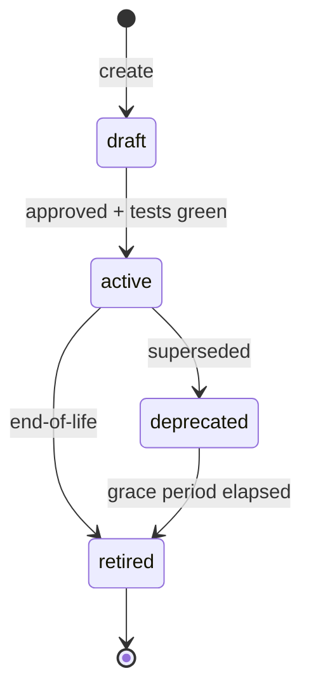
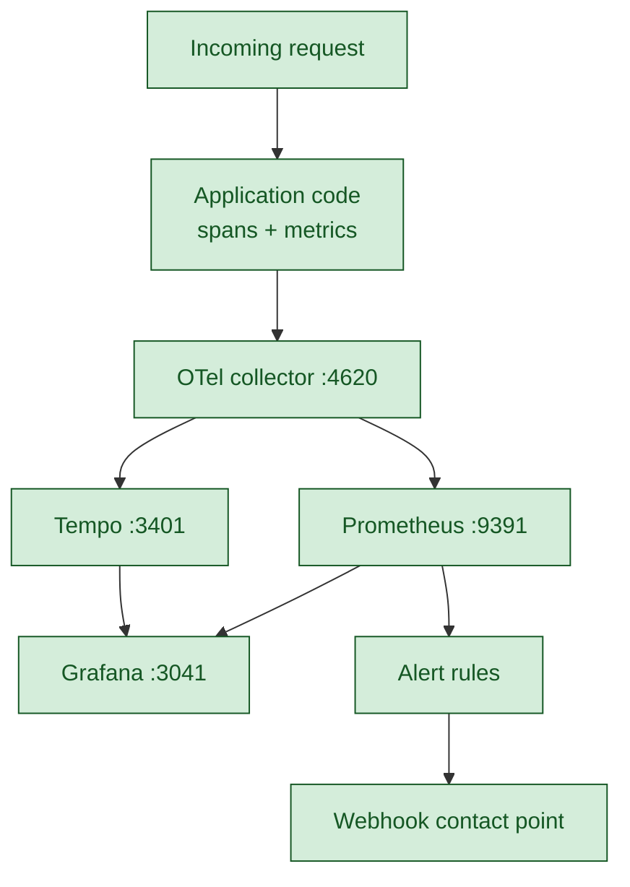
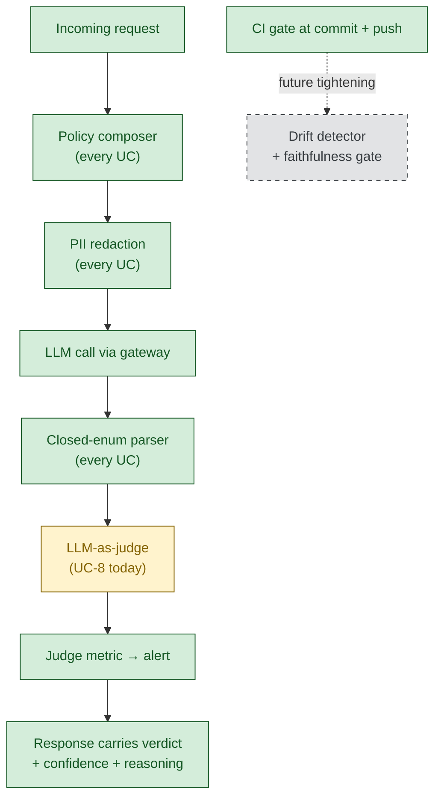
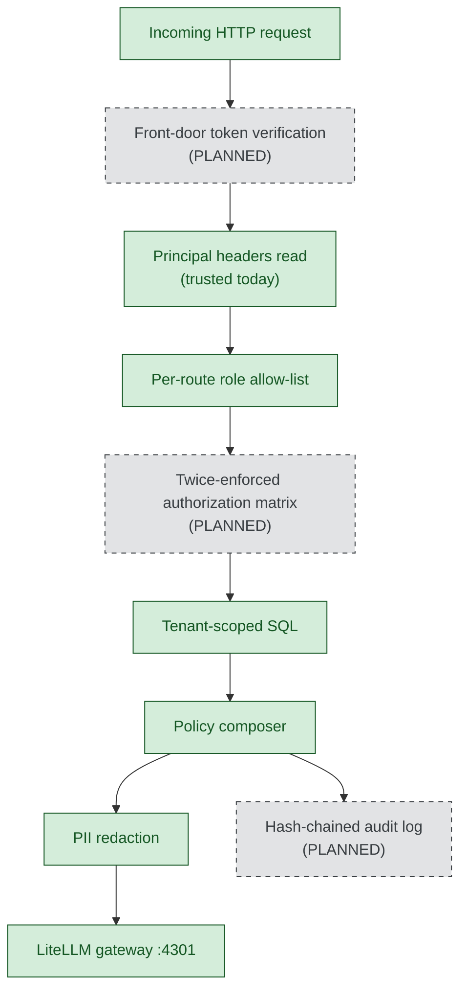
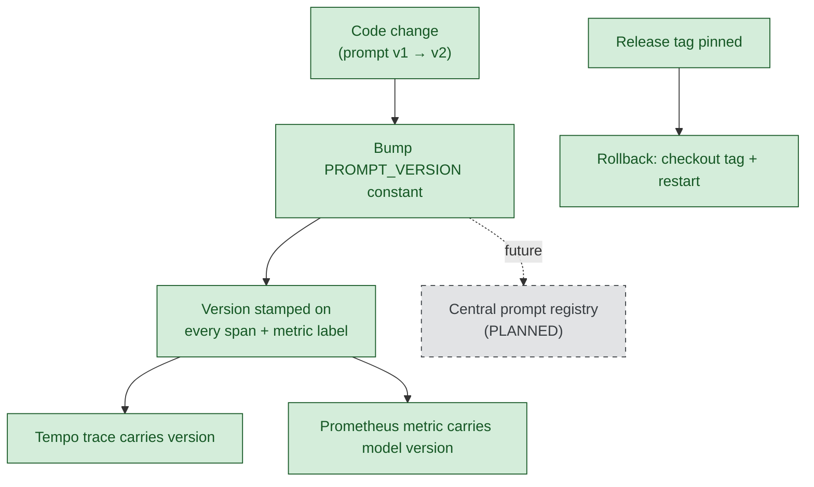
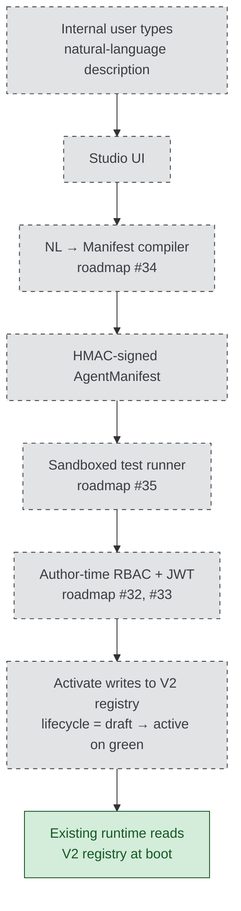

# OneOps-NextGen — Management briefing

**Date:** 2026-05-31

OneOps-NextGen is an AI system that handles a defined set of IT-service-management tasks for multiple business units. A user sends a request, by typing in chat or by clicking a button. The platform routes the request to the appropriate use case — summarising a ticket, finding similar past tickets, looking up a knowledge-base article, triaging an incoming incident, or fulfilling a catalog request. Every request passes through three structural layers before any large-language-model call is made: a router that selects the use case, a policy layer that applies enterprise rules and redacts personally identifiable information, and a tenant-scoped data layer so one customer's data never reaches another's request.

---

## Executive cut

**Five use cases run live against multi-tenant data.** The Day-1 execution plan is complete and independently verifiable: a single command (`make pmg-verify`) produces a green per-phase evidence report. Roughly 80 per cent of the 22-document production-maturity target is covered; the remaining 20 per cent is named and sized in the roadmap. The infrastructure tier is containerised; the application tier runs as a Python process and is gated from container-image deployment by a small follow-on listed in the roadmap.

### Status at a glance

| Axis | Status | One-line summary |
|---|---|---|
| Agent lifecycle | PARTIAL | Five agents registered with version and lifecycle metadata; boot-time enforcement active. |
| Performance tracking | SHIPPED | Active code instrumentation feeds the observability stack; nine alert rules are live. |
| Output validation | PARTIAL | Defense-in-depth across all use cases; the LLM-as-judge layer is enforced on UC-8 only. |
| Security | PARTIAL | Tenant isolation is structural; identity at the door is scaffolded but not enforced. |
| Versioning | SHIPPED | Prompt, agent, model, schema, cache, and code versions are stamped and pinned. |
| Adding new use cases | PARTIAL today, PLANNED via Studio | The reference-package pattern works today; Studio is the future authoring path. |

### Single biggest risk

Identity at the boundary. Front-door token verification and the materialised role-based access-control matrix are scaffolded in code but not enforced on incoming traffic. Both are required before external or untrusted multi-tenant exposure, and both are required before OneOps Studio is exposed to any internal user. Both are sized at two to three days and listed in the roadmap as items #32 and #33.

### How to read this document

- **SHIPPED** — working and verifiable today.
- **PARTIAL** — scaffolded or present but not fully enforced.
- **PLANNED** — deferred, with a sized roadmap entry.

Paths, ports, counts, and verification commands appear inline alongside the claims they support. A compact Technical Appendix at the end of this document holds the broader verification block and the items that could not be confirmed.

---

## Architecture

The platform separates **runtime** (the path a live request takes) from **authoring-time** (how a new agent is created), with a registry serving as the contract between them. The runtime exists today. The authoring layer — OneOps Studio — is planned. The runtime never knows Studio exists; it reads the registry at boot like any other configuration source.

### The five non-negotiable design principles

Documented in `docs/PROJECT-BRIEFING.md` §2 and enforced across the runtime:

- **Single LLM egress** (rule §2.5). Every model call passes through `src/oneops/llm/gateway.py`. This is the only point where cost metering, policy composition, and PII redaction apply, so it cannot be bypassed.
- **Mandatory policy composer** (rule §2.3). Every LLM call composes one of seven policy profiles defined in `src/oneops/policy/composer.py`.
- **Structural tenant isolation** (rule §2.4). Every SQL query carries `tenant_id` as the first predicate; cache keys are tenant-scoped.
- **LangGraph-first orchestration** (rule §2.8). State, retries, caching, and fan-out use the LangGraph framework rather than ad-hoc patterns.
- **No silent failures** (rule §2.7). Observability code emits a metric and returns a user-visible response rather than swallowing exceptions.

### The five live use cases

| Use case | What it does | Surface(s) | Status |
|---|---|---|---|
| **UC-1 Summarization** | Summarises a ticket from its identifier. | Chat | SHIPPED |
| **UC-2 Similar Tickets** | Finds the top semantically similar past tickets. | Button + chat | SHIPPED |
| **UC-3 KB Lookup** | Answers a natural-language question by grounding in published KB articles. | Chat | SHIPPED |
| **UC-5 Triage** | Proposes category, priority, impact, urgency, and assignment group for untriaged tickets. | Button | SHIPPED |
| **UC-8 Fulfillment** | Creates an SR from free text, matches to a catalog template, runs the fulfillment workflow. | Button (chat surface deferred ~4–6 h post-demo) | SHIPPED button; PLANNED chat |

### Deployment and integration

The service runs as a single FastAPI process and can be integrated into a larger platform as a service it offers, not a library that must be linked.

- **Application launch.** `uvicorn oneops.api.app:create_app --factory --host 127.0.0.1 --port 8765`.
- **Infrastructure tier.** Eight container services declared in `docker-compose.yml`: Dragonfly (cache, port 6680), NATS (message bus, port 4623), Postgres (development substitute for managed Supabase), Tempo (trace storage, port 3401), OTel collector (OTLP HTTP on port 4620), Prometheus (port 9391), Grafana (port 3041), and LiteLLM (LLM proxy, port 4301).
- **Integration headers.** Inbound requests carry three required headers: `x-tenant-id`, `x-user-id`, and `x-role`.
- **Integration contract.** OpenAPI schema at `/openapi.json` (returns HTTP 200), enumerating eighteen routes with their request and response shapes.
- **Application container image.** Not yet built — no `Dockerfile` exists at the repository root. Half-day roadmap item.
- **`/health` and `/ready` endpoints.** Not yet exposed (return HTTP 404). Two-hour roadmap item.
- **Resilience.** Persistent tier on managed Postgres with provider point-in-time backups. Application is stateless between requests; session state is checkpointed to Postgres via `AsyncPostgresSaver` per ADR-0004, so a process restart resumes turns from the last checkpoint. Multi-region active-active deployment and defined recovery-point and recovery-time targets are PLANNED under the infrastructure-port scope. Today's posture is single-region — appropriate for the demo and trusted-boundary integration, explicitly not for service-level-agreement-bound production.

The service is deployable and integrable today within a trusted boundary. Two items gate external or untrusted multi-tenant exposure: a container image for the application process, and the security pair listed under Security below. The same security pair gates the rollout of OneOps Studio.

---

## Agent lifecycle

This axis answers two questions: every agent in production must have a known version and a defined state; and the platform must refuse to route traffic to anything that is not active.

### What exists today

- **Five agents declared** as JSON manifests in `registries/v2/agents/` (`uc01_summarization.json`, `uc02_similar_tickets.json`, `uc03_kb_lookup.json`, `uc05_triage.json`, `uc08_fulfillment.json`). Each carries an identifier, an `active_version` pointer, and a `versions[]` history.
- **Boot-time validation** in `src/oneops/registry/store.py`. The registry is read and schema-validated at application startup; invalid entries refuse to load.
- **Router refusal path** in `src/oneops/router/router.py`. Traffic arriving for a non-active agent emits a `lifecycle.refused` span event and returns a refusal response rather than dispatching. The exercised path is captured in `ops/pmg-evidence/phase-3-lifecycle.log`.
- **Registry reconciliation finding.** The dead-code audit at `docs/findings/DEAD-CODE-AUDIT.md` found that the V1 root-level registries (`agent-catalog-registry.json`, `agent-tool-mapping.json`, `agent-registry.json`, `router-alias-registry.json`) have zero references in `src/oneops/`. The live, consumed registry is `registries/v2/`. When Studio activation is built, its write target must be the V2 directory; writing to V1 would silently fail to publish.

### Lifecycle state machine

### Tenant onboarding

A new tenant joins the platform by:

- Creating the tenant row in the relevant ITSM tables (`itsm.sys_user`, `itsm.incident`, `itsm.request`, `itsm.kb_knowledge`, `itsm.catalog_item`) with a unique tenant identifier.
- Seeding any catalog templates and knowledge-base articles that tenant requires using the existing reference seed scripts (`scripts/uc03_seed_password_reset_kb.py` and `scripts/uc08_seed_mfa_catalog.py` are the copy-patterns).
- Routing the tenant's traffic to the API with the tenant identifier in every request header.

Every existing agent runs against every tenant automatically because tenant isolation is structural; there is no per-tenant agent enable-or-disable surface today. Per-tenant catalog overlay is described in DOC-07 §4.6 of the production-maturity plan and is a P1 roadmap item.

**Gaps: see Roadmap items #32, #33, and the manifest-export item.**

---

## Performance tracking

This axis answers whether operations and finance have observable, per-tenant evidence of cost and latency, and whether on-call has alerts that fire on real degradations before users notice them.

The central point: this is **active code instrumentation, not bolted-on dashboards**. Application code emits the data; Tempo, Prometheus, and Grafana display it.

### What is wired today

- **107 span emission sites** across `src/oneops/` open trace spans around routing stages, tool calls, and LLM calls.
- **95 counter increments and 17 histogram observations** in production code track event totals and latency or size distributions.
- **Per-tenant cost meter** `ai.llm.cost_usd_micros{tenant_id, model}` at `src/oneops/llm/cost.py:69` — emitted on every LLM call, single billing source.
- **Token meters** `ai.llm.tokens.{input,output,total}` with model, operation, and provider labels.
- **LLM latency histogram** `ai.llm.latency_ms` drives the `AgentP99LatencyHigh` alert.
- **Cache meters** `ai.cache.{hits,misses,writes,stale_reads}.total` and `ai.cache.latency_ms` drive `CacheMissStorm`.
- **Agent-runs counter** `ai.agent.runs.total{agent_id, tenant_id, status}` drives `TurnFailureRateHigh` and `AgentSubjectSilent`.
- **UC-8-specific counters** `ai.uc08.{create_sr, match, fulfill, judge.verdict, agent.events}.total` drive three UC-8 alerts.
- **Bounded LLM timeout** of 60 seconds at every UC-8 LLM call site (`text_extract.py:39`, `judge.py:54`, `catalog_search.py:83`) — overridable per environment but defaulting to 60 so a stalled model cannot block the flow.
- **15 dashboard panels** in `ops/grafana/dashboards/oneops-overview.json`.
- **9 alert rules** in `ops/grafana/provisioning/alerting/alert-rules.yaml` — six baseline plus three UC-8 specific.
- **4 synthetic probes** in `ops/probes/` (`uc01.sh`, `uc03.sh`, `uc05.sh`, `uc08.sh`) plus a driver and a shared helper, each issuing a golden-path request and logging latency and HTTP status.
- **Forced-breach evidence** in `ops/pmg-evidence/day1-am-alert-fired.log` — evaluated each UC-8 alert's expression against live Prometheus with the threshold lowered to zero, proving the Prometheus → Grafana evaluator → webhook chain is wired end-to-end.

### Data path

**Gaps: see Roadmap items on drift detection, prompt-regression in CI, and the deferred smoke and devil's-play scripts.**

---

## Output validation

This axis answers whether the platform has structural mechanisms that catch wrong AI answers before they reach the user. The validation story is defense-in-depth: most layers apply across all five use cases; one layer — the dedicated LLM-as-judge — is enforced on UC-8 today and not yet on the others.

### Coverage at a glance

| Validation layer | Covers | Status |
|---|---|---|
| Policy composer on every LLM call | UC-1, UC-2, UC-3, UC-5, UC-8 | SHIPPED |
| PII redaction at egress | UC-1, UC-2, UC-3, UC-5, UC-8 | SHIPPED |
| Closed-enum parsers (reject hallucinated values) | UC-5 (impact / urgency / priority), scope classifier (category) | SHIPPED |
| Pydantic schema enforcement at routes | UC-2, UC-5, UC-8 routes | SHIPPED |
| End-to-end + devil's-play tests | UC-1, UC-2, UC-3, UC-5, UC-8 | SHIPPED |
| LLM-as-judge (FAITHFUL / UNFAITHFUL / UNCERTAIN) | UC-8 only | PARTIAL |

### What applies to every use case

- **Policy composer** on every LLM call. Defined in `src/oneops/policy/composer.py` (307 lines, seven policy profiles). Loaded from `docs/policies/updated_policy_v2.md`. SHIPPED across UC-1, UC-2, UC-3, UC-5, and UC-8.
- **PII redaction at egress.** `src/oneops/llm/redaction.py` (54 lines). Scrubs email, phone, and account-identifier patterns from messages before they reach the model. SHIPPED across all use cases.
- **Closed-enum parsers.** Reject hallucinated values in structured outputs and fall back to safe defaults rather than crashing. `_VALID_VERDICTS` in `judge.py:65` (judge verdicts); `_VALID_IMPACTS`, `_VALID_URGENCIES`, `_VALID_PRIORITIES` in `src/oneops/use_cases/uc05_triage/tools/prioritize.py` (triage outputs); `_VALID_CATEGORIES` in `src/oneops/executor/boundary.py` (scope classifier). SHIPPED.
- **Pydantic schema enforcement.** Every route Pydantic model uses `model_config = ConfigDict(extra="forbid")`. Malformed requests return HTTP 422 rather than being silently coerced. SHIPPED across UC-2, UC-5, UC-8 routes.
- **End-to-end and devil's-play tests.** 15 integration tests in `tests/integration/test_uc08_button_user_journey.py` run against an in-process FastAPI server with the message bus, the judge, and the embedding-refresh trigger all in the loop. Per-use-case unit-test counts: 2 for UC-1, 32 for UC-2, 0 for UC-3 (covered upstream by router and KB-store tests), 9 for UC-5, 28 for UC-8.
- **CI gate.** `scripts/ci.sh` invoked by `make ci-fast` on every commit via `.git/hooks/pre-commit` and by `make ci` on every push. Ratcheting baseline (see CI framing below). SHIPPED.

### What is UC-8 only today

- **LLM-as-judge.** An independent LLM scores each AI decision as FAITHFUL, UNFAITHFUL, or UNCERTAIN. Module at `src/oneops/use_cases/uc08_fulfillment/judge.py` (379 lines; `JudgeVerdict` line 59; `judge_extraction` line 320; `judge_rerank` line 345). Verdict, confidence, and reasoning are surfaced on the API response. The metric `ai.uc08.judge.verdict.total{judge, verdict}` drives the `UC08JudgeUnfaithfulHigh` alert when the UNFAITHFUL share exceeds 10 per cent over 10 minutes.
- **The coverage gap is load-bearing**, not cosmetic. There is at least one documented class of error UC-8-only coverage cannot catch: the router-rewriter has been observed corrupting intent in multi-turn conversations — for example, a follow-up question intended as "summarise this" rewritten so it routes to "similar tickets" instead. UC-8-only judging cannot catch this class because the corrupted intent never reaches a judge gate. Expanding judge coverage to UC-1, UC-2, UC-3, and UC-5 is sized at roughly seven hours of focused work.

### Validation diagram

### CI gate framing

The continuous-integration gate enforces a **ratcheting baseline**, not zero-debt strict mode. The pre-commit hook runs the fast gate on every commit; the full gate runs on every push.

- Ratchet declared in `pyproject.toml`: under `[tool.ruff.lint]`, 24 lint categories are explicitly listed in `ignore` with a one-line rationale each (pre-existing technical debt with a climb-back plan). Under `[tool.mypy]`, `strict = false` and 14 error categories are disabled (the same grandfathered debt for type checking).
- Any new violation in a category not on the ignore list fails the gate.
- The commit-gate path is green today at HEAD `0f1c035`.
- A separately-run `tests/unit/router/test_time_filter_extractor.py` bundle shows 13 event-loop-isolation failures of 195 tests; these are not on the commit-gate path because that gate runs `pytest -m unit` which filters by marker.

**Gaps: see Roadmap items on judge expansion across use cases, drift detection, prompt-regression in CI, and RAG-faithfulness as a hard gate.**

---

## Security

This axis answers whether the platform has identity at the boundary, role-based access at the route layer, and per-tenant data isolation.

### What is enforced today

- **Tenant-scoped data access.** Every SQL query in the use-case and route layers carries `tenant_id` as the first predicate. Examples: the SR INSERT at `src/oneops/api/uc08_routes.py:284–340`; the triage queue summary at `src/oneops/api/uc05_routes.py:162–169`; the shared ticket-store reads in `src/oneops/use_cases/_shared/ticket_store.py`.
- **Per-route role allow-lists.** Declared as `frozenset` constants at module scope. `_TRIAGE_ROLES` in `uc05_routes.py`; `_PERMITTED_MATCH_ROLES` and `_PERMITTED_FULFILL_ROLES` in `uc08_routes.py`. Requests from a non-listed role are refused at the `_require_role` helper with HTTP 403 before any business logic runs.
- **Policy composer on every LLM call** (rule §2.3, see Output Validation above).
- **PII redaction at the gateway** (`src/oneops/llm/redaction.py`).

### What is not yet enforced

- **Front-door bearer-token verification.** Authorization-layer modules exist as scaffolding in `src/oneops/authz/` (`tokens.py`, `rbac.py`, `abac.py`, `decision_cache.py`) but are not wired onto the request path. Principal headers are trusted at the boundary today. PLANNED as roadmap item #32 (two to three days).
- **Materialised role × tool authorization matrix.** Would be checked at both authoring time and runtime. PLANNED as roadmap item #33 (two to three days).
- **Hash-chained immutable audit log + RTBF endpoint.** Not present. PLANNED at P1.

### Request path with enforced and planned gates

OneOps Studio is the first surface where any internal user could activate an agent — add a tool-using capability to the runtime. Header trust is acceptable for back-office actors on the existing button surface inside a trusted boundary. It is not acceptable for Studio. Items #32 and #33 are therefore listed as gating Studio rollout, not merely correlated with it.

**Gaps: see Roadmap items #32 and #33, plus the audit-log and cross-tenant-adversarial entries.**

---

## Versioning

This axis answers whether the platform can identify, at audit grade, the exact code and configuration that produced any past result.

Versioning applies at seven layers, each with a concrete mechanism:

- **Prompts.** Module-level `PROMPT_VERSION` constants at every LLM call site (examples: `text_extract.py:47`, `judge.py:55`, `catalog_reranker.py`). The constant is set as a span attribute (`uc08.prompt_version`) on the spans emitted by the call, so any Tempo trace can be filtered by prompt version.
- **Agents.** Each agent manifest in `registries/v2/agents/<uc>.json` carries `active_version` and a `versions[]` history.
- **Models.** Cost-metric labels carry the full model version string (e.g. `model="gpt-4o-mini-2024-07-18"`) — granular enough to distinguish upgrades within a family.
- **Schema.** Numbered SQL migrations `migrations/0001_*.sql` through `migrations/0007_*.sql`, applied in lexical order, idempotent on re-run.
- **Caches.** Constants `PIPELINE_CACHE_VERSION` and `HUMANISE_RECORD_VERSION` in code; bumping either invalidates downstream cache reads without a manual flush.
- **Tools.** Declared in `registries/tool-registry.json` by identifier with consumed capabilities and required role; signature changes ship as new entries with new identifiers so consumers adopt them at their own pace.
- **Code.** Git release tags pinned at known-good points: `uc08-button-demo-ready`, `uc08-production-ready`, `day1-cut-complete-2026-05-31`.

### Versioning data flow

API route versioning is partial in a specific way: the OpenAPI schema at `/openapi.json` declares `info.version = "0.1.0"`, route paths are stable per release tag, but a URL-prefixed scheme such as `/v1/` or `/v2/` is not yet introduced — breaking route changes are coordinated through tag-pinned releases.

**Gaps: see Roadmap item on the central prompt registry with diff and rollback view.**

---

## Adding new use cases

This axis answers how cheaply and safely a new use case can be added. Today's path is real and documented but manual. The future path is OneOps Studio.

### Today's path — manual but production-grade

A developer adds a use case by:

- Copying the reference package at `src/oneops/use_cases/uc08_fulfillment/` (eleven files: contracts, handlers, core, executor, adapters, NATS agent, NATS dispatcher, judge, catalog search and reranker, priority computation, historical-suggestion logic, text-extract LLM call, and SR-id minting).
- Respecting the thirteen non-negotiable rules in `docs/PROJECT-BRIEFING.md` §2.
- Touching the relevant registries (`registries/v2/agents/<new_uc>.json`, `registries/tool-registry.json`, `registries/agent-tool-mapping.json`).
- Copying the end-to-end test pattern in `tests/integration/test_uc08_button_user_journey.py`.
- Walking the thirty-item definition-of-done checklist in `docs/production-maturity-plan.md` §D before claiming the use case complete.
- Running `make pmg-verify`, which writes `ops/pmg-evidence/REPORT.md` and confirms each piece is in place.

### Studio — the future path

Studio's minimum-viable build is sized at seven to eight days of focused work, broken into roadmap items #31 through #37. Items #32 and #33 (token verification and the authorization matrix) are listed as gating because activating an agent without a verified principal would let any caller add capabilities to the runtime.

**Gaps: see Roadmap items #31 through #37, plus the scaffolding command-line tool.**

---

## Roadmap

The single consolidated table of every PLANNED item with priority from the production-maturity plan and an effort estimate. The "Gates" column states whether the item gates a downstream rollout.

| # | Item | Priority | Effort | Gates |
|---|---|---|---|---|
| 32 | Front-door bearer-token verification | P0 | 2–3 days | External exposure and Studio |
| 33 | Twice-enforced authorization matrix | P0 | 2–3 days | External exposure and Studio |
| 31 | Cross-service tool-catalog refactor | P0 | ~2 days | Studio MVP |
| 34 | NL-to-manifest compiler | P0 | ~3 days | Studio MVP |
| 35 | Sandboxed test runner for authored agents | P0 | ~1 day | Studio MVP |
| 36 | Studio user interface | P0 | ~1 day | Studio MVP |
| 37 | Studio end-to-end demo and runbook | P0 | ~0.5 day | Studio MVP rollout |
| — | Judge expansion to UC-1, UC-2, UC-3, UC-5 | P0 | ~7 hours | Closes load-bearing validation gap |
| — | Drift detector and per-use-case quality scoring | P0 | ~2 days | — |
| — | Prompt-regression continuous-integration gate | P0 | ~2 days | — |
| — | RAG faithfulness as a hard gate | P0 | included in drift scope | — |
| — | Manifest export and import command | P0 | ~0.5 day | Operator workflow |
| — | Cross-tenant adversarial CI corpus | P0 | ~1 day | Continuous security validation |
| — | Container image for the application process | P0 | ~0.5 day | Container deployment |
| — | `/health` and `/ready` endpoints | P0 | ~2 hours | Kubernetes-style probes |
| — | Hash-chained immutable audit log + RTBF endpoint | P1 | ~1 day each | Compliance |
| — | Reversible PII token store | P1 | ~3 days | Compliance |
| — | Per-tenant catalog overlay operator surface | P1 | ~1 day | Customer customisation |
| — | Quality-gated promotion tied to lifecycle | P1 | ~1 day | Closes the loop with judge metrics |
| — | Central prompt registry with diff and rollback view | P1 | ~2 days | Operator tooling |
| — | Scaffolding command-line tool for new use cases | P1 | ~2 days | Drop-in for hand-copy |
| — | A/B traffic split via Istio | P2 | infrastructure-dependent | Scale-time |

---

## Appendix — quick-reference questions and take-home artifacts

| Question | One-line answer |
|---|---|
| How do we know the system is observable? | 107 span sites and 112 metric sites in production code feed Tempo, Prometheus, and Grafana. |
| How do we know LLM cost is per tenant? | The cost meter is emitted at the gateway boundary with tenant and model labels on every call. |
| What stops a developer from shipping broken code? | A commit-time gate runs on every commit and a fuller gate runs before push, both with a documented ratchet baseline. |
| How is the system bounded against runaway LLM calls? | A sixty-second default timeout applies at every LLM call site. |
| Can it be deployed independently? | Yes, within a trusted boundary; a container image for the application process is a roadmap item. |
| What is the largest deferred risk? | Identity at the boundary; both items are sized at two to three days. |
| Where is the demo script? | `docs/pmg-demo-runbook.md`. |
| Where is the evidence report? | `ops/pmg-evidence/REPORT.md`. |

### Take-home artifacts

Four documents committed at the release reference for this briefing:

- `ops/pmg-evidence/REPORT.md` — auto-generated phase-by-phase evidence report (7/7 phases green).
- `docs/pmg-demo-runbook.md` — 45-minute demo script with a seven-act narrative walkthrough and Q&A.
- `docs/manager-decision-package.md` — ten binding-answer questions framed for management with recommended answers, cost of the alternative, and downstream gates.
- `docs/production-maturity-plan.md` — the full 22-document target plan including §F-LOCKED (Day-1 cut), §A.7 (deferred-with-rationale), and §G (open scoping questions).

---

## Technical Appendix — verification at release `day1-cut-complete-2026-05-31` (HEAD `0f1c035`)

### Verified counts

| Item | Value |
|---|---|
| OTel span emission sites | 107 |
| Counter increments | 95 |
| Histogram observations | 17 |
| Grafana dashboard panels | 15 |
| Grafana alert rules | 9 (6 baseline + 3 UC-8) |
| Synthetic probes | 4 UC-specific + 1 driver + 1 helper |
| UC-8 integration tests | 15 |
| Per-use-case unit-test counts | UC-1: 2 · UC-2: 32 · UC-3: 0 (covered upstream) · UC-5: 9 · UC-8: 28 |
| Judge module line count | 379 |
| Policy composer line count | 307 |
| PII redaction line count | 54 |
| Policy profiles defined | 7 |
| Docker-compose services | 8 |
| API routes declared in OpenAPI | 18 |

### CI gate status at the time of writing

- `make ci-fast` (commit-time gate, via `.git/hooks/pre-commit`): green — ruff ✓, mypy ✓, `pytest -m unit` ✓ at HEAD `0f1c035`.
- `make ci` (full gate): green on stages 1–4; stages 5 (smoke) and 6 (devils) print "deferred — script not present (Phase 6 fills in)". Deferral is deliberate per the Day-1 plan.
- `tests/unit/router/test_time_filter_extractor.py` (separate path, not on the commit gate): 13 failures of 195 — event-loop-isolation flakes; not a product regression.

### Items that could not be confirmed

| Item | Reason | Recommended next step |
|---|---|---|
| Permalink URLs to source files at the release reference | No git remote is configured (`git remote get-url origin` returns nothing). | Source citations rendered as inline paths per the documented fallback rule; when a remote is added, replace inline paths with pinned permalinks. |
| `/health` and `/ready` HTTP endpoints | Both return 404. | Add to the FastAPI surface; included in the roadmap. |
| Container image for the application process | No `Dockerfile*` present at the repository root. | Build one; included in the roadmap. |
| V2 agent files' flat top-level lifecycle metadata | The V2 schema uses nested `active_version` and `versions[]` rather than flat top-level fields. | Document the actual V2 schema in `docs/CONVENTIONS.md`. |
| Studio activation write path | Studio is PLANNED; no activation code exists yet. | When tasks #34 and #37 are built, target `registries/v2/` per the registry reconciliation finding. |

### Prepared by

This briefing was prepared on 2026-05-31 against release `day1-cut-complete-2026-05-31` (HEAD `0f1c035`). All factual claims were verified against the codebase at that exact reference.
