# OneOps-NextGen — Platform Operations

Date 2026-06-01 · Release reference `pre-demo-2026-06-01`

OneOps-NextGen is a multi-tenant AI platform for IT service management. This document describes the operational characteristics of the platform by axis: how correctness is enforced, how performance is engineered, how cost is governed, how security and tenant isolation are guaranteed, how scale is delivered, how observability is wired, how failures are contained, how the system is versioned and rolled back, how quality is assured, and how the platform grows.

---

## How to read

Three status tags appear throughout the document and carry the same meaning everywhere they appear:

- SHIPPED — working and verifiable today.
- PARTIAL — present in code; coverage expansion sequenced.
- PLANNED — sized and sequenced as the next wave of capability expansion.

---

## Executive summary

> Five use cases run live against multi-tenant data, fully observable, with structural correctness, cost, and security controls at every layer of the stack.

The platform is instrumented end-to-end from inside the application code rather than bolted on after the fact. Every meaningful checkpoint is pinned as a release tag, every model call is recorded per tenant per model in micro-dollar precision, and tenant isolation is structural rather than advisory. The next wave of capability expansion is sequenced across validation, performance, cost, security, and authoring surfaces.

---

## 1. Response validation

> Five independent layers catch wrong AI answers before they reach the user. Defense in depth is structural, not best-effort.

Correctness is enforced at five distinct layers. Inputs are validated at the route boundary, the policy composer mediates every model call with mandatory profile selection and PII redaction, closed-enum parsers reject hallucinated values in structured outputs, an independent LLM-as-judge scores the AI's decision, and retrieval-augmented generation has a per-candidate relevance floor.

The first three layers cover every use case today. The judge layer is enforced on UC-8 today; expansion to the other four use cases is sequenced. The retrieval floor covers UC-2 and UC-3.

| Layer | Coverage |
|---|---|
| Schema and RBAC at route boundary | All use cases |
| Policy composer and PII redaction | All LLM calls |
| Closed-enum parsers | UC-5 and the scope classifier |
| Independent judge | UC-8 today |
| RAG retrieval floor | UC-2 and UC-3 |

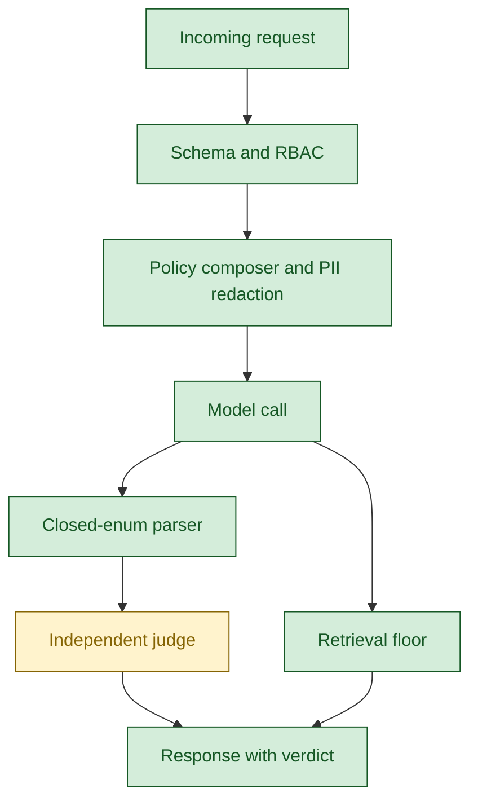

*Figure 1. The validation pipeline. Each layer catches a different class of error; the judge node is partial because it covers UC-8 today.*

- Incoming request — every HTTP call arriving at the platform edge, carrying the principal headers.
- Schema and RBAC — Pydantic schema enforcement at the route boundary plus the per-route role allow-list that refuses unauthorised callers before any work runs.
- Policy composer and PII redaction — selects one of seven policy profiles per use case and strips personally identifiable information from the input before the model receives it.
- Model call — the single egress point through which every language-model invocation passes.
- Closed-enum parser — validates structured outputs (priority, category, verdict) against a fixed allow-list and substitutes a safe default if the model returns a value outside the set.
- Independent judge — a second model that scores the first model's output as FAITHFUL, UNFAITHFUL, or UNCERTAIN; live on UC-8 today.
- Retrieval floor — a per-candidate relevance gate on retrieval-augmented generation that returns a clean no-match when evidence is weak rather than fabricating from low-similarity candidates.
- Response with verdict — the final response delivered to the caller, carrying the judge verdict, confidence, and reasoning where applicable.

---

## 2. Performance monitoring

> Active instrumentation inside the application code feeds the standard observability stack. The dashboard reflects what the code emits; nothing is bolted on.

Every LLM call is measured at the single egress point. The metrics carry the model version, the tenant, the operation, and the prompt version. A 60-second hard timeout fires at every model call site so a stalled model cannot block the agent. Every agent run records lifecycle status, latency at three percentiles, and tenant attribution. Cache behaviour, message-bus throughput, per-tool outcomes, and use-case-specific events are all measured by the same path.

Nine alert rules are live. Each rule has been individually verified by deliberately firing it with the threshold dropped to zero, end-to-end through the webhook contact point. The alerting chain is known-working rather than assumed.

| Component | Status |
|---|---|
| Span and metric emission in production code | SHIPPED |
| Per-tenant cost meter at the model gateway | SHIPPED |
| Dashboard panels and alert rules live | SHIPPED |
| Drift detector and per-UC quality scoring | PLANNED |

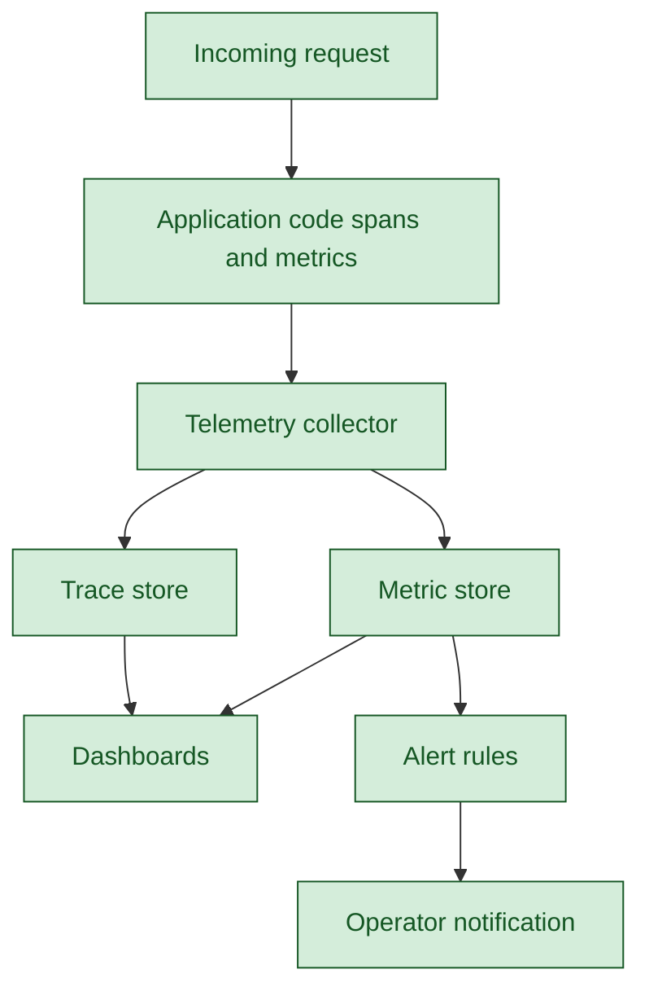

*Figure 2. The telemetry data path from application code to operator notification, with one collector and one display plane.*

- Incoming request — every HTTP call arriving at the platform edge.
- Application code spans and metrics — instrumentation embedded inside the production code that emits distributed-trace spans and quantitative metrics on every request.
- Telemetry collector — the single OpenTelemetry collector that receives every signal from the application and forwards it to the appropriate store.
- Trace store — Tempo, where distributed traces land and are queryable by trace identifier.
- Metric store — Prometheus, where counters and histograms land and are queryable by label.
- Dashboards — Grafana panels that render the metric and trace data for both engineers and management in real time.
- Alert rules — the nine live evaluators that watch metric series for threshold breaches and route notifications to operators.
- Operator notification — the webhook contact point that receives alert fires; the chain has been verified end-to-end through forced-breach testing.

---

## 3. Cost management

> Cost is recorded with micro-dollar precision and reduced by architecture. Caching turns repeat queries free; refusal at the cheapest layer prevents work from reaching the model.

Every LLM call is recorded with the tenant identifier, the full model version string, and the operation label. Token volume is recorded separately for input and output. The dashboard surfaces cumulative spend, cost per minute by tenant, cost per minute by model, and a per-tenant by per-model breakdown table that supports exact attribution.

Cost is reduced at five architectural layers. The edge cache eliminates LLM invocation on repeat queries, with verified warm-hit latency in the single-digit milliseconds. Default routing uses a small fast model approximately ten times cheaper than the flagship; the larger model is reserved for the judge layer. Off-domain queries are caught by the scope classifier before the LLM is invoked, so a security refusal is also a cost refusal. Retrieval-first design answers from the vector store before generation, returning a clean no-match when evidence is weak rather than fabricating from low-similarity candidates. Embeddings are reused across queries via content-hash gating.

| Component | Status |
|---|---|
| Cost meter at gateway with tenant labels | SHIPPED |
| Edge cache with version-keyed safety | SHIPPED |
| Refusal as cost control | SHIPPED |
| Per-tenant budget caps and anomaly alerts | PLANNED |

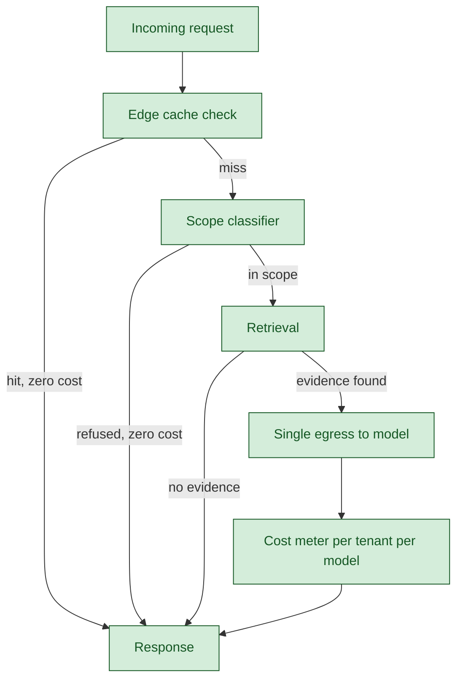

*Figure 3. The cost-aware request path. Cache hits, scope refusals, and no-evidence retrievals all bypass the model entirely.*

- Incoming request — every HTTP call arriving at the platform edge.
- Edge cache check — the version-keyed cache that returns a prior response in single-digit milliseconds with zero language-model invocation; the largest cost saver in the architecture.
- Scope classifier — a tiny embedding-based check that rejects off-domain queries before any expensive work begins; a security refusal is also a cost refusal.
- Retrieval — the vector-store lookup that finds candidate evidence in the tenant's data before generation is considered.
- Single egress to model — the one gateway through which every language-model call passes, so cost can be measured and policy enforced without exception.
- Cost meter per tenant per model — the metric emission point that records cost in micro-dollar precision with the tenant identifier and the full model version string as labels.
- Response — the final response delivered to the caller, with cost attributed and observable.

---

## 4. Security and tenant isolation

> Three controls are enforced on every request today. Two additional controls are scaffolded in code and sequenced for the next sprint to unlock external exposure and the authoring surface.

Tenant-scoped data access is enforced structurally: every query in the use-case and route layers carries the tenant identifier as the first predicate, not a wrapper applied later. Per-route role allow-lists refuse requests from non-listed roles at the route boundary, with the refusal surfaced on the dashboard as a distinct counter. The policy composer applies one of seven profiles to every model call, and the redaction module strips personally identifiable information before the model receives input.

Two further controls are scaffolded in the authorisation modules and sequenced for activation in the next sprint. Principal headers are read at the boundary today and trusted, appropriate for the existing managed-boundary integration. Bearer-token verification is ready in the authorisation modules and will be wired into the FastAPI middleware to unlock external exposure. The materialised role-by-tool authorisation matrix will be checked at both authoring time and runtime alongside the authoring surface.

| Control | Status |
|---|---|
| Tenant-scoped data access | SHIPPED |
| Per-route role allow-lists | SHIPPED |
| Policy composer and PII redaction | SHIPPED |
| Front-door bearer-token verification | PARTIAL |
| Twice-enforced authorisation matrix | PLANNED |
| Audit log and right-to-be-forgotten endpoint | PLANNED |

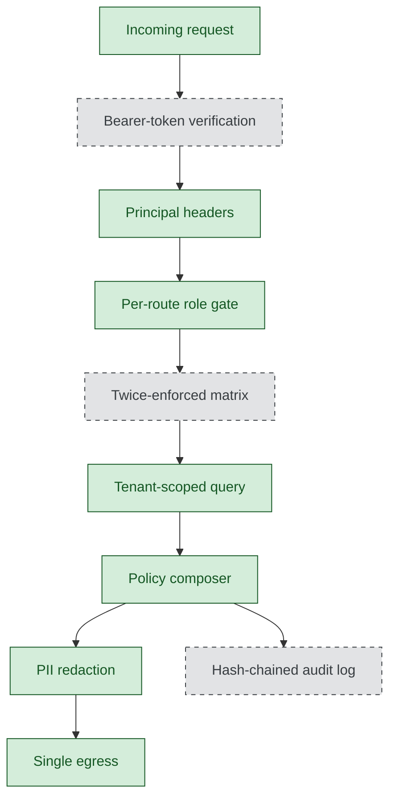

*Figure 4. The request control path. Dotted nodes are sequenced for the next sprint; solid nodes apply on every request today.*

- Incoming request — every HTTP call arriving at the platform edge.
- Bearer-token verification — cryptographic check of the JSON Web Token against the issuer's signing keys; scaffolded in the authorisation modules and sequenced for activation in the next sprint to unlock external exposure.
- Principal headers — the tenant identifier, user identifier, and role identifier read from the request headers; trusted today inside the managed-boundary integration.
- Per-route role gate — the per-route allow-list, expressed as an immutable frozen set, that refuses requests from roles outside the set before any work runs and counts the refusal on the dashboard.
- Twice-enforced matrix — the role-by-tool capability matrix that will be checked at two points: once at authoring time when a Studio user assembles an agent, and again at runtime on every request; sequenced alongside the authoring surface.
- Tenant-scoped query — every database query carries the tenant identifier as the first predicate so no code path can read or write across tenant boundaries.
- Policy composer — the module that selects one of seven policy profiles per use case and applies it to every language-model call without exception.
- PII redaction — the module that strips personally identifiable information from the input before the model receives it, so raw sensitive data never reaches the model.
- Single egress — the one gateway through which every language-model call passes; the structural chokepoint that makes the policy composer unbypassable.
- Hash-chained audit log — the tamper-evident log where each entry's hash includes the prior entry's hash, providing cryptographic provenance for every privileged action; sequenced as a P1 roadmap item.

---

## 5. Multi-tenant architecture and scaling

> Tenant isolation is part of the query, not a wrapper around it. A new tenant joins by inserting rows with a new identifier and routing traffic with that identifier in the header.

Every layer of the stack separates tenants by structure. Database queries lead with the tenant predicate. Vector indexes partition by tenant before cosine ranks across candidates. The cache namespaces by tenant. The message-bus payload carries the tenant identifier. The LLM cost metric is labelled by tenant. Every span and every metric carries the tenant attribute.

The application process is stateless between requests; session state lives in the database via the checkpointer, so horizontal scaling is a load-balancer change rather than an architecture migration. A new tenant is onboarded by inserting rows in the relevant ITSM tables, seeding catalog templates and knowledge-base articles via the reference scripts, and routing traffic with the tenant identifier in the request header. The existing five agents serve the new tenant from the first request. No code deploy, no new containers, no schema changes, no agent registration are required.

| Layer | Tenant separation |
|---|---|
| Database | Predicate first on every query |
| Vector index | Tenant partition before cosine |
| Cache | Tenant as key namespace |
| Message bus | Tenant on every message payload |
| LLM gateway | Tenant label on every cost metric |
| Observability | Tenant on every metric and span |

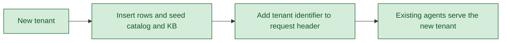

*Figure 5. The tenant-onboarding flow. The architecture absorbs new tenants without code change because isolation is structural.*

- New tenant — the customer being added to the platform; identified by a unique tenant identifier from the first moment.
- Insert rows and seed catalog and KB — the operational step of populating the tenant's ITSM tables and using the reference seed scripts to load catalog templates and knowledge-base articles; embedding triggers fire on insert so the tenant's data becomes searchable within five seconds.
- Add tenant identifier to request header — the only integration change required at the calling system; the tenant identifier rides on every request header from then on.
- Existing agents serve the new tenant — the five use cases that were running before serve the new tenant from the first request because tenant isolation is structural, not per-instance.

---

## 6. Failure handling and resilience

> Failures are made visible, contained at the layer where they occur, and surfaced to operators without losing user work.

Retries are declared per node on the orchestration graph rather than scattered across the code; the policy is a property of the node and visible on the trace. A 60-second hard timeout fires at every model call site. Every catch site logs structurally and emits a metric, so the dashboard reflects four distinct lifecycle states: success, failed, refused, and started. The split between failed and refused is structural — security activity does not pollute the quality signal, and a real failure cannot hide as a security refusal.

State survives crashes. Session state is checkpointed to the database at every node boundary; a process restart resumes turns from the last checkpoint. The fulfillment endpoint accepts an idempotency key so a retried request returns the prior response rather than creating a duplicate ticket. The message bus uses queue groups, so a worker that crashes mid-message triggers redelivery to another worker in the same group. The embedding-refresh substrate is backed by a durable queue: jobs survive worker restarts and permanently failed jobs are visible for inspection.

| Mechanism | Status |
|---|---|
| Declarative retries per node | SHIPPED |
| Hard timeout at every model call site | SHIPPED |
| Structured logging with no silent failures | SHIPPED |
| Stateful checkpointing for crash recovery | SHIPPED |
| Idempotent fulfillment | SHIPPED |
| Durable queues for at-least-once delivery | SHIPPED |

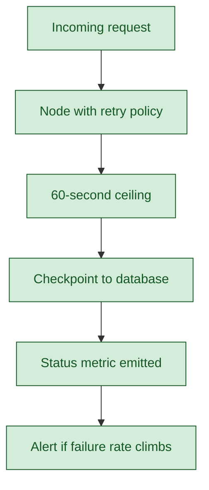

*Figure 6. The resilience path. Each step is observable, recoverable, and surfaced.*

- Incoming request — every HTTP call arriving at the platform edge.
- Node with retry policy — a step in the orchestration graph whose retry behaviour is declared per node with backoff, max attempts, and retry-on-exception-class, all visible on the trace.
- 60-second ceiling — the hard timeout enforced at every model call site, so a stalled model cannot freeze an agent or run up indefinite tokens.
- Checkpoint to database — the session-state checkpoint written at every node boundary, so a process restart resumes the user's turn from the last checkpoint rather than starting over.
- Status metric emitted — the lifecycle counter that records whether the run succeeded, failed, was refused by policy, or is still in flight; visible on the Turns-by-agent dashboard.
- Alert if failure rate climbs — the alert evaluator that watches the failure-rate metric and notifies operators if the rate crosses threshold over the evaluation window.

---

## 7. Observability

> Three signal types, one collector, one display plane, single source of truth. Span context propagates across processes so one turn appears as one trace, not two disjoint trees.

Distributed traces, metrics, and structured logs are emitted from inside the application code and converge into a single telemetry collector. Traces land in Tempo, metrics land in Prometheus, and structured logs carry the request identifier, tenant identifier, session identifier, and trace identifier so a grep on a trace identifier returns every log line from a single turn across processes. The same dashboard surfaces what the developer uses for investigation and what management sees for status.

Every span carries tenant attribution, prompt version, agent identifier, model version, operation, and duration. A single user turn produces a span tree of approximately twenty-six to forty spans across the router, policy layer, tool runner, message bus, agent, and LLM gateway. The W3C trace-context header propagates across the message bus so the cross-process steps remain a single trace.

| Signal | Storage | Display |
|---|---|---|
| Distributed traces | Tempo | Grafana Explore |
| Metrics | Prometheus | Grafana panels and alerts |
| Structured logs | Per-component files | Cross-reference by trace identifier |

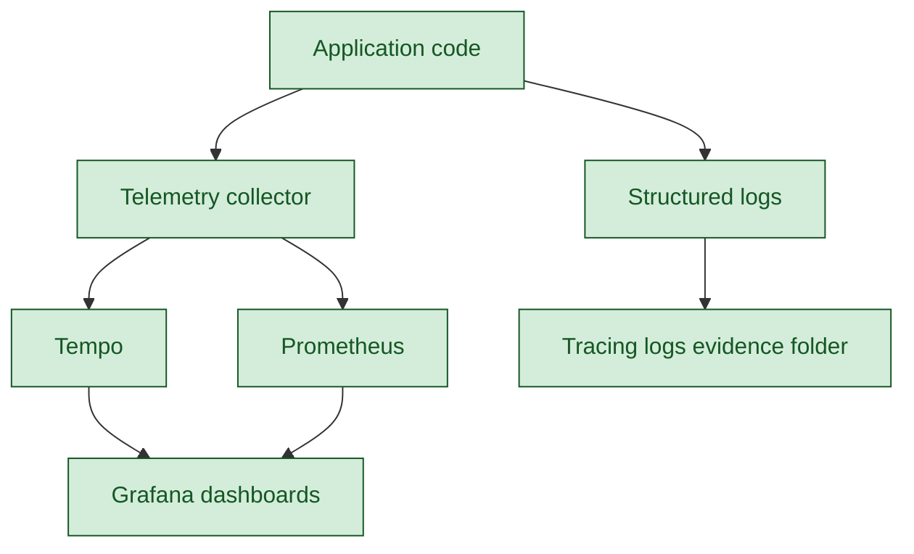

*Figure 7. The observability stack. One emit, one collector, two stores, one display, one auditor-grade evidence folder.*

- Application code — the production code that emits distributed-trace spans, quantitative metrics, and structured logs from inside the call path rather than scraping output after the fact.
- Telemetry collector — the OpenTelemetry collector that receives every signal from the application and forwards each to the appropriate store.
- Tempo — the distributed-trace store; each user turn appears as a single tree of twenty-six to forty spans across the router, policy layer, tool runner, message bus, agent, and language-model gateway.
- Prometheus — the metric store; counters and histograms drive the dashboard panels and the alert rules.
- Structured logs — log lines that carry the request identifier, tenant identifier, session identifier, and trace identifier so a grep on a trace identifier returns every line from a single turn across processes.
- Grafana dashboards — the display surface; the same panels engineers use for investigation are what management sees for status.
- Tracing logs evidence folder — the auditor-grade live-tail folder with one channel per infrastructure component plus a thirty-second heartbeat so file freshness reflects monitor liveness.

---

## 8. Versioning and rollback

> Seven independent version layers carry the platform from a code change to an audit-grade trace of any past result. Any single layer can be rolled back without disturbing the others.

Prompt versions are constants stamped on every span. Agent versions live in the registry as an active version plus a history list. Model versions are recorded as the full version string on every cost metric, so historic spend can be re-priced against new vendor terms. Schema versions are numbered, ordered, idempotent migrations. Cache-key version constants orphan old entries safely when prompt or output shape changes. Tool registry entries are immutable, with signature changes shipping as new identifiers. Release tags pin the code state at every meaningful checkpoint.

Rollback at any layer is a focused operation. A bad prompt is reverted by editing one constant and redeploying; the cache cleanly returns to its prior state because old keys were never overwritten. A bad agent is reverted by editing the registry. A bad model is reverted by editing the routing configuration. The data tier uses the managed-Postgres point-in-time restore the provider already offers.

| Layer | Mechanism |
|---|---|
| Prompt | Constant stamped on every span |
| Agent | Active version in registry |
| Model | Full version string on cost metric |
| Schema | Numbered migrations |
| Cache | Version constant orphans old keys |
| Tool | Immutable registry entry per signature |
| Code | Release tag |

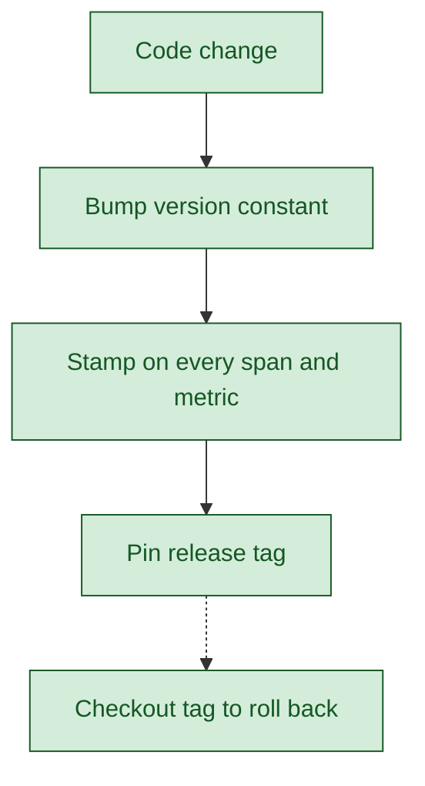

*Figure 8. The versioning flow. Each code change updates a constant that is stamped on the matching span and metric, making any past result traceable to the version that produced it.*

- Code change — any change to a prompt body, an output shape, or a downstream behaviour that should be distinguishable from prior versions.
- Bump version constant — the deliberate increment of the corresponding version constant (prompt, cache, schema) that makes the new behaviour identifiable.
- Stamp on every span and metric — the propagation of the new version label onto every distributed-trace span and every quantitative metric emitted by the changed code path.
- Pin release tag — the git tag pinned at the deploy commit, establishing the rollback point for the entire codebase at that moment.
- Checkout tag to roll back — the single-command rollback operation that restores the codebase to the pinned tag; the cache cleanly returns to its prior state because old keys were never overwritten.

---

## 9. Quality assurance and testing

> Five categories of test, gated at two stages, reinforced by AI-specific quality machinery that runs in production.

Unit tests run on every commit at the developer's laptop. Integration tests run the full request path against real Postgres, real cache, and an in-process FastAPI server. Live end-to-end suites and adversarial probes exercise the model path and the dashboard simultaneously. Field-parity tests verify substrate cutovers before flag flips. Devil's-play probes confirm that the system refuses off-domain queries, treats SQL-injection text as content, and asks for clarification rather than fabricating answers.

The pre-commit gate runs lint, type-check, and the fast unit subset; the pre-push gate adds integration tests and the per-phase verifier that writes the auditable evidence report. A ratchet baseline lets existing technical debt sit while blocking new violations in non-listed categories. In production, closed-enum validation rejects hallucinated values, schema enforcement rejects malformed payloads, the independent judge on UC-8 scores each turn and drives an alert if the unfaithful rate climbs, and per-tenant cost anomalies serve as an early warning that a prompt has started misbehaving.

| Category | Status |
|---|---|
| Unit tests on every commit | SHIPPED |
| Integration tests against real infrastructure | SHIPPED |
| Live and adversarial suites per use case | SHIPPED |
| Ratchet baseline for technical debt | SHIPPED |
| Independent judge in production | PARTIAL |

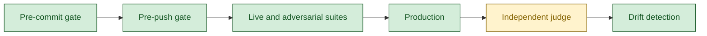

*Figure 9. The testing-and-quality lifecycle from commit-time gate to production-time judge.*

- Pre-commit gate — the local gate triggered by the git pre-commit hook that runs lint, strict type-check, and the fast unit subset; stops broken code at the developer's laptop.
- Pre-push gate — the fuller gate triggered before push that adds integration tests against real infrastructure and the per-phase verifier that writes the auditable evidence report.
- Live and adversarial suites — the per-use-case probes and the adversarial corpus that exercise the model path and verify the dashboard counters move correctly, proving the observability claim alongside the functional claim.
- Production — the live runtime where the quality machinery continues to operate on real traffic rather than only on test corpora.
- Independent judge — the second model that scores each turn FAITHFUL, UNFAITHFUL, or UNCERTAIN in production; live on UC-8 today and sequenced for the other four use cases.
- Drift detection — the comparison of current behaviour against a rolling baseline so slow regressions in latency, refusal rate, or judge verdict become visible before they impact customers.

---

## 10. Performance and capacity engineering

> Latency is engineered per layer, throughput per component, and the first capacity wall is named explicitly.

Warm cache hits return in single-digit milliseconds; cold-path completion is in seconds with a 60-second ceiling enforced at every model call site. The application process is async at every step and stateless between requests, so horizontal scaling adds replicas behind a load balancer without sticky sessions. Multi-step queries fan out concurrently on the orchestration graph rather than running serially. Workers consume from queue groups so adding capacity is a scaling command rather than a code change. The vector index has been hardened for scale by enabling iterative scan with the appropriate index parameters, verified across field-parity tests and adversarial probes.

The first capacity wall at scale is the LLM provider's rate limit, common across the industry. The mitigations — aggressive caching and provider diversification through the single egress — are structural commitments already in place.

| Component | Headroom today |
|---|---|
| Application process | Stateless; horizontally scalable |
| Database | Thousands of tenants on a single instance |
| Vector index | Approximately fifty million chunks across all tenants |
| Cache | Thousands of tenants in memory |
| Message bus | Millions of messages per second |
| LLM gateway | Provider rate limit is the wall |

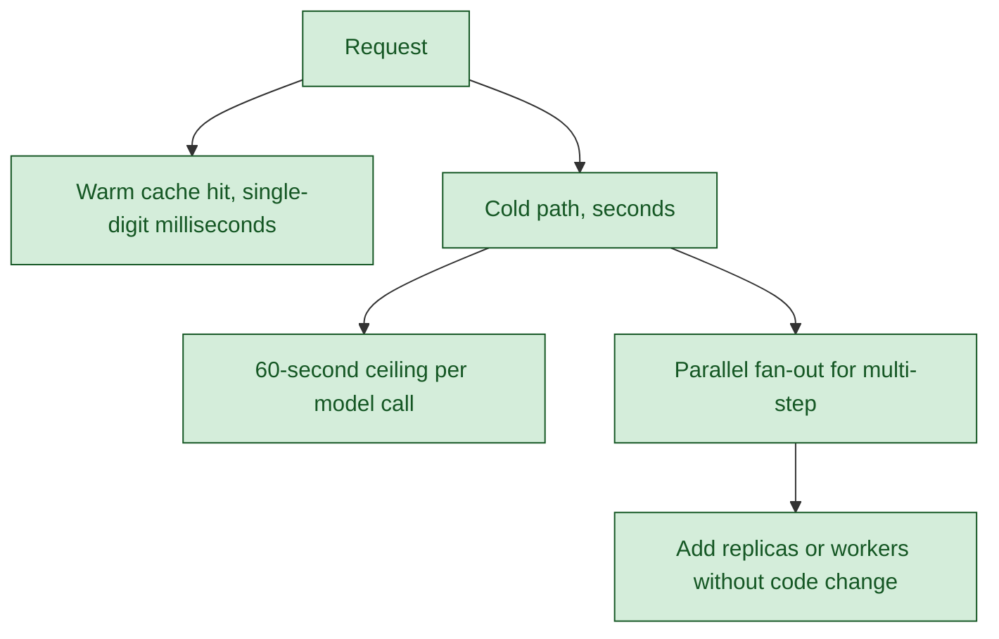

*Figure 10. The performance layers. Warm and cold paths share the same correctness contract; scale adds capacity rather than rewriting code.*

- Request — every HTTP call arriving at the platform edge, identical in shape whether it lands on a warm or cold path.
- Warm cache hit, single-digit milliseconds — the version-keyed cache that returns a prior response without invoking the language model, verified at sub-ten-millisecond latency.
- Cold path, seconds — the full request pipeline through router, policy, retrieval, model, and judge when the cache cannot serve.
- 60-second ceiling per model call — the hard timeout enforced at every model call site so the cold path has a bounded worst case.
- Parallel fan-out for multi-step — the orchestration-graph primitive that runs independent sub-steps of a multi-part query concurrently rather than serially.
- Add replicas or workers without code change — the horizontal scaling lever; the application is stateless between requests, workers consume from queue groups, and adding capacity is a scaling command.

---

## 11. Use case onboarding

> Two paths exist by design. The reference-package pattern works today; OneOps Studio is the future authoring surface. Both produce the same shape of agent manifest in the same registry.

A developer adds a use case today by copying the most recent reference package, declaring the agent in the registry with lifecycle metadata, declaring any new tools, adding route handlers with the principal headers and role allow-list, copying the live end-to-end test pattern, and walking the thirty-item definition-of-done checklist. The per-phase verifier audits each step and writes an auditable green-or-red report.

Studio is the future path. An internal user describes the agent they want in natural language; an LLM compiler picks tools from the existing catalog and validates that the chosen tools exist; an independent judge verifies the tool selection; the manifest is signed and tested against a fixture corpus; activation writes the manifest to the registry with lifecycle state draft until tests pass. The runtime never knows which path was used, because both write the same shape of manifest to the same registry.

| Path | Status |
|---|---|
| Reference-package pattern with per-phase verifier | SHIPPED |
| Definition-of-done checklist | SHIPPED |
| End-to-end test pattern | SHIPPED |
| Scaffolding command-line tool | PLANNED |
| Studio authoring surface | PLANNED |

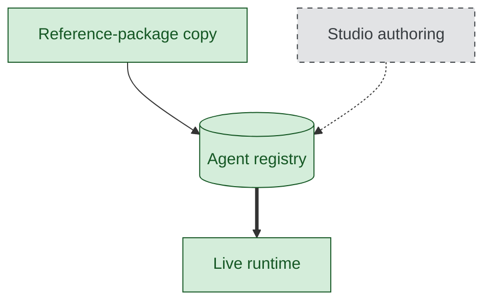

*Figure 11. The two authoring paths converging on a shared registry. The runtime is indifferent to which path produced the manifest.*

- Reference-package copy — the developer-driven path today: copy the most recent use-case package, declare the agent in the registry, copy the live test pattern, and walk the thirty-item definition-of-done checklist.
- Studio authoring — the future authoring surface: an internal user types a natural-language description; an LLM compiler picks tools from the existing catalog; an independent judge verifies the selection; the manifest is signed, tested in a sandbox, and activated.
- Agent registry — the shared contract between authoring and runtime; both paths write the same shape of manifest with active version and lifecycle metadata.
- Live runtime — the existing five-use-case runtime that reads the registry at boot and refuses to route to agents whose state is not active, so half-built agents stay invisible until promoted.

---

## Document reference

Prepared at release reference `pre-demo-2026-06-01` (HEAD `ef16f00`) on 2026-06-01. Factual claims are verifiable against the codebase at that exact reference.
