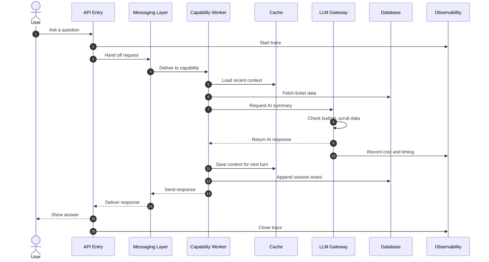

# OneOps Architecture Explanation

## Table of Contents

- [1. Architecture Summary](#1-architecture-summary)
- [2. Component-Level View](#2-component-level-view)
- [3. Component Deep-Dives](#3-component-deep-dives)
- [4. End-to-End Request Flow](#4-end-to-end-request-flow)
- [5. Reliability, Observability and the AI Layer](#5-reliability-observability-and-the-ai-layer)
- [6. What's Next](#6-whats-next)

> **How to read this document.** Throughout, you will see two distinct phrases: *"today the system does X"* and *"the architecture is designed to support Y later."* Always check which one a paragraph is using. The first is shippable. The second is a future capability that the foundation accommodates.

---

## 1. Architecture Summary

OneOps is built like a well-run kitchen.

A customer (the user) places an order (a natural-language question). A **host** at the front (the API entry) takes the order and writes it on a ticket. The ticket goes on a **conveyor belt** (the messaging layer) that delivers it to the right **station** in the kitchen. Each station (a *capability*, like ticket summarization or knowledge lookup) does its specialized work. Stations can call on **specialist tools** (data fetchers, AI calls), can check a **pantry of frequently-used ingredients** (the cache), and can pull from the **stockroom** (the database). Every order is **tasted at the pass** (the governance layer) before it leaves the kitchen, to make sure it is within budget, scrubbed of anything sensitive, and recorded for the books. The whole kitchen has **cameras and timers** (the observability layer) so the head chef can see exactly which station was slow on which order.

When the meal is ready, it goes back down the conveyor belt to the host, who delivers it to the customer.

The same kitchen serves many restaurants at once (multi-tenant) without orders ever crossing.

This metaphor maps cleanly onto the real components:

- **The host** is the public-facing entry that accepts user queries.
- **The conveyor belt** is the messaging layer that lets parts of OneOps talk to each other instantly.
- **The stations** are the use cases (capabilities) — today, Ticket Summarization and Knowledge Lookup.
- **The pantry** is the cache — fast-access storage for recent sessions and frequently-needed data.
- **The stockroom** is the customer's actual ticket and knowledge data, in the database.
- **The pass** is the LLM Gateway — the single checkpoint every AI call goes through for budget, safety, and accounting.
- **The cameras** are the observability layer — every step is traced and timed.

The rest of this document walks through each piece in product terms.

---

## 2. Component-Level View

This table covers every major component PMG needs to know about. Each row labels the component, says what it does in one sentence, explains why it exists, calls out the customer-visible value, and points to where it lives in the code.

| Component | What It Does | Why It Exists | Product Value | Evidence in Codebase |
| --- | --- | --- | --- | --- |
| **API Entry** | Accepts the user's question over a web request and returns the answer | A single, simple front door so any client (web UI, chatbot, partner integration) can talk to OneOps the same way | Easy integration with customer environments | `src/oneops/api/app.py` |
| **Messaging Layer (NATS)** | Carries requests and responses between parts of OneOps with sub-millisecond latency and survives if one part is briefly down | So OneOps can be split across many machines, scale horizontally, and stay responsive under load | Enterprise-grade resilience and scale | `src/oneops/adapters/nats_client.py`, worker modules |
| **Routing** | Decides which capability handles each question | Lets users speak naturally instead of picking a feature from a menu | Conversational user experience | `src/oneops/executor/` routing modules |
| **Use Case: Ticket Summarization** | Answers any question about a ticket (incident, request, problem, change, asset, configuration item) | The most common service-desk task: *"what's going on with this ticket?"* | Core product capability — live in production | `src/oneops/use_cases/uc01_summarization/` |
| **Use Case: Knowledge Lookup** | Searches the knowledge base by meaning and by keyword and returns the right article | Service desks live and die by their knowledge base; users cannot find what they need | Core product capability — live in production | `src/oneops/use_cases/uc03_kb_lookup/` |
| **Use Case: Conversational Fallback** | Handles greetings and politely declines out-of-scope questions | Makes the experience feel natural and trustworthy at the same time | Polish | `src/oneops/use_cases/uc99_*` |
| **LLM Gateway** | The single checkpoint every AI call passes through; enforces budget, scrubs sensitive data, retries on failure, tracks cost | Without one gateway, governance and cost control become impossible to enforce | Critical for enterprise procurement | `src/oneops/llm/gateway.py` |
| **Cache (Dragonfly)** | Holds recent conversation context, common answers, and quick-access data in memory | So OneOps feels instant on repeat questions and follow-ups | Speed and perceived intelligence | `src/oneops/adapters/dragonfly.py`, session modules |
| **Session Store** | Remembers the conversation across turns, including what ticket the user is currently focused on | Lets users say *"who is it assigned to?"* without re-saying the ticket ID | Multi-turn conversation | `src/oneops/session/` |
| **Database (PostgreSQL)** | Stores the customer's tickets, knowledge articles, conversation logs, and the AI's checkpoints | Persistent home for everything that must survive a restart | Data durability and auditability | `migrations/`, `src/oneops/adapters/postgres.py` |
| **Observability (OTEL + Tempo + Prometheus + Grafana)** | Records every step of every request — what happened, how long it took, did it succeed | So we can answer *"why was that slow?"* with evidence, not guesses | Operability story for enterprise | `src/oneops/observability/`, `ops/otel/`, `ops/grafana/` |
| **Agent Worker** | A per-capability background worker that subscribes on the messaging layer and runs the capability's tool handlers end-to-end | Every use-case step (Summarization, Knowledge Lookup) is dispatched to its agent worker over NATS today — the transport for inter-component communication | **Done** for transport. Agent-to-agent autonomy (one agent autonomously dispatching to another) is the roadmap part | `src/oneops/workers/agent_worker.py` |

> Every component above is either **Done** or labeled with its true status. Nothing has been omitted to make the picture look cleaner.

---

## 3. Component Deep-Dives

Each subsection covers one component in seven angles: what it is, why we chose it, its role in OneOps today, the customer-facing benefit, what it enables long-term, its limits, and what happens when something goes wrong.

### 3.1 API Entry

**What it is.** The public-facing web endpoint a client (web UI, chatbot, partner system) sends questions to.

**Why we chose this approach.** A single, simple HTTP entry is the most universally-integrable shape. Any tool that can make a web request can talk to OneOps.

**Role today.** Two endpoints are live: one for general conversational queries, one for fast-path calls when the client already knows which capability to invoke.

**Customer benefit.** Easy to integrate. A customer can put a chatbot in front of OneOps in an afternoon.

**What it enables long-term.** The same entry can host streaming responses, real-time push notifications, and partner-facing webhooks without re-architecture. *That work is planned, not built today.*

**Limits.** The entry validates the request shape but does not authenticate users — authentication is assumed to be handled by the customer's existing identity layer in front of OneOps.

**What happens on failure.** A malformed request returns a structured error immediately. An internal failure returns a safe error response with a trace identifier so support can investigate.

---

### 3.2 Messaging Layer (NATS)

**What it is.** NATS is the system that lets the different parts of OneOps talk to each other instantly and keep working even if one part is briefly down. Think of it as a high-speed conveyor belt between kitchen stations.

**Why we chose it.** When the platform is split across many machines (for scale or resilience), the parts need a way to send work to each other that does not bottleneck on a database and does not lose work if one machine restarts. NATS is purpose-built for exactly this.

**Role today.** Today, the API entry uses NATS to hand each incoming question to a worker that runs the full pipeline. The worker replies on the same channel. This is the live path for every user request.

**Customer benefit.** The system scales horizontally — handling 10x the load is a matter of running more workers, not redesigning the system. It also keeps responding even if one worker is restarted mid-day.

**What it enables long-term.** The same messaging layer is the foundation for *agent-to-agent workflows* — one AI agent dispatching work to another to handle multi-step actions. **The worker code for this is already built; it is not yet wired into the live request path. The foundation is in place; the capability is not active.**

**Limits.** A more durable variant of messaging (where messages persist to disk and survive a full system restart) is available in the same technology and configured on the infrastructure, but is not used by code today. It is ready to switch on when the action use case ships.

**What happens on failure.** If a worker is down, the message waits until one becomes available. If the messaging layer itself has a hiccup, a built-in circuit breaker pauses traffic to the affected route and resumes when it is healthy again.

---

### 3.3 Routing

**What it is.** The logic that decides which capability handles each user question.

**Role today.** Routing is decided by a small chain of focus-aware language-model calls. First a **focus-aware control gate** decides whether the message belongs to the IT/ITSM domain at all — it receives the active record as structured context, so it can distinguish a legitimate follow-up like *"any data on this"* from a genuinely unrelated query like *"how to fix the bluetooth connectivity"* when the same incident is in focus. If the gate refuses, the platform replies politely without dispatching to any capability. Otherwise a **language-model disambiguator** picks between the record-summary capability and the knowledge-lookup capability, again with the active record's identity in the prompt as context. New phrasings are handled by the language models' semantic reasoning, not by keyword lists. Multi-turn references like *"and the linked change"* resolve correctly because the platform tracks the active record as a structured state channel that every routing layer reads from.

**Why this design.** Earlier in the build the routing pipeline had several layers independently re-interpreting the user's intent (a decomposer, a rewriter, a router, agent-level filters). They occasionally disagreed and produced misroutes. Routing authority is now centralized in one place — every upstream layer preserves the user's wording, the router classifies, every downstream layer executes without re-classifying. This is verified end-to-end against ninety-plus regression cases including unseen paraphrases.

**Customer benefit.** Users speak naturally instead of choosing a tool from a menu, and follow-up questions in a multi-turn conversation route the same way whether the user says *"priority"*, *"what's the priority"*, *"and the priority?"*, or *"how important is it"*. A user asking *"status of the linked problem"* gets the linked record's status, with the linked record identifier named in the reply so it is clear which entity answered.

**Limits.** Genuinely ambiguous queries — where the user's wording could reasonably mean two different things — are returned with a polite clarification rather than a guess. The routing decision and the candidate set are visible per-request in the observability layer (see Section 3.8), so any misroute is investigable, not invisible.

---

### 3.4 LLM Gateway

**What it is.** The single checkpoint every AI call in OneOps passes through. *LLM* stands for *Large Language Model* — the AI brain behind the answers. *Gateway* means there is exactly one door in and one door out, and every call goes through it.

**Why we chose this approach.** Without a single gateway, governance, cost control, and data safety would have to be reimplemented in every capability — inconsistent and impossible to audit. With a gateway, every safety and cost rule is enforced in exactly one place.

**Role today.** Every AI call — whether to summarize a ticket, embed a query for search, or generate a clarifying question — flows through this gateway. Before the call, the gateway checks the customer's budget for the day and scrubs any sensitive data from the request. After the call, it records the cost in dollars against that customer's account and surfaces it in the observability layer.

**Customer benefit (and procurement benefit).** When an enterprise customer asks *"how do you control AI spend per customer?"* or *"can you guarantee no PII goes to the model provider?"*, we can answer with evidence, not promises.

**What it enables long-term.** Multi-model routing (using a cheaper model for simple questions and a more capable one for hard questions), automatic failover between providers, and tighter per-team budget controls. The architecture supports all of these; they are *Planned*, not built today.

**Limits.** The gateway adds a small amount of latency to every AI call — measured in milliseconds, well below human perception, and traded happily for the governance guarantee.

**What happens on failure.** If the AI provider has a transient error, the gateway automatically retries with backoff. If the failure persists, the gateway returns a structured error to the calling capability, which then responds to the user with a graceful message and an offer to retry.

---

### 3.5 Cache (Dragonfly)

**What it is.** Dragonfly is a very fast in-memory store. Think of it as the kitchen pantry — frequently-used ingredients live here so the cooks do not have to walk to the stockroom every time.

**Role today.** Five distinct things live in the cache: the recent turns of each user's conversation, summaries of tickets the user just asked about, rate-limit counters for budget enforcement, deduplication markers so the same question asked twice in quick succession is only answered once, and embeddings of common search queries.

**Customer benefit.** The system feels instant. A follow-up like *"and the priority?"* returns in a fraction of a second because everything needed is already in the pantry.

**Limits.** The cache is intentionally not durable on its own — anything that must survive a restart lives in the database. The cache is an accelerator, not a system of record.

**What happens on failure.** If the cache is briefly unavailable, the system continues to work by going to the database directly. It is slower but correct. A warning is logged for operations.

---

### 3.6 Session Store

**What it is.** The memory of each conversation. Every user turn is appended to a per-session log so the system can answer follow-ups in context.

**Role today.** Each session keeps the recent turns in the cache (for speed) and the full history in the database (for durability and audit). When a user says *"who is it assigned to?"*, the session store knows what *it* refers to.

**Customer benefit.** Multi-turn conversation that actually feels like conversation, not a series of disconnected questions.

**Limits.** Sessions expire after a configurable inactivity window. Conversations beyond that window start fresh.

**What it enables long-term.** Per-user profile memory — preferences, frequently-asked-about ticket types, working hours. **The interface is defined; the working storage is Planned.**

---

### 3.7 Database (PostgreSQL)

**What it is.** The durable home for everything that must survive a restart — tickets and knowledge articles (the customer's actual data), conversation event logs, and AI checkpoints.

**Role today.** All persistent state lives here. The schema is versioned and migrated via standard SQL migration files.

**Customer benefit.** Auditability. Every conversation, every AI decision, every cost record can be traced back to a row.

**Limits.** The database is the typical bottleneck in any web system. OneOps mitigates this with the cache layer (so most reads never hit the database) and with proper connection pooling.

**What happens on failure.** If the database is briefly unavailable, the system returns a structured error and the messaging layer holds incoming requests until the database recovers.

---

### 3.8 Observability (OTEL + Tempo + Prometheus + Grafana)

**What it is.** A unified telemetry stack. *OTEL* stands for *OpenTelemetry*, a vendor-neutral standard for emitting traces, metrics, and logs. Tempo stores the traces. Prometheus stores the metrics. Grafana displays both on dashboards.

**Role today.** Every request emits a structured trace: which capability handled it, how long each step took, did the AI call succeed, how much did it cost. The trace is granular at the routing layer — each routing stage (focus-state update, focus-aware control gate, decompose, rewrite, retrieve, filter, language-model disambiguator) is its own span with attributes like *which records survived as candidates*, *what the control gate decided*, *which agent the disambiguator selected*, and *the model's confidence*. When a misroute is reported, the entire decision path is visible in a single trace in Grafana, with the language-model reasoning visible at each layer. Sensitive content (the actual question text) is never put into traces by default — only hashes and lengths, so we can correlate without leaking.

**Customer benefit.** When a customer says *"this query was slow yesterday at 3pm,"* the platform can show exactly which step took how long, on which request. No guessing.

**What it enables long-term.** Customer-facing usage dashboards (so the customer can see their own usage and cost), proactive alerting (so we catch degradations before the customer does), and SLA monitoring.

**Limits.** Dashboards exist as foundations; customer-facing dashboard polish is planned, not built today.

---

### 3.9 Agent Worker — Live transport, autonomy on the roadmap

**What it is.** A per-capability background worker that subscribes on its own NATS subject (`oneops.agent.<capability_id>`) and runs the capability's tool handlers end-to-end. There is one agent worker per use case — one for Summarization, one for Knowledge Lookup — and the platform is designed to scale that fleet out as new capabilities ship.

**Role today.** **Live for every request.** Every use-case step in OneOps is dispatched over NATS to the appropriate agent worker. A request like *"summarize INC0001001"* travels: API → NATS → graph worker → NATS → Summarization agent worker → result back the same way. Both NATS hops are visible in the observability layer with end-to-end trace propagation. This is the production transport for inter-component communication today.

**Customer benefit.** The system is structurally horizontal — adding capabilities does not mean editing a central dispatcher, it means running another agent worker that subscribes on its own subject. Capabilities can be scaled independently, restarted independently, and observed independently.

**What is not yet active.** The **autonomy** layer — the pattern where one agent, mid-workflow, decides on its own to dispatch the next step to a *different* agent (e.g. *"open a change for this incident and notify the on-call"* triggering the Summarization agent → the Action agent → the Notify agent without the user re-asking). The transport carries this pattern natively; what is missing is the orchestration logic and the action capability that would consume the dispatched work. Activation depends on the action use case shipping.

**Why this matters.** When PMG hears *"agent worker built, not active"* the impression is *"the messaging plumbing is dormant."* The opposite is true — the plumbing handles every request. The pending piece is one specific use of that plumbing: autonomous mid-workflow hand-off between agents.

---

## 4. End-to-End Request Flow

The diagram below shows what happens when a user asks *"summarize INC0001234."* Read it top to bottom; the numbered annotations beneath explain each step in plain language.

*Diagram: One full round-trip of a user question through the OneOps platform.*

**What is happening, step by step:**

1. The user types a question into a client (web UI, chatbot, partner integration).
2. The API entry receives it and starts a trace — every step from here is recorded.
3. The request is handed to the messaging layer.
4. A capability worker (the right one for this type of question) picks it up.
5. The worker checks the cache for the user's recent conversation context.
6. The worker fetches the relevant ticket data from the database, applying the user's permissions.
7. The worker asks the LLM Gateway for an AI-generated summary.
8. The gateway checks the customer's budget, scrubs sensitive data, then calls the AI provider.
9. The AI response comes back to the worker.
10. The gateway records the cost and timing in the observability layer.
11. The worker saves the updated context to the cache so the next follow-up is fast.
12. The worker appends a record of this turn to the durable session log in the database.
13. The worker sends the response back through the messaging layer.
14. The messaging layer delivers it to the API entry.
15. The API entry returns the answer to the user.
16. The trace closes; the full request, with every step's timing, is now searchable in the observability layer.

**For PMG.** Steps 8 and 10 are why enterprises trust the platform — every AI call has a budget check, a data scrub, and a cost record. Steps 5 and 11 are why follow-ups feel instant. Step 6 is where the customer's own permissions are enforced — no user ever sees data they should not see.

> Per-use-case flow walkthroughs (one diagram per capability) live in [Document 3 — Use Case Deep-Dives](./03-use-case-deep-dives.md).

---

## 5. Reliability, Observability and the AI Layer

This section answers the three questions enterprise buyers always ask: *Does it stay up? Can we see what it is doing? How is the AI controlled?*

**Does it stay up.** Every cross-component call has a defined timeout. Transient failures are retried automatically with backoff. The messaging layer has a circuit breaker per route — if one capability is unhealthy, traffic to it is paused until it recovers, instead of cascading failures across the rest of the platform. The cache layer fails open (slower but correct) instead of failing closed (down). The database has a properly bounded connection pool. None of these are aspirational — they are how the system already works.

**Can we see what it is doing.** Yes. Every request emits a structured trace covering every step. Every AI call records cost and tokens. Every cache hit and miss is counted. Every error carries a trace identifier the customer can give support, who can then pull the full picture in seconds. Dashboards exist for latency, error rate, AI cost, and per-customer usage.

**How is the AI controlled.** Three layers:

- **Budget control** — every customer has a daily AI spend limit, enforced before the call is made.
- **Data safety** — every prompt is automatically scrubbed of sensitive patterns before it leaves the platform.
- **Output safety** — the AI is never trusted to invent data. The system grounds every answer in retrieved facts and refuses to answer when it does not have grounding. (*"I don't have information on that ticket"* is a feature, not a bug.)

Each of these is enforced in the LLM Gateway — one place, one rule set, no exceptions.

---

## 6. What's Next

The architecture implies a natural roadmap, not a wishlist.

**Near-term (next live capability).** Take action on tickets — close, assign, update. This activates the agent-to-agent autonomy layer (the agent-worker transport is already live) and unlocks the multi-step workflows below.

**Medium-term.** Multi-step workflows where one user request triggers a coordinated sequence (*"open a change for this incident and notify the on-call"*). Foundation is built; activation depends on the action capability shipping.

**Medium-term.** User profile memory — preferences, working hours, frequently-asked-about ticket types. Interface defined; storage to be built.

**Longer-term.** Customer-facing usage and cost dashboards; multi-model routing for cost optimization; richer SLA monitoring.

> Every item above is *enabled by the current architecture without a re-platform*. That is the most important architectural validation point: nothing on the roadmap requires us to rebuild what we have.

---
