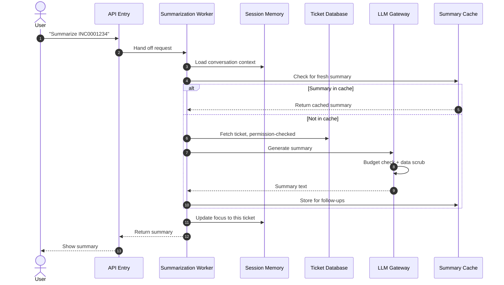
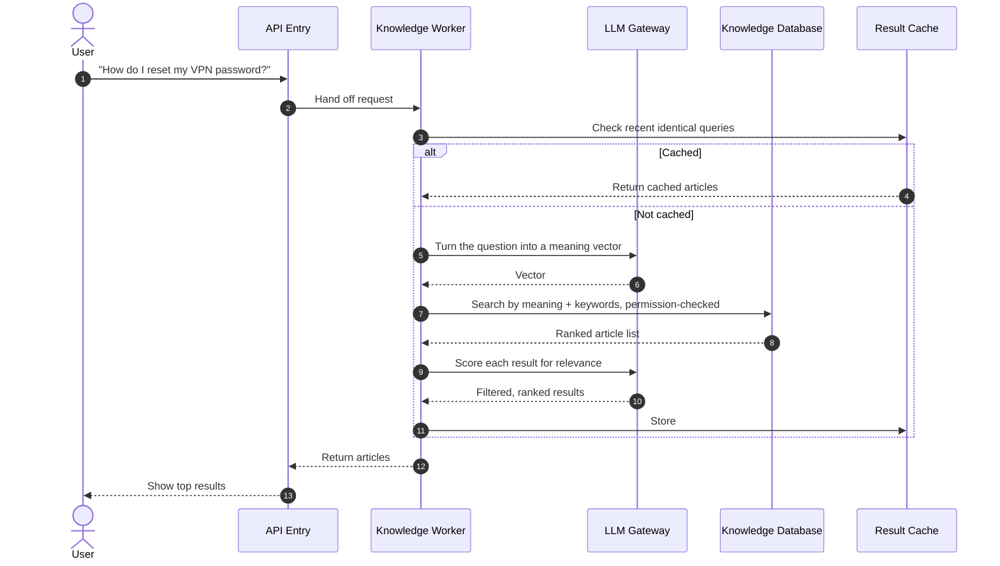

# OneOps Use Case Deep-Dives

## Table of Contents

- [How to read this document](#how-to-read-this-document)
- [Use Case 1 — Ticket Summarization](#use-case-1--ticket-summarization)
- [Use Case 2 — Knowledge Lookup](#use-case-2--knowledge-lookup)
- [Use Case 3 — Conversational Fallback](#use-case-3--conversational-fallback)
- [Multi-Turn Conversation Capability](#multi-turn-conversation-capability)
- [Planned — Take Action on a Ticket](#planned--take-action-on-a-ticket)
- [Planned — Multi-Step Agent Workflows](#planned--multi-step-agent-workflows)

> **How to read this document.** Each use case is presented in the same shape: name, customer problem, trigger, step-by-step flow with a diagram, output, status, demo notes, and the questions PMG should answer to validate it. Anywhere a section is labeled **Planned**, the working code does not exist yet.

---

## Use Case 1 — Ticket Summarization

**Status: Done. Demo-ready.**

### Customer problem

A service desk agent opens a ticket and needs to understand it fast — what happened, who is involved, what is the priority, what was the last update. Today, they read through screens of fields and history notes. Multiply by fifty tickets a day and the cost is enormous.

OneOps replaces that with one sentence: *"summarize INC0001234."*

### Business objective

Cut the time-to-context on any ticket from minutes to seconds. Make every follow-up question (priority, assignee, history, linked records) one short reply away, in the same conversation.

### Trigger and input

The user types a question that names a ticket, either explicitly (*"summarize INC0001234"*, *"show me REQ0002007"*) or implicitly through follow-up (*"who is it assigned to?"* after a previous turn).

The system accepts a wide range of input shapes — uppercase, lowercase, with or without spaces, with or without a verb, embedded in a sentence, multiple IDs in one message — and asks for clarification only when the request is genuinely ambiguous.

### Step-by-step flow



*Diagram: How a ticket summarization request flows through OneOps.*

**Plain-language steps:**

1. The user asks about a ticket by ID.
2. The summarization worker checks the conversation memory to understand the context.
3. The worker checks the cache — if this ticket was just summarized, the saved summary is returned instantly.
4. If not cached, the worker pulls the ticket from the database, respecting the user's permissions.
5. The worker asks the LLM Gateway to produce a clean summary.
6. The gateway checks the customer's budget and scrubs sensitive data, then calls the AI.
7. The summary is returned, cached for the next follow-up, and the conversation memory is updated so *"and the priority?"* will know what *it* refers to.
8. The user sees the summary.

### Components involved

- API Entry (receives the question)
- Messaging Layer (carries the request to the worker)
- Summarization Worker (runs the flow)
- Session Memory (loads context, updates focus)
- Cache (fast summary reuse)
- Database (the source of truth for ticket data)
- LLM Gateway (governance + the AI call)
- Observability (records every step's timing)

### Output

A structured summary covering the ticket's status, priority, assignee, recent activity, and linked records. Follow-up questions return precise field values without re-summarizing.

### Demo readiness

Demo-ready. The capability handles single-turn summaries, follow-up field reads (*"and the priority?"*), entity switches (*"now show me REQ0002007"*), comparison queries (*"compare INC0001234 with INC0001999"*), and graceful clarification when the request is ambiguous.

### PMG validation questions

1. Are the ticket types we support (incidents, requests, problems, changes, assets, configuration items) the right priority order for customers?
2. Are the follow-up patterns we support (field reads, entity switches, linked-record hops, comparisons) the ones customers actually use?
3. When the system asks for clarification (*"which ticket?"*), is the wording right?
4. Is *summary* the right default response shape, or do customers expect a specific format (bullet points, a structured card, a timeline view)?

### Product risks

- Customer data quality varies. A poorly-maintained ticket produces a poor summary. The system flags missing data honestly rather than inventing.
- A summary is only as fresh as the underlying ticket. Caching is short-lived (minutes), but a ticket updated in the last second may show as stale on the next query.

---

## Use Case 2 — Knowledge Lookup

**Status: Done. Demo-ready.**

### Customer problem

The customer's knowledge base contains the answer the user needs — but search tools rely on exact keywords, and users rarely type exact keywords. The result is that knowledge articles go unread, the same incidents recur, and service desks repeat work.

OneOps replaces keyword-only search with meaning-based search. A user can ask *"how do I reset my VPN password?"* even if the article is titled *"Network credential recovery procedure."*

### Business objective

Make the knowledge base actually used. Reduce ticket volume by letting users (and agents) find the right article on the first try.

### Trigger and input

A natural-language question that does not reference a specific ticket, OR a follow-up that asks for documentation about the record currently in focus. Examples:

- *"how do I reset my VPN password?"*
- *"what to do when the printer on floor 3 won't print"*
- *"show me KB0005001"* (direct article fetch by ID)
- *"find KB for INC0001234"* (knowledge articles related to a specific ticket)
- *"any data in kb related to this"* mid-conversation about an incident (the platform uses the focused record's title as the relevance signal)

### Relevance gating

Knowledge articles linked to a ticket can be tagged broadly in source data, which means a tag-based lookup occasionally returns articles that are technically linked but topically unrelated. The platform applies a **semantic relevance gate** between the database lookup and the response composer: each candidate article is scored against the focused record's title and the user's query in embedding space, and articles below the configured cosine floor (default 0.50, environment-configurable) are dropped before the user sees them. The gate uses the same embedding scorer that powers the meaning-based search path, so calibration is shared. Per-candidate scores are logged for empirical recalibration; the gate fails open if the embedding service is unreachable, so a vendor outage never blocks legitimate answers.

### Step-by-step flow



*Diagram: How a knowledge lookup request flows through OneOps.*

**Plain-language steps:**

1. The user asks a natural-language question.
2. The knowledge worker checks the cache for an identical recent query.
3. If not cached, the worker asks the LLM Gateway to convert the user's question into a "meaning vector" — a numerical fingerprint of what the question is about.
4. The worker searches the knowledge database by both meaning and keywords, returning the highest-ranked candidates the user has permission to see.
5. The worker passes the candidates back through the LLM Gateway for a final relevance check — does this article actually answer the user's question?
6. The filtered results are cached and returned.
7. The user sees the top relevant articles, with a clear *"no matching articles"* message when nothing fits.

### Components involved

- API Entry
- Messaging Layer
- Knowledge Worker
- LLM Gateway (for embedding and relevance scoring)
- Database (knowledge articles with semantic search)
- Cache
- Observability

### Output

A ranked list of relevant knowledge articles, each with title and excerpt. Users can then ask *"open the first one"* or *"show me KB0005001"* to fetch the full article.

### Demo readiness

Demo-ready. The capability handles meaning-based search, direct fetch by article ID, ticket-context search (*"find KB for INC0001234"*), follow-up actions (*"open the first one"*), and honest *"no matching articles"* responses when the knowledge base has no good answer.

### PMG validation questions

1. For customers with large knowledge bases (tens of thousands of articles), is meaning-based search the most valued capability, or do they expect filters (by category, owner, age)?
2. When no good match exists, the system says so plainly rather than returning weak matches. Is this the right behavior, or do customers prefer to see weak matches with low-confidence flags?
3. Is the return format (ranked list with excerpts) right, or do customers expect a synthesized answer drawn from multiple articles?

### Product risks

- Knowledge base quality varies enormously between customers. The system reflects the quality of the source data; it does not improve a poorly-maintained knowledge base.
- A meaning-based search inherently ranks; the top result is not always the user's choice. The system surfaces multiple candidates rather than committing to one.

---

## Use Case 3 — Conversational Fallback

**Status: Done. Demo-ready.**

### Customer problem

Users will inevitably say *"hi"*, *"thanks"*, *"what's the weather?"*, or *"tell me a joke."* A system that does not handle these gracefully feels broken. A system that tries too hard to be friendly with non-ITSM topics feels untrustworthy.

OneOps takes a middle path: greet politely with one line, then offer ITSM help; for genuinely off-scope questions, decline cleanly and redirect.

### Customer-visible behavior

| User says | OneOps responds |
| --- | --- |
| *"hi"* | One-line greeting plus an offer to help with ITSM work. |
| *"thanks"* | Brief acknowledgement plus a check for follow-up needs. |
| *"what's the weather?"* | *"You are asking questions that are out of my scope. Please ask your questions within the ITSM/ITOM domain."* |
| *"tell me a joke"* | Same out-of-scope decline. |
| *"who is the CEO of Google?"* | Same out-of-scope decline. |

### Why it matters

This is a trust capability. By declining off-scope cleanly, OneOps signals to the customer that the system has a defined remit and will not hallucinate answers outside it. It pairs with the data-grounding behavior in the other use cases — both are evidence that the system knows what it does and does not know.

### Demo notes

Include one off-scope question in every demo. It is short and it lands the trust message that *the system is bounded, not magical*.

### PMG validation questions

1. Is the decline wording right? Is it too formal, too casual, too long, too short?
2. Are greetings the right place to brand the product (*"Hi, I'm OneOps, your ITSM assistant"*) or should the response stay neutral?
3. Some customers may want OneOps to handle adjacent topics (general IT troubleshooting, light HR questions). Is that a future capability, or should the scope stay tightly ITSM?

---

## Multi-Turn Conversation Capability

**Status: Done. Live across all use cases above.**

Multi-turn conversation is not a separate use case — it is a capability that wraps all of them. It is worth its own section because it is the single biggest differentiator from screen-based ITSM tools.

### What it means in practice

After a user has asked about a ticket or a knowledge article, they can refer back to it without re-typing the ID.

**Example conversation:**

```
User: summarize INC0001234
OneOps: [summary]
User: who is it assigned to?
OneOps: [assignee name]
User: what's its priority?
OneOps: [priority]
User: any related knowledge articles?
OneOps: [list of KB articles for this ticket]
User: open the first one
OneOps: [full article]
```

Each turn knows the context from the previous turns. The user never re-types *"about INC0001234."*

### Patterns supported today

| Pattern | Example |
| --- | --- |
| Follow-up field reads | *"and the priority?"*, *"who is the caller?"*, *"when was it created?"* |
| Entity switches | *"now show me REQ0002007"*, *"what about INC0001999?"* |
| Linked-record hops | *"and the linked change"*, *"the parent problem"*, *"the configuration item"* |
| Cross-capability hops | *"summarize INC0001234"* → *"any KB articles for it?"* → *"open the first one"* |
| Comparative queries | *"compare INC0001234 with INC0001999"* |
| Ordinal picks after clarification | *"first"* / *"the second one"* / *"REQ0002007"* in response to a clarifying question |
| Multiple sub-questions in one message | *"who is assigned INC0001234 and what's its priority?"* |

### What happens when context goes stale

If a user has a long unrelated conversation in between, the system gates references to the older context. The user gets a polite clarification (*"which ticket?"*) rather than a wrong-context answer.

### PMG validation questions

1. Is the depth of follow-up context (how many turns we remember) right for customer workflows? Service desk shifts can be long.
2. Are the patterns above the ones customers actually use, or are there common patterns we have missed?
3. How should we present multi-turn conversation in marketing — as a differentiator, as table stakes, or both?

---

## Planned — Take Action on a Ticket

**Status: Planned. Designed; no working code yet. Foundation in place.**

### Customer problem

Reading and answering is half the value. The other half is doing — closing a ticket, assigning it, updating a field, creating a related record, notifying a stakeholder. Today, OneOps reads but does not act.

### Intended capability

Users will be able to say:

- *"close INC0001234 with resolution code: user education"*
- *"assign REQ0002007 to the network team"*
- *"create a change request from INC0001234"*
- *"notify the on-call about INC0001234"*

Each action will respect the user's permissions, write to the customer's ITSM system through approved interfaces, and produce an auditable record.

### What is built today

The framework that recognizes action requests and routes them is in place. The agent-worker transport — per-capability NATS subscribers that run each capability's tool handlers — is already live and carrying every request today. What is missing for the action capability are (a) the action handlers themselves (close, assign, update, create) and (b) the orchestration that lets the action agent execute write operations under approval gates.

### What needs to happen before it ships

1. Finalize the action-execution design, including approval gates for high-risk actions.
2. Build the action handlers per ticket type and register them on a new agent worker.
3. Integration-test against the customer's ITSM system.

### PMG validation questions

1. Which actions are highest priority? Close? Assign? Update?
2. Should every action require explicit user confirmation, or should low-risk actions execute on first ask?
3. How should OneOps surface actions that are blocked by the customer's permission model (*"you cannot close this ticket — only the assignee can"*)?

---

## Planned — Multi-Step Agent Workflows

**Status: Planned. Transport already live (messaging layer + per-UC agent workers carrying every request today); the agent-to-agent autonomy layer is the pending piece.**

### Customer problem

A real ITSM task often spans multiple steps: *"open a change request for this incident, link them, and notify the on-call."* In a screen-based tool, that is a five-minute click-fest. Even with single-step action capability, the user would have to issue three separate commands.

### Intended capability

One user request triggers a coordinated sequence handled by multiple AI agents collaborating through the messaging layer. The user sees one coherent response; under the hood, the summarization agent, the action agent, and the notification agent each played their part.

### What is built today

The transport for agent-to-agent dispatch is live — every use-case step is already published over NATS to the appropriate per-UC agent worker today. The orchestration logic that lets one agent autonomously decide mid-workflow to dispatch the next step to a *different* agent is designed, not built; that is the autonomy layer.

### What needs to happen before it ships

1. The single-step action capability must ship first.
2. Build the orchestration logic for autonomous agent-to-agent hand-off (the transport beneath it is already in production).
3. Define the user experience for partial failures (one step succeeds, another fails — how is that surfaced?).

### PMG validation questions

1. Which multi-step workflows are most valuable to customers? Incident-to-change is one obvious candidate. What others?
2. How transparent should the multi-agent collaboration be to the user? Should they see *"step 2 of 3"*, or just the final result?
3. What is the right cost model for a multi-step request that calls the AI three or four times? Per-step? Per-workflow?

---
