# OneOps Detailed Architecture — A Narrated Walkthrough

## Table of Contents

- [1. The Architectural Ideology](#1-the-architectural-ideology)
- [2. The Big Picture](#2-the-big-picture)
- [3. The Architecture in Layers](#3-the-architecture-in-layers)
  - [3.1 Interface Layer](#31-interface-layer)
  - [3.2 Messaging and Eventing Layer](#32-messaging-and-eventing-layer)
  - [3.3 Orchestration Layer](#33-orchestration-layer)
  - [3.4 Capability Layer](#34-capability-layer)
  - [3.5 AI Governance Layer](#35-ai-governance-layer)
  - [3.6 State, Caching and Memory Layer](#36-state-caching-and-memory-layer)
  - [3.7 Persistence Layer](#37-persistence-layer)
  - [3.8 Observability Layer](#38-observability-layer)
- [4. How It All Moves — End-to-End Flow](#4-how-it-all-moves--end-to-end-flow)
- [5. Why It's Built This Way — Key Design Decisions](#5-why-its-built-this-way--key-design-decisions)
- [6. How It Holds Up — Resilience, Scale and Observability](#6-how-it-holds-up--resilience-scale-and-observability)
- [7. Where It's Headed](#7-where-its-headed)

> **How to use this document.** Each section follows the same shape: a diagram (or principle), a written walkthrough beneath it, and a short *Talking point* call-out you can use as a speaker note when narrating live.

---

## 1. The Architectural Ideology

OneOps is not a stack of components glued together. It is the expression of a specific belief about how an AI-native enterprise product should be built. Before walking through any diagram, it is worth stating that belief plainly — because every component choice that follows is downstream of it.

The belief has five parts.

### 1.1 The parts of the system should not depend on each other being awake

Most enterprise software is built as a chain of direct phone calls. *Service A picks up the phone and calls Service B.* If B is down, A waits, fails, retries, or crashes. If B is slow, A is slow. If B is being upgraded, A breaks. This makes large systems brittle in proportion to how many parts they have.

OneOps is built event-driven. Parts of the system do not call each other directly. They drop messages onto a shared, in-memory delivery layer (the messaging bus), and other parts pick them up when they are ready. If one part is briefly down, the messages wait. If one part is slow, the others keep moving. If a part is being upgraded, traffic flows around it.

The product effect: OneOps stays responsive under load and during partial outages. The same property is what lets the system scale horizontally — add more workers, and the messaging layer fans the work out automatically.

### 1.2 Every AI call must pass through one door

The most consequential decision in an AI-native product is *where the AI call happens*. If every capability does its own AI call, then every capability has its own copy of the budget logic, its own copy of the data-scrubbing logic, its own retry policy, its own cost accounting. That copy-paste sprawl makes governance impossible in a year and impossible to audit in a quarter.

OneOps has one door for every AI call: the AI Gateway. Every model invocation — from any capability, for any purpose — goes through it. The gateway enforces the per-customer budget, scrubs sensitive data, retries transient failures, and records the cost in dollars before returning the answer.

The product effect: when an enterprise procurement team asks *"how do you control AI spend per customer?"* or *"prove no PII leaves the system,"* the answer is *one component, audited once, governs every call.* That is the difference between an AI product an enterprise will buy and one it will not.

### 1.3 Observability is a feature, not a debugging tool

In most systems, observability is added late, by a different team, with whatever spare time is available. The result is logs no one reads, metrics that do not match the dashboards, and traces that stop halfway through a request.

OneOps treats observability as a customer-visible feature. Every request, every step, every AI call emits structured telemetry from day one. Every step has a trace, a timing, an outcome. Sensitive content is never captured — only hashes and lengths — so privacy is preserved without losing the operational picture.

The product effect: when a customer says *"this was slow yesterday at 3pm,"* the platform can show exactly which step took how long, on which request, for which user. That is the difference between an operations team that knows and one that guesses.

### 1.4 Caching is structural, not opportunistic

Most systems cache as an afterthought, in scattered places, with inconsistent rules. OneOps treats caching as a layer with a defined role. Recent conversation context lives in the cache. Frequently-asked summaries live in the cache. Rate-limit counters live in the cache. The cache is the difference between a follow-up question feeling instant and feeling laggy.

The product effect: multi-turn conversation that feels like conversation, not like a series of disconnected questions.

### 1.5 The architecture must be ready for the second use case, the tenth, the hundredth

The temptation, when building the first two capabilities, is to optimize the system around them. OneOps does the opposite. Every architectural choice has been evaluated against the question *"will this still work when there are a hundred capabilities, not two?"* Routing, the AI gateway, the messaging layer, the observability layer, the cache strategy — each is designed once, correctly, so that adding the third or thirtieth capability is a matter of writing the capability, not re-architecting the platform.

The product effect: the roadmap is bounded by *what to build*, not by *what would have to be rebuilt to enable it*. That is the most important architectural validation point for PMG: nothing on the roadmap requires us to re-platform what already works.

> **Talking point:** *"OneOps is event-driven because it has to stay responsive under load. It has one AI door because that is how we make enterprise governance real. It is observable from day one because customers will ask why something was slow. Everything else — every component, every choice you'll see in the diagrams — is downstream of those five beliefs."*

---

## 2. The Big Picture

This is the anchor diagram for the entire presentation. Everything in Sections 3 through 7 zooms into one piece of this picture.

```mermaid
flowchart LR
    subgraph CLIENT[Client]
        U[User or Client App]
    end

    subgraph INTERFACE[Interface Layer]
        API[API Gateway]
    end

    subgraph MSG[Messaging Layer]
        BUS[Messaging Bus NATS]
        CB[Circuit Breaker]
    end

    subgraph ORCH[Orchestration Layer]
        GW[Graph Worker]
        EX[Workflow Executor LangGraph]
        AW[Agent Worker - Live transport, autonomy pending]
    end

    subgraph CAP[Capability Layer]
        UC1[Ticket Summarization]
        UC3[Knowledge Lookup]
        UC99[Conversational Fallback]
    end

    subgraph AI[AI Governance Layer]
        GATE[AI Gateway]
        PROXY[Model Proxy LiteLLM]
        MODEL[(External LLM Provider)]
    end

    subgraph MEM[State and Memory Layer]
        CACHE[Cache Layer Dragonfly]
        SESS[Session Store]
    end

    subgraph STORE[Persistence Layer]
        DB[(Application Database PostgreSQL)]
        VEC[(Vector Index pgvector)]
    end

    subgraph OBS[Observability Layer]
        OTEL[Telemetry Collector OTEL]
        TEMPO[(Trace Store Tempo)]
        PROM[(Metric Store Prometheus)]
        GRAF[Dashboards Grafana]
    end

    U -- "sends user question over HTTPS" --> API
    API -- "publishes request event" --> BUS
    BUS -- "delivers request to worker" --> GW
    GW -- "drives workflow" --> EX
    EX -- "invokes capability" --> UC1
    EX -- "invokes capability" --> UC3
    EX -- "invokes capability" --> UC99

    UC1 -- "reads and writes context" --> SESS
    UC3 -- "reads and writes context" --> SESS
    SESS -- "hot recent data" --> CACHE
    SESS -- "durable event log" --> DB

    UC1 -- "fetches ticket data" --> DB
    UC3 -- "searches knowledge" --> VEC

    UC1 -- "requests AI call" --> GATE
    UC3 -- "requests embedding or answer" --> GATE
    GATE -- "forwards governed call" --> PROXY
    PROXY -- "calls provider" --> MODEL
    MODEL -- "returns completion" --> PROXY
    PROXY -- "returns response" --> GATE
    GATE -- "returns AI result" --> UC1
    GATE -- "returns AI result" --> UC3

    EX -- "publishes response event" --> BUS
    BUS -- "delivers reply" --> API
    API -- "returns answer over HTTPS" --> U

    BUS -. "guarded by" .- CB
    EX -. "dispatches agent step - future path" .-> AW
    AW -. "reads and writes data - future path" .-> DB

    API -- "emits traces and metrics" --> OTEL
    BUS -- "emits traces and metrics" --> OTEL
    EX -- "emits traces and metrics" --> OTEL
    GATE -- "emits cost and traces" --> OTEL
    CACHE -- "emits hit and miss metrics" --> OTEL
    DB -- "emits query metrics" --> OTEL
    OTEL -- "stores traces" --> TEMPO
    OTEL -- "stores metrics" --> PROM
    TEMPO -- "feeds" --> GRAF
    PROM -- "feeds" --> GRAF
```

*Diagram: The complete OneOps architecture — every layer, every major element, every connection.*

### Tour of the diagram, block by block

**Client.** On the far left, the user (a service-desk agent, an end user, or a client application acting on their behalf) sends a natural-language question over a standard secure web request.

**Interface Layer — API Gateway.** The single front door. It validates the request shape, attaches identity and tenant context, and starts the observability trace that will follow the request all the way through. It does not run any business logic itself; its job is to receive cleanly and dispatch correctly.

**Messaging Layer — Messaging Bus (NATS) and Circuit Breaker.** Instead of the API calling a worker directly, it publishes the request as an event onto the messaging bus. A worker picks it up. This is the *event-driven* discipline from Section 1.1. The circuit breaker sits alongside the bus and pauses traffic to any route that becomes unhealthy, so one slow component never drags the rest down.

**Orchestration Layer — Graph Worker, Workflow Executor, Agent Worker.** The graph worker is the consumer that picks up incoming requests from the bus. It hands them to the workflow executor, which is the brain that decides what steps to run, in what order, with what context. The agent workers are per-capability subscribers on the bus that run each capability's tool handlers end-to-end — they are live for every request today, carrying inter-component messaging between the executor and the use cases. The dotted edges in the diagram mark the **autonomy** pattern (one agent autonomously dispatching the next step to a different agent) — that orchestration layer is the part not yet wired.

**Capability Layer — Ticket Summarization, Knowledge Lookup, Conversational Fallback.** These are the actual customer-facing capabilities. Each is a self-contained module the executor invokes. New capabilities slot in here without changing anything to their left.

**AI Governance Layer — AI Gateway, Model Proxy, External LLM Provider.** Any capability that needs the AI calls the gateway. The gateway checks budget, scrubs sensitive data, then forwards the governed call through the model proxy to the external model provider. The response comes back through the same path, with cost and timing recorded on the way out.

**State and Memory Layer — Cache Layer (Dragonfly), Session Store.** The session store is the conceptual *memory of the conversation*. Recent turns live in the cache for speed; the full history lives in the durable store for audit. Capabilities read and write context through the session store without caring which layer satisfies the read.

**Persistence Layer — Application Database (PostgreSQL), Vector Index (pgvector).** The durable home for everything that must survive a restart: tickets, knowledge articles, conversation event logs, AI workflow checkpoints. The vector index is the meaning-based search index for knowledge articles.

**Observability Layer — Telemetry Collector (OTEL), Trace Store (Tempo), Metric Store (Prometheus), Dashboards (Grafana).** Every other layer emits structured telemetry into the collector. Traces go to Tempo. Metrics go to Prometheus. Grafana reads both to render the dashboards that an operations team — or a customer — looks at.

**The path of one request.** Read the diagram left to right along the bold arrows: a question enters at the user, flows through the API into the messaging bus, is picked up by the orchestration layer, dispatched to a capability, which reads context from the session store, fetches data from the database, asks the AI gateway for an answer, then returns the response back through the messaging bus to the API and out to the user. Telemetry flows downward into the observability layer at every step.

> **Talking point:** *"This is the whole platform on one screen. Every box has a job. Every arrow has a label. Notice that the AI gateway is in the middle — every AI call passes through it. Notice that the messaging bus sits between the front door and everything else — the front door does not call workers directly. Notice that the observability layer reads from every other layer. The rest of this document is a zoom into each of these layers."*

---

## 3. The Architecture in Layers

Each subsection below zooms into one layer of the big picture, shows its internal block diagram, and explains how it connects to its neighbors.

---

### 3.1 Interface Layer

```mermaid
flowchart LR
    subgraph CLIENT[Client]
        U[User or Client App]
    end

    subgraph INTERFACE[Interface Layer]
        ROUTES[HTTP Routes]
        VALID[Request Validator]
        AUTH[Identity and Tenant Context]
        TRACE[Trace Initiator]
        DISPATCH[Event Publisher]
    end

    subgraph DOWN[To Messaging Layer]
        BUS[Messaging Bus]
    end

    U -- "sends user question over HTTPS" --> ROUTES
    ROUTES -- "passes raw request" --> VALID
    VALID -- "passes validated request" --> AUTH
    AUTH -- "attaches identity and tenant" --> TRACE
    TRACE -- "opens trace context" --> DISPATCH
    DISPATCH -- "publishes request event" --> BUS
    BUS -- "returns final answer" --> ROUTES
    ROUTES -- "responds over HTTPS" --> U
```

*Diagram: The Interface Layer — every request enters and exits the platform here.*

**What it is.** The single web-facing entry to OneOps. Every external request — whether from a web UI, a chatbot, or a partner integration — arrives here and leaves here.

**Design intent.** Keep the front door dumb on purpose. The interface layer does not run business logic. It validates, identifies, traces, and dispatches. By keeping it narrow, the same interface can serve many client types without conditional sprawl, and the system stays testable because the business logic lives behind the bus, not behind the HTTP route.

**What it contains.** A small set of HTTP routes (one for general conversational queries, one for fast-path direct calls when the client already knows which capability to invoke), a request validator, an identity-and-tenant context attacher (so every downstream component knows who the request belongs to), a trace initiator (so observability begins at the door), and an event publisher that hands the request to the messaging bus.

**How it connects.** Upward to the client over HTTPS. Downward to the messaging bus by publishing an event. It never talks directly to a worker, a capability, or a database — that is the whole point.

**What it means for the product.** Any client that can make a web request can integrate with OneOps in an afternoon. The interface stays stable as capabilities behind it change.

> **Talking point:** *"The front door doesn't do work. It identifies you, tags your request, and drops it on the bus. That looks simple, but it is the reason we can swap out anything behind it without breaking client integrations."*

---

### 3.2 Messaging and Eventing Layer

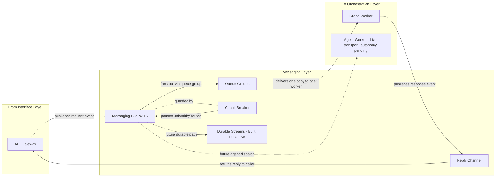

*Diagram: The Messaging Layer — how parts of OneOps hand work to each other.*

**What it is.** The in-memory message bus that carries every request and response inside OneOps. *NATS* is the underlying technology — chosen because it is fast, lightweight, and built for exactly this pattern.

**Design intent.** Make parts of the platform independent in time. The publisher does not need the consumer to be alive at the same instant. If a worker is restarting, the request waits. If five workers are running, the bus shares the load between them automatically.

**What it contains.** The bus itself; queue groups (the mechanism that lets multiple worker copies share load — one message is delivered to one worker in the group, never duplicated); reply channels (so a request can carry its own *send the answer back here* address); a circuit breaker that watches per-route health and pauses traffic to anything misbehaving; and durable streams that are configured on the infrastructure but not yet used by code — the foundation for messages that must survive a full system restart.

**How it connects.** Upward, it accepts events from the interface layer. Downward, it delivers them to the orchestration layer's workers. Future-state, it will also dispatch work to the agent worker — the dotted arrow shows the wiring that exists in code but is not yet active.

**What it means for the product.** Horizontal scalability is a configuration choice, not a code change. Resilience under partial failure is a property of the architecture, not a wish.

> **Talking point:** *"This bus is what lets the platform scale by adding workers, and what lets it survive a worker restarting in the middle of the day. It is also where future multi-agent workflows will run — the wiring is already there, we just have not turned it on."*

---

### 3.3 Orchestration Layer

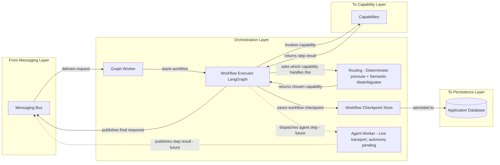

*Diagram: The Orchestration Layer — the brain that decides what to run, in what order, with what context.*

**What it is.** The component that picks up a request from the bus, decides what needs to happen to answer it, and runs the steps in the right order. *LangGraph* is the framework used to define and execute the workflow.

**Design intent.** Separate the *deciding what to do* from the *doing*. The capabilities (next layer down) are the *doing*. The orchestration layer is the *deciding*. This separation means routing decisions can evolve without touching any capability, and intent classification lives in exactly one place — earlier layers preserve the user's wording, the router decides, every downstream component executes without re-classifying.

**What it contains.** The graph worker (a NATS consumer that picks up requests); the workflow executor (the engine that runs the chosen workflow, tracks its state, and saves checkpoints); the routing component — a **focus-aware control gate** (off-domain detection with the active record as structured context) followed by a **language-model disambiguator** (records-vs-knowledge choice with focus + candidate descriptions in the prompt), and an **embedding-based field matcher** that resolves field-level questions against semantic descriptions of canonical record fields; the workflow checkpoint store (so a partially-run workflow can resume after a restart instead of starting over); and the per-capability agent workers (one per use case, each subscribing on its own NATS subject, executing the use case's tool handlers — live for every request today). Each routing stage emits its own observability span (focus-state update, focus-aware control gate, decompose, rewrite, retrieve, filter, language-model disambiguator) so every routing decision is investigable in Grafana.

**How it connects.** Upward to the messaging bus (in and out). Downward into the capability layer (calls a chosen capability). Sideways into the persistence layer (writes workflow checkpoints).

**What it means for the product.** Workflows are durable. Routing logic can evolve without breaking capabilities. Multi-step workflows that span multiple AI calls or multiple capabilities can be defined once and run reliably.

> **Talking point:** *"The orchestration layer is the brain. It decides which capability handles your question, runs the steps in order, and remembers where it is so a restart does not lose your work. Routing authority is centralized in one place, with each stage independently traced — so when someone asks 'why did this query go to that capability?' we can show the decision path for that exact request."*

---

### 3.4 Capability Layer

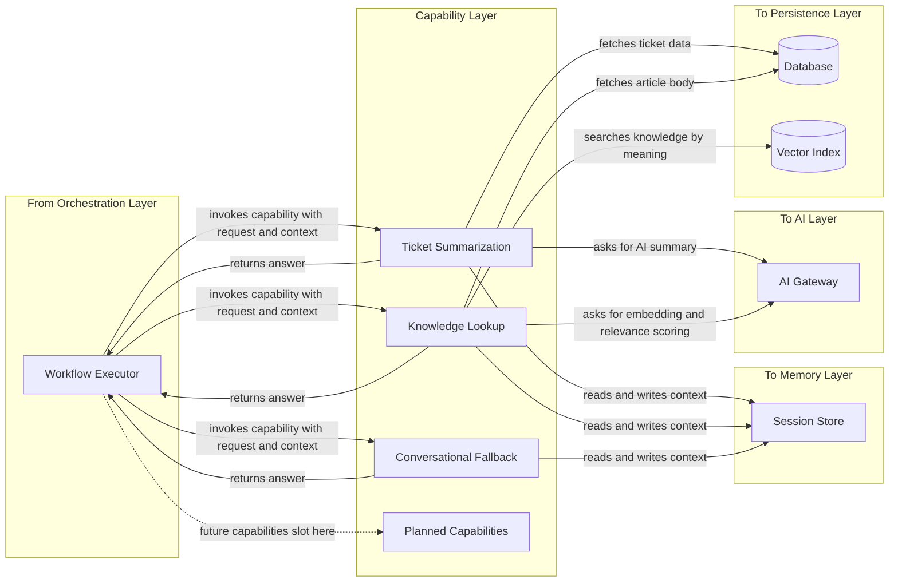

*Diagram: The Capability Layer — the self-contained modules that do the actual customer-facing work.*

**What it is.** The collection of customer-facing capabilities the orchestration layer can invoke. Today: Ticket Summarization, Knowledge Lookup, Conversational Fallback. Tomorrow: more.

**Design intent.** Each capability is self-contained. It owns its own logic, its own prompts, its own data access patterns. It does not know about other capabilities. The orchestration layer above and the gateway/data layers below are its only contracts. This is what makes the platform extensible — adding a capability is writing a new self-contained module, not modifying existing ones.

**What it contains.** Live: Ticket Summarization (answers any question about a ticket — incident, request, problem, change, asset, configuration item); Knowledge Lookup (meaning-based and keyword search of the knowledge base); Conversational Fallback (greetings and out-of-scope decline). Planned: Action on a Ticket (close, assign, update, create) and other capabilities that will be added on the same pattern.

**How it connects.** Upward to the orchestration layer (invoked by it, returns results to it). Downward into three places: the memory layer to read and write conversation context, the AI gateway for any model call, and the persistence layer for ticket and knowledge data.

**What it means for the product.** New customer capabilities can be shipped without touching anything else in the platform. The same governance, observability, and memory model applies automatically to every new capability — the work is in the capability itself, not in re-establishing the platform around it.

> **Talking point:** *"This is where new capabilities show up. Each one is a self-contained module that uses the same gateway, the same memory, the same observability as every other. That is what 'designed for the hundredth capability, not the second' actually looks like in practice."*

---

### 3.5 AI Governance Layer

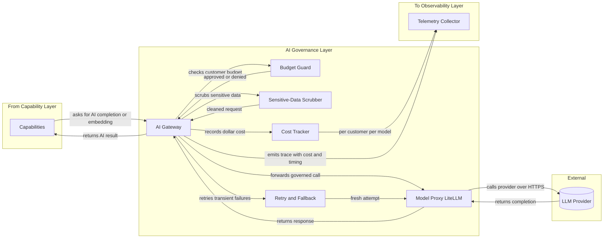

*Diagram: The AI Governance Layer — the single door every AI call passes through.*

**What it is.** The single checkpoint for every AI model call in OneOps. *LLM* stands for *Large Language Model* — the AI brain. *Gateway* means there is exactly one way in and one way out, and no capability is allowed to bypass it.

**Design intent.** Centralize governance. Without a single gateway, budget enforcement, data scrubbing, retry policy, and cost accounting would have to be reimplemented in every capability — impossible to audit, impossible to keep consistent. With a gateway, these rules are written once, tested once, and applied to every call automatically.

**What it contains.** The gateway itself (the entry point); the budget guard (refuses the call if the customer is over their daily limit); the sensitive-data scrubber (removes structural PII before the request leaves the platform); the retry-and-fallback logic (handles transient provider errors with backoff and can fall over to an alternate model if configured); the cost tracker (records dollars-spent per customer per model on every call); and the model proxy (the standardized adapter that talks to the external provider, currently using the *LiteLLM* technology).

**How it connects.** Upward to capabilities (they request AI work). Outward to the external LLM provider (over HTTPS). Sideways to observability (cost, timing, and outcome of every call).

**What it means for the product.** When an enterprise customer asks the procurement-critical questions — *how do you control spend per tenant, how do you guarantee no PII leaves the platform, how do you handle provider outages* — the answer is *one component, audited once, governs every call.* This is not an aspiration; it is how the system already works.

> **Talking point:** *"This single gateway is the most important component in the platform from a procurement perspective. Budget, data safety, cost tracking, failover — all enforced in one place, on every call, no exceptions. That is the answer to ninety percent of enterprise AI buyer questions."*

---

### 3.6 State, Caching and Memory Layer

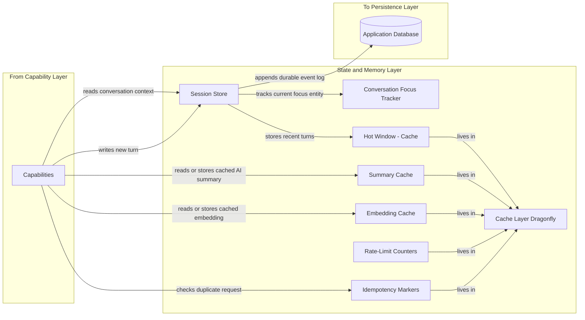

*Diagram: The State, Caching and Memory Layer — how OneOps remembers and how it stays fast.*

**What it is.** The combined memory system for conversations and the high-speed cache for everything that benefits from being instantly available. *Dragonfly* is the cache technology (a high-throughput in-memory store compatible with the widely-used Redis interface).

**Design intent.** Make conversation feel like conversation, and make repeat work instant. The system should never re-fetch what it just fetched, never re-summarize what it just summarized, never re-embed what it just embedded.

**What it contains.** The session store (the conceptual *memory of the conversation*); the conversation focus tracker (which entity the user is currently talking about, so *"and the priority?"* resolves to the right ticket); the hot window of recent turns; the summary cache (so a follow-up question about the same ticket does not re-run the AI); the embedding cache (so a repeated search query does not re-embed); the rate-limit counters (used by the budget guard in the AI layer); the idempotency markers (so the same request submitted twice in quick succession is only answered once). All cached items live in Dragonfly; the durable event log lives in the database.

**How it connects.** Upward to capabilities (they read and write context, hit the caches transparently). Downward to the persistence layer (the durable event log).

**What it means for the product.** Multi-turn conversation that actually feels conversational. Sub-second follow-ups. Cost reduction (cached calls do not pay for AI a second time).

> **Talking point:** *"The reason a follow-up like 'and the priority?' returns instantly is in this layer. The reason the system knows what 'it' refers to is also here. Caching is not an afterthought — it is the layer that makes the product feel responsive instead of laggy."*

---

### 3.7 Persistence Layer

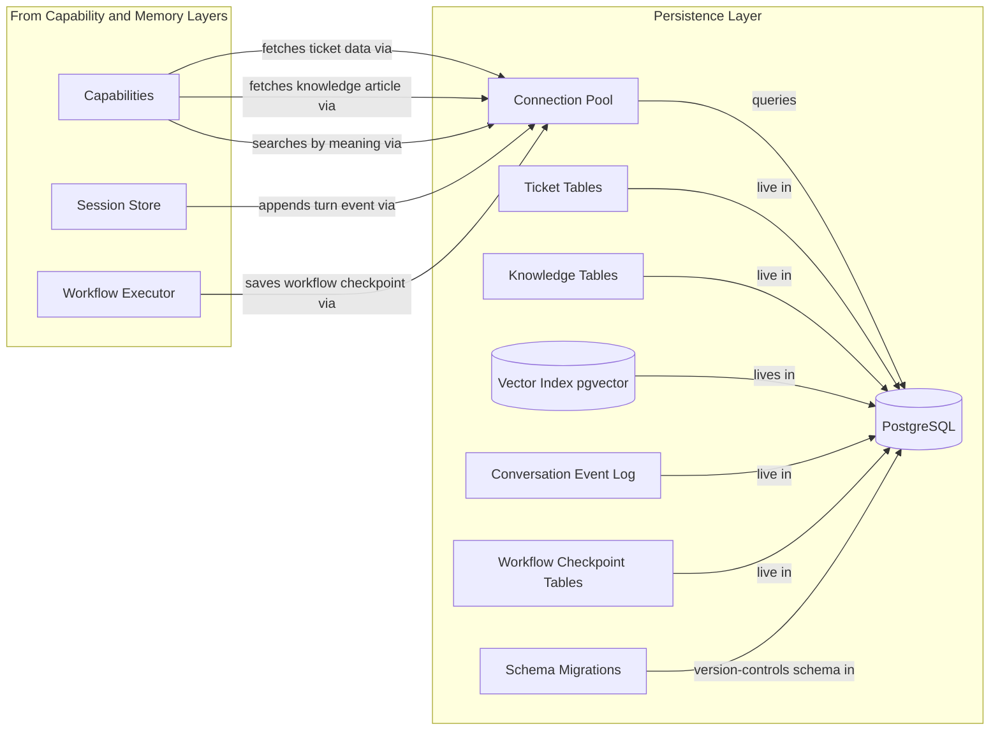

*Diagram: The Persistence Layer — the durable home for everything that must survive a restart.*

**What it is.** The relational database that stores all durable state. *PostgreSQL* is the technology. *pgvector* is the extension that makes meaning-based search possible on the same database.

**Design intent.** One durable store, used carefully through a bounded connection pool, with a versioned schema. Avoid the temptation to scatter data across many specialized stores when one well-managed store is enough.

**What it contains.** Ticket tables (the customer's actual ticket data, made available to OneOps); knowledge tables (the customer's knowledge articles); the vector index (the numerical fingerprints that power meaning-based search); the conversation event log (the append-only record of every turn in every session); workflow checkpoint tables (so the workflow executor can resume a partially-run workflow after a restart); schema migrations (so the database structure can evolve safely as the product evolves); and the connection pool (so the database is never overwhelmed by concurrent demand).

**How it connects.** Upward to capabilities (data reads), the session store (event appends), and the workflow executor (checkpoints). Has no downstream — the database is the bottom of the stack.

**What it means for the product.** Auditability. Every conversation, every AI decision, every cost record can be traced back to a row. Multi-tenant isolation is enforced at this layer through tenant-scoped queries.

> **Talking point:** *"This is the only thing in the platform that has to survive a power cut. Everything else can restart, recover, reconnect. Because the cache absorbs most reads, the database itself stays calm even under heavy load."*

---

### 3.8 Observability Layer

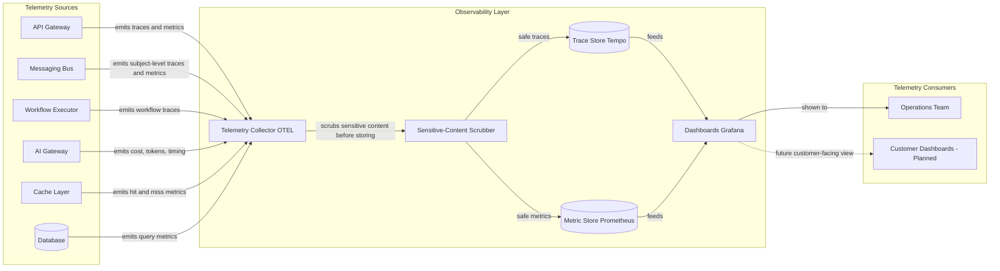

*Diagram: The Observability Layer — how the platform proves it is healthy.*

**What it is.** The unified telemetry stack. *OTEL* (OpenTelemetry) is the vendor-neutral standard for emitting traces, metrics, and logs. Tempo stores the traces. Prometheus stores the metrics. Grafana renders both into dashboards.

**Design intent.** Make every step of every request observable from the moment the platform starts running. Treat observability as a customer-facing feature, not as a debugging tool added later.

**What it contains.** The telemetry collector (the single ingest point all other layers emit to); the sensitive-content scrubber (ensures raw user text never reaches the trace or metric stores — only hashes and lengths); the trace store; the metric store; the dashboards. Customer-facing dashboards are planned — the data is collected; the presentation layer for customer eyes is not yet built.

**How it connects.** Inward from every other layer (which all emit telemetry). Outward to the operations team today, and to customers in the planned customer-facing dashboards.

**What it means for the product.** When a customer asks *"why was this slow?"*, the answer comes from data, not guesses. When something degrades, it is visible before the customer notices. Future: the customer can see their own usage, cost, and query patterns directly.

> **Talking point:** *"This layer is why we can answer the questions enterprise buyers ask after the demo — 'how do you know it is healthy, how would you find a slow query, how do we get visibility into our own usage.' All the data is here. The customer-facing presentation is on the roadmap."*

---

## 4. How It All Moves — End-to-End Flow

This is the one section that uses a sequence diagram, because it is about *ordering over time* — one specific user request, traced through every layer.

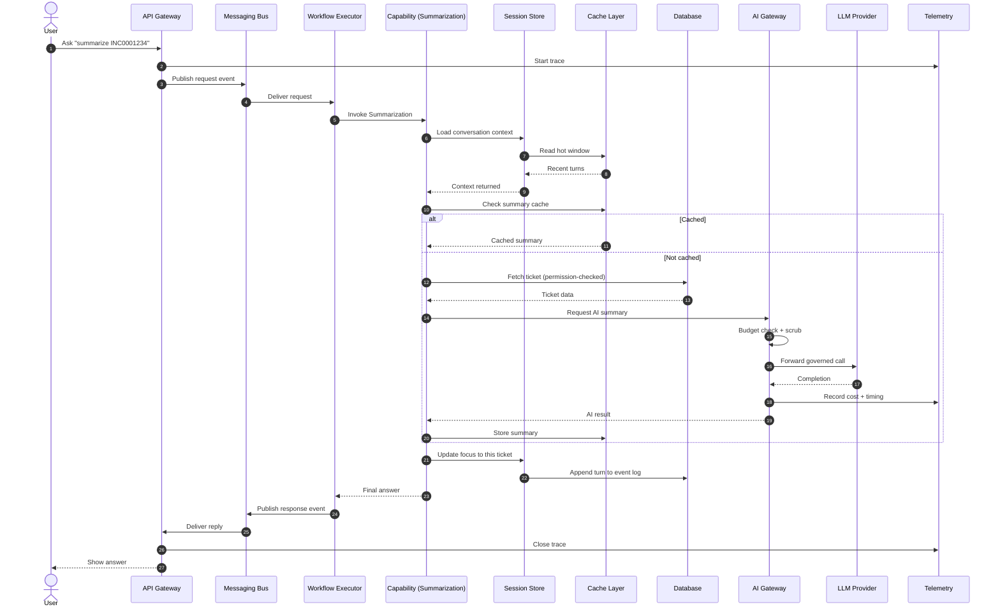

*Diagram: The complete journey of one user question through every layer of OneOps.*

**Walking through the hops:**

1. The user sends a question. The interface layer owns this hop — it receives the HTTPS request.
2. The interface layer opens a trace. From here on, every step is recorded against this trace ID.
3. The interface layer publishes the request as an event. *Notice it does not call a worker directly.* This is the event-driven discipline at work.
4. The messaging bus delivers the request to whichever graph worker picks it up from the queue group.
5. The graph worker hands the request to the workflow executor.
6. The executor invokes the right capability (here, Summarization).
7. The capability asks the session store for conversation context.
8. The session store reads the hot window from the cache.
9. The cache returns recent turns.
10. The session store returns the assembled context to the capability.
11. The capability checks the summary cache for a fresh summary of this ticket. If present (path 12a–13), use it. If not (path 12b onward), generate one.
12. The capability fetches the ticket from the database, with the user's permissions applied.
13. The capability asks the AI gateway for a summary.
14. The gateway checks the customer's budget and scrubs sensitive data before the call leaves the platform.
15. The gateway forwards the governed call to the external LLM provider.
16. The provider returns a completion.
17. The gateway records cost and timing in the observability layer.
18. The gateway returns the AI result to the capability.
19. The capability stores the fresh summary in the cache for the next follow-up.
20. The capability updates the conversation focus — the next *"and the priority?"* will know what *it* refers to.
21. The session store appends this turn to the durable event log.
22. The capability returns its answer to the executor.
23. The executor publishes the response event onto the bus.
24. The bus delivers the response back to the API.
25. The API closes the trace and returns the answer to the user.

**Why the design routes it this way.** Steps 3 and 23 are the event-driven discipline — no direct calls between the front door and the executor. Steps 14 and 17 are the AI governance discipline — every AI call goes through the budget, scrub, and cost path. Steps 8 and 11 are the caching discipline — fast paths first, fall back to the expensive path only when needed. Steps 21 and the trace records throughout are the audit discipline — everything that happened can be reconstructed afterward.

> **Talking point:** *"This is one request, top to bottom. The whole platform participates. Notice how many of these hops are 'check the cache first' or 'go through the governance layer' — that is not overhead, that is the product. Without those hops, the platform is cheaper to build but impossible to run at enterprise scale."*

---

## 5. Why It's Built This Way — Key Design Decisions

The five decisions below were the architectural forks where another choice was possible. Each is presented as *the choice / the alternative / why this one / the product benefit*, so any one of them can be defended directly if PMG pushes back.

### 5.1 Event-driven messaging instead of direct calls

**The choice.** Components publish events to a messaging bus; consumers pick them up.

**The alternative.** Components call each other directly over HTTP or gRPC.

**Why this one.** Direct calls couple availability — if the called service is down, slow, or being restarted, the caller fails. Event-driven decouples in time — the publisher does not need the consumer to be alive at the same instant. The same mechanism enables horizontal scaling (queue groups distribute load automatically) and clean failure isolation (circuit breakers per route).

**Product benefit.** Resilience under partial failure. Horizontal scaling without code changes. Future capabilities (especially multi-agent workflows) inherit these properties for free.

### 5.2 One AI Gateway instead of scattered model calls

**The choice.** Every AI call, from every capability, passes through one gateway component.

**The alternative.** Each capability makes its own AI calls with its own budget and safety logic.

**Why this one.** Scattered AI calls make governance impossible. Budget enforcement, data scrubbing, retry policy, and cost accounting all have to be copy-pasted into every capability and re-tested every time any of them changes. With one gateway, these rules live in one place, are tested once, and apply automatically to every call — including future capabilities.

**Product benefit.** Enterprise procurement questions about cost control and data handling have one-sentence answers backed by evidence. Adding multi-model routing, provider failover, or new safety rules is a single-place change.

### 5.3 Cache as a structural layer, not opportunistic optimization

**The choice.** Caching is a layer in the architecture with defined contents: recent turns, fresh summaries, embeddings, rate-limit counters, deduplication markers.

**The alternative.** Add caching ad hoc when a specific path turns out to be slow.

**Why this one.** Ad-hoc caching produces inconsistent rules, inconsistent expiry, and a long tail of "why is this stale?" bugs. Structural caching makes performance predictable from day one and gives the cache layer its own observable behavior (hit rates, miss rates) that operations can monitor.

**Product benefit.** Multi-turn conversation feels conversational. Repeat AI work is not paid for twice. The product feels fast without surprises.

### 5.4 LangGraph-based orchestration instead of hand-rolled workflow code

**The choice.** Use a graph-based workflow framework to define the steps of every capability and let the framework handle state, checkpointing, and step ordering.

**The alternative.** Write the orchestration logic for every capability by hand.

**Why this one.** Hand-rolled orchestration ends up reinventing the same primitives — durable state, retry policy, conditional branching — capability by capability, inconsistently. A framework gives those primitives once, correctly, and makes new workflows (especially multi-step ones) a matter of declaration, not code.

**Product benefit.** Workflows resume cleanly after restarts. Multi-step workflows (the next wave of capabilities) reuse the same primitives the live capabilities already use.

### 5.5 Observability built in from day one, not added later

**The choice.** Every layer emits structured telemetry from the start, with sensitive content scrubbed at the source.

**The alternative.** Ship the product, then add observability when something goes wrong.

**Why this one.** Retrofitted observability is always incomplete and always inconsistent. Built-in observability gives the operations team and (eventually) the customer the same picture of system health. Sensitive-content scrubbing at the source is the only way to have meaningful telemetry without compliance risk.

**Product benefit.** Enterprise customers get the *how do we get visibility?* answer they need to buy. Operations can answer *why was this slow?* with evidence. Future customer-facing dashboards are a presentation-layer change, not a re-instrumentation.

> **Talking point:** *"Each of these five decisions was a fork. Each could have gone the other way and the product would have looked similar from the outside — for the first six months. The difference shows up when the second customer asks a hard question, when the tenth capability ships, when the AI provider has an outage. That is when these choices pay off."*

---

## 6. How It Holds Up — Resilience, Scale and Observability

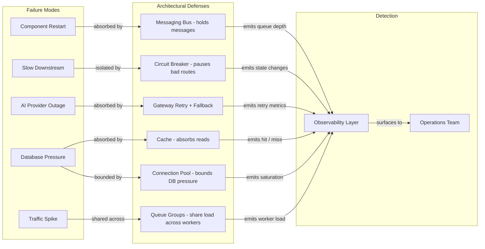

*Diagram: How architectural choices map to failure modes — each defense is a deliberate choice, each is visible to operations.*

**Failure absorption.** A component restarting is invisible to the user because the messaging bus holds messages until the component is back. A slow downstream is isolated by the circuit breaker, which pauses traffic to that route until it recovers. An AI provider outage is absorbed by the gateway's retry-and-fallback logic. Database pressure is absorbed by the cache (most reads never reach the database) and bounded by the connection pool (the database is never overwhelmed). A traffic spike is shared across multiple worker copies in the queue group.

**Scaling.** The platform scales horizontally by running more workers. Queue groups share load automatically — no code change required. The messaging bus is the same single component whether there are two workers or two hundred. The database is the typical bottleneck of any web system; the cache layer in front of it dramatically reduces pressure for the read-heavy traffic OneOps generates.

**Health visibility.** Every failure mode above has corresponding metrics emitted into the observability layer. Queue depth, circuit breaker state, retry rates, cache hit ratios, connection pool saturation, worker load — all are dashboard-visible to operations. The same data is the foundation for future customer-facing dashboards.

> **Talking point:** *"The architecture has a defense for each common failure mode and a signal for each defense. We don't just survive failures — we see them happen and we know why."*

---

## 7. Where It's Headed

The architecture is not just adequate for the current capabilities. It is shaped for what comes next. The diagram below shows what is live today, what is built but not yet active, and what is designed-for.

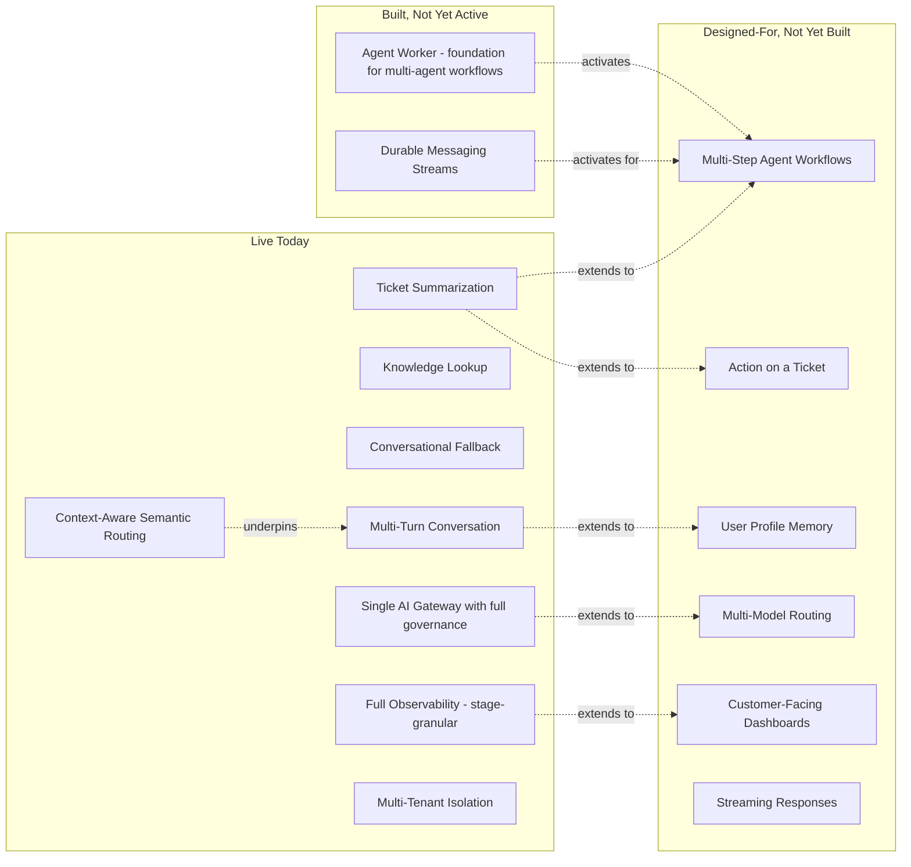

*Diagram: The capability roadmap, anchored in what the architecture already supports.*

**What the foundation enables.** Each *Planned* item connects back to a *Live* or *Built* element. Action on a ticket extends the same capability pattern Summarization already uses, through the same AI gateway, with the same observability. Multi-step workflows activate the agent worker that already exists. User profile memory extends the same session store that already powers multi-turn conversation. Customer-facing dashboards extend the same telemetry the observability layer already collects. Multi-model routing is a configuration of the gateway that already exists. Streaming responses are a presentation change at the API gateway, not a new pipeline.

**What this means architecturally.** Every roadmap item is *enabled by the current architecture without a re-platform*. That is the most important architectural validation point for PMG: the roadmap is bounded by what to build, not by what would have to be rebuilt to enable it.

**What is not on the diagram (deliberately).** Capabilities that would require a fundamental re-architecture are not implied. If a future requirement demands, for example, fully on-premises air-gapped deployment with no external AI provider, that is a different conversation, not a small extension. The architecture has clear extension boundaries, not infinite plasticity.

> **Talking point:** *"Look at the dotted arrows. Every planned capability is anchored in something that already exists. That is the architectural story: we have not built the second use case — we have built a foundation that supports the second, the tenth, and the hundredth. The roadmap is about what to build next, not what to rebuild first."*

---
