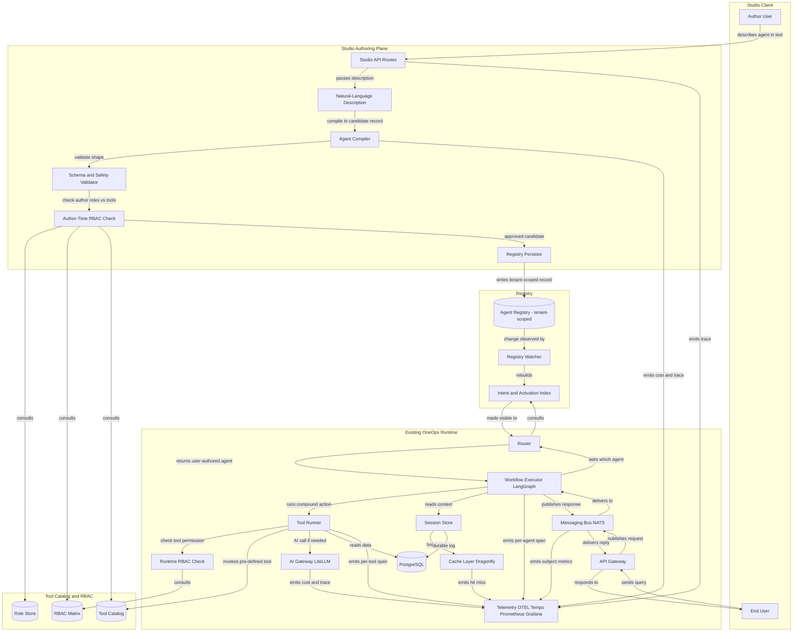
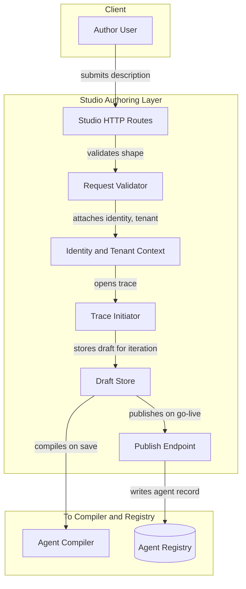
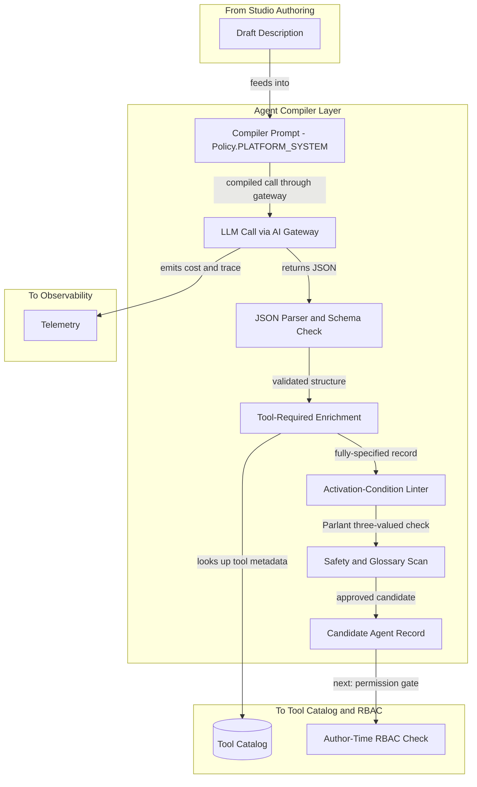
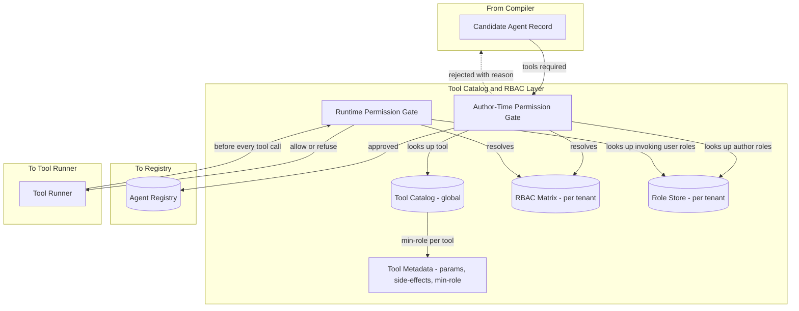
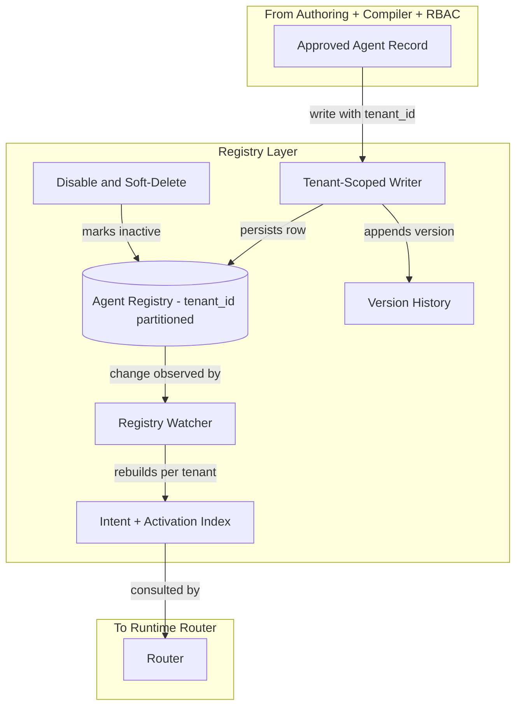
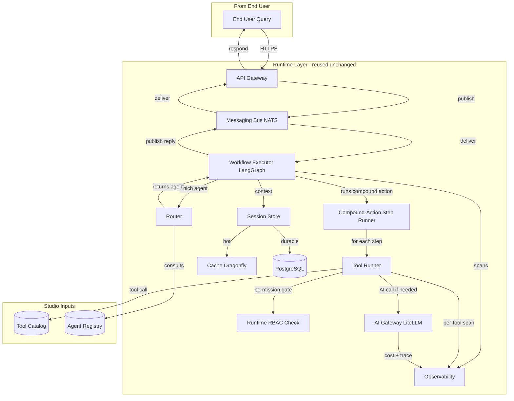
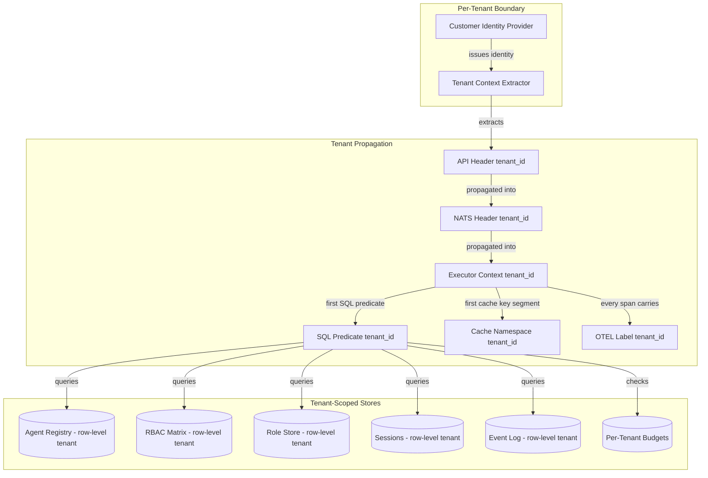
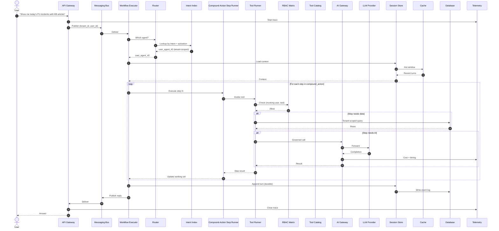
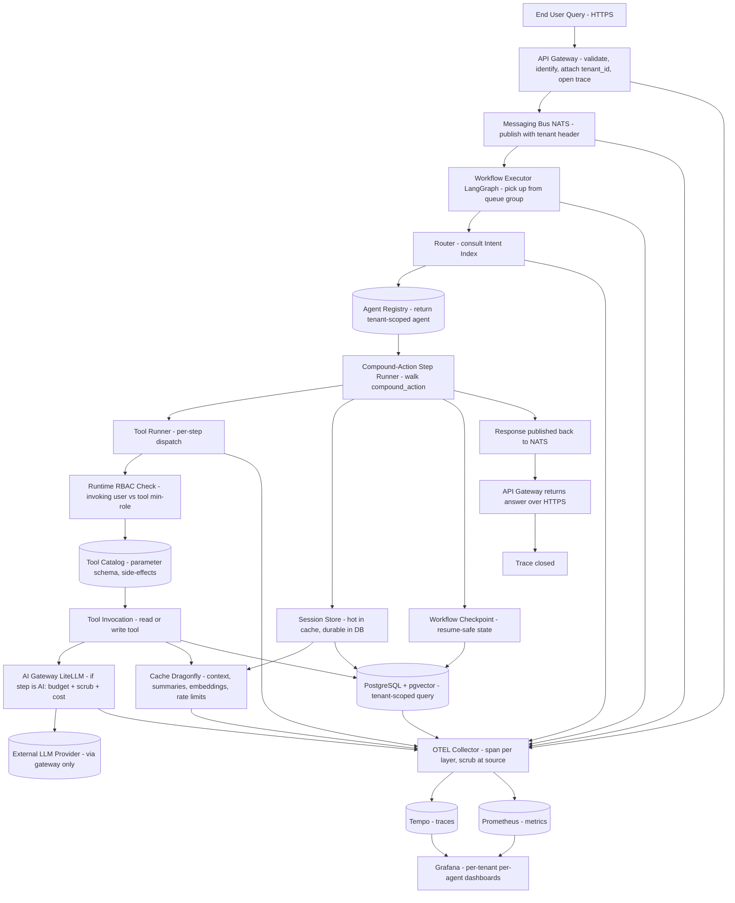

# OneOps Studio — Architecture for User-Authored Agents

## Table of Contents

- [1. What OneOps Studio Is](#1-what-oneops-studio-is)
- [2. The Studio Ideology](#2-the-studio-ideology)
- [3. The Big Picture](#3-the-big-picture)
- [4. The Architecture in Layers](#4-the-architecture-in-layers)
  - [4.1 Studio Authoring Layer](#41-studio-authoring-layer)
  - [4.2 Agent Compiler Layer](#42-agent-compiler-layer)
  - [4.3 Tool Catalog and RBAC Layer](#43-tool-catalog-and-rbac-layer)
  - [4.4 Registry Layer](#44-registry-layer)
  - [4.5 Runtime Layer (Reused from the Platform)](#45-runtime-layer-reused-from-the-platform)
  - [4.6 Multi-Tenant Isolation Layer](#46-multi-tenant-isolation-layer)
- [5. Authoring Flow — From Text to a Live Agent](#5-authoring-flow--from-text-to-a-live-agent)
- [6. Invocation Flow — How a User-Authored Agent Serves a Query](#6-invocation-flow--how-a-user-authored-agent-serves-a-query)
- [7. Vertical Execution Across Every Platform Component](#7-vertical-execution-across-every-platform-component)
- [8. Why the Existing Architecture Already Serves Studio](#8-why-the-existing-architecture-already-serves-studio)
- [9. What Is Net-New for Studio](#9-what-is-net-new-for-studio)
- [10. Safety, Tenancy, and Governance](#10-safety-tenancy-and-governance)
- [11. Limits and Future Work](#11-limits-and-future-work)

> **How to read this document.** This is a companion to [Document 6 — Detailed Architecture](./06-architecture-detailed.md). Studio does not replace the OneOps platform; it sits on top of it. Every component referenced here either already exists in the platform or is a thin, additive extension. Where a piece is *Planned* or *Built, not yet active*, it is labelled explicitly.

---

## 1. What OneOps Studio Is

OneOps Studio is a **no-code agent authoring surface** that runs on top of the OneOps platform. A business user — a service-desk lead, an IT manager, a knowledge-base owner — describes the agent they want in plain English. Studio compiles that description into a declarative agent record, wires it to a pre-approved set of tools, gates every tool call through the user's role and permissions, and exposes the new agent to the chat surface alongside the platform's built-in capabilities (Ticket Summarization, Knowledge Lookup, and future use cases).

Two sentences capture the product promise:

- **A user creates an agent by typing what they want.** They do not write code. They do not pick from a complex form. They describe an outcome.
- **The platform decides what the agent can touch.** The user's role determines which tools are eligible. The platform enforces that boundary at authoring time and again at every invocation.

Studio is built for a **multi-tenant SaaS** deployment. Every authored agent belongs to a tenant. Tools, roles, registries, sessions, caches, and traces are tenant-scoped from the first SQL predicate to the last dashboard label. No cross-tenant leakage is possible by construction.

> This document covers the architecture of Studio. It does not cover UI design, pricing, or go-to-market — those belong in separate PMG conversations.

---

## 2. The Studio Ideology

Studio inherits all five beliefs from the parent architecture (Document 6, Section 1) and adds three of its own. Each shapes the component choices that follow.

### 2.1 Agents are data, not code

A user-authored agent is a JSON record in a registry, not a snippet of code. The runtime that executes the agent is fixed, reviewed, and shipped by us. The user never authors logic that the platform will execute as code. They author *configuration* that the platform interprets through a pre-built, audited engine.

The product effect: a customer can never inject arbitrary code into our runtime. The worst-case input is an invalid configuration, which is rejected at the authoring boundary.

### 2.2 The tool catalogue is closed, the agents are open

The set of *tools* an agent can use is fixed by us (read-and-write capabilities across incident, request, problem, change, asset, CMDB, knowledge, and notification services). The set of *agents* a customer can compose is open. Customers compose new behaviours by combining catalogued tools in new sequences; they do not bring their own tools into our runtime.

The product effect: every tool is pre-audited for safety, idempotency, side-effects, and cost. New tools are added by us, not by customers, on a controlled cadence.

### 2.3 Permission is the first-class boundary, not an afterthought

The user's role determines which tools they can author against. The same role determines which tools the agent can invoke at runtime. The permission check happens twice — once at compile time (so a forbidden agent never persists), once at invocation time (so a later role change immediately revokes access). Both checks share one source of truth: the RBAC matrix.

The product effect: when an enterprise customer asks *"can a help-desk user accidentally build an agent that closes change requests?"*, the answer is *no, the platform refuses to persist such an agent, and even if it somehow existed, the runtime would refuse to invoke the tool.*

> **Talking point:** *"Studio gives users the power to compose. The platform retains the power to bound what 'compose' means. Tools are catalogued, roles are enforced twice, and every agent is a piece of validated data running on our fixed engine."*

---

## 3. The Big Picture

This is the anchor diagram for Studio. Everything in Sections 4 through 7 zooms into one piece of it.



*Diagram: The complete OneOps Studio architecture — authoring plane on the left, runtime on the right, shared catalog and registry in the middle. Every box that says "existing" is reused unchanged from the platform.*

### Tour of the diagram, block by block

**Studio Client.** Two distinct human roles: the *Author* (creates agents) and the *End User* (uses agents). They may be the same person in a small tenant; they are usually different in an enterprise.

**Studio Authoring Plane.** A small set of HTTP routes that accept a natural-language description, run it through the Agent Compiler (an LLM call governed by the existing AI Gateway), validate the resulting JSON against the agent schema, run the author-time RBAC check, and persist the record to the agent registry.

**Tool Catalog and RBAC.** Three shared stores: the *Tool Catalog* (every read and write tool the platform exposes, with its parameters, side-effects, and minimum-role requirement), the *RBAC Matrix* (which roles can invoke which tools), and the *Role Store* (which users hold which roles in which tenant). All three are tenant-scoped where appropriate. The catalog itself is global; the matrix and role assignments are per-tenant.

**Registry.** The persistent home for all agents — both platform-shipped (UC-1, UC-3) and user-authored. The *Registry Watcher* notices a new record and rebuilds the *Intent and Activation Index* that the Router consults at runtime. This is the existing registry pattern from the platform; Studio just writes new records into it.

**Existing OneOps Runtime.** Everything from the API Gateway down to OTEL is reused unchanged from the parent architecture. The Router resolves a user query to a user-authored agent the same way it resolves to UC-1 or UC-3 today. The Workflow Executor runs the agent's compound action through the Tool Runner. The Tool Runner enforces RBAC at every tool call. The AI Gateway governs every model invocation. The Cache, Session Store, and PostgreSQL serve user-authored agents identically to platform-shipped ones. OTEL traces every step.

**The two flow directions.** The left-to-right *authoring* flow happens once when an agent is created. The bottom-to-top *invocation* flow happens every time an end user queries an authored agent.

> **Talking point:** *"Look at where the existing runtime sits in this diagram. Nothing about the runtime changes. Studio is an authoring layer that writes new records into the registry the runtime already reads. We did not build a new engine — we built a way for users to teach the existing engine new patterns."*

---

## 4. The Architecture in Layers

Each subsection below zooms into one layer of Studio, shows its block diagram, and explains how it connects to its neighbours.

---

### 4.1 Studio Authoring Layer



*Diagram: The Studio Authoring Layer — every authoring request enters here and produces either an iterated draft or a published agent.*

**What it is.** The web-facing surface for agent authoring. A small set of routes: *create draft*, *iterate on draft*, *preview*, *publish*, *list my agents*, *disable agent*.

**Design intent.** Keep the authoring surface as narrow as the production API. It validates, identifies, traces, and dispatches — nothing else. All business logic for compiling, validating, and persisting agents lives in the layers behind it.

**What it contains.** HTTP routes specific to authoring; a request validator that enforces shape; an identity-and-tenant attacher (so every authored agent is permanently bound to the author and tenant); a trace initiator (authoring is observable end to end, same as production traffic); a draft store (so an author can iterate without publishing); and the publish endpoint that writes the final record to the registry.

**How it connects.** Upward to the author over HTTPS. Downward to the Agent Compiler (on every save) and to the Agent Registry (on publish only).

**Multi-tenant behaviour.** Every route extracts `tenant_id` and `author_user_id` from the identity layer and propagates them through every downstream call. The draft store is keyed by `(tenant_id, author_user_id, draft_id)`. No draft is ever visible across tenants or even across authors within the same tenant unless explicitly shared.

> **Talking point:** *"The authoring surface is intentionally as thin as the production front door. It validates, identifies, and dispatches. The interesting work happens in the layers behind it."*

---

### 4.2 Agent Compiler Layer



*Diagram: The Agent Compiler — turns natural-language descriptions into validated agent records.*

**What it is.** The component that turns *"build me an agent that finds P1 incidents and lists the top KB articles for each"* into a JSON record the runtime can execute.

**Design intent.** All of the intelligence required to interpret an author's intent is in the compiler. All of the rules required to keep the output safe are in the validator. These are deliberately separated so the intelligent part can evolve (better prompts, better few-shot examples) without weakening the safety part.

**What it contains.** The compiler prompt (assembled at request time through the existing Policy layer, profile `PLATFORM_SYSTEM`, with the closed tool catalogue inlined so the LLM cannot hallucinate tools); the LLM call itself, which goes through the AI Gateway like every other model invocation (budget-checked, scrubbed, cost-tracked); a strict JSON parser and schema validator; an enrichment step that looks up tool metadata from the catalog and binds it into the record; an activation-condition linter that runs the same Parlant three-valued logic the platform's built-in agents use; and a safety scan that catches glossary violations.

**How it connects.** Upward from the authoring layer (receives drafts). Sideways to the AI Gateway (every compiler call is governed). Downward to the Tool Catalog (looks up tool metadata) and to the author-time RBAC check (passes the candidate forward only if it parses cleanly).

**Why the AI Gateway governs the compiler too.** The compiler is itself an AI call. It pays the same governance toll every other AI call pays. This means *the cost of building an agent is observable, budgeted, and scrubbed* — same governance story as the runtime.

> **Talking point:** *"The compiler is an AI call, and it goes through the same gateway every other AI call uses. The output of the compiler is data, not code. The validator that comes next is what makes that data safe to persist."*

---

### 4.3 Tool Catalog and RBAC Layer



*Diagram: The Tool Catalog and RBAC — the closed surface of capabilities and the two gates that bound them.*

**What it is.** The closed set of tools the platform exposes, paired with the role-based access control matrix that decides who can use them. The catalog is global (every tenant sees the same tools); the matrix and role store are per-tenant (every tenant decides which of its users hold which roles).

**Design intent.** Tools are pre-audited by us, once, with care. Roles are managed by the customer through their existing identity layer. The matrix between the two is the *only* policy surface the customer configures, and it is small and bounded by design.

**What it contains.**

*Tool Catalog (global).* A registry of every tool — read and write — across the platform's service surface:

| Tool ID | Type | Service | Default Min-Role |
| --- | --- | --- | --- |
| `incident.search` | read | ITSM | agent_user |
| `incident.summarize` | read | ITSM | agent_user |
| `incident.update` | **write** | ITSM | incident_manager |
| `incident.close` | **write** | ITSM | incident_manager |
| `request.search` | read | ITSM | agent_user |
| `request.approve` | **write** | ITSM | approver |
| `problem.search` | read | ITSM | agent_user |
| `change.create` | **write** | Change | change_manager |
| `change.approve` | **write** | Change | change_approver |
| `asset.search` | read | Asset | agent_user |
| `cmdb.lookup` | read | CMDB | agent_user |
| `cmdb.update_ci` | **write** | CMDB | cmdb_admin |
| `kb.search` | read | Knowledge | agent_user |
| `kb.search_by_ticket` | read | Knowledge | agent_user |
| `kb.publish` | **write** | Knowledge | kb_author |
| `notify.slack` | write (egress) | Notification | notification_publisher |
| `notify.email` | write (egress) | Notification | notification_publisher |

Each entry carries a parameter schema, side-effect classification (read / write / external-egress), an idempotency annotation, and an estimated cost band.

*RBAC Matrix (per tenant).* A configurable mapping from `role → tool_id → allow/deny`. Customers can be more restrictive than the defaults; they cannot be more permissive than what we ship.

*Role Store (per tenant).* The customer's existing role assignments, propagated into the platform through the identity layer.

*Two permission gates.* The *author-time gate* runs once when an agent is being published: every tool in the candidate's `tools_required` list is checked against the author's role set. The *runtime gate* runs every time a tool is about to be invoked: the *invoking user's* role set is rechecked against the tool. The two gates use different inputs (author vs invoker) and the same matrix.

**How it connects.** Sideways to the Compiler (consulted during enrichment), upward to the author-time check, downward to the Tool Runner (which consults the runtime gate). The Role Store is fed from the customer's identity layer.

**Why two gates.** The author-time gate prevents an authored agent from existing in a forbidden shape. The runtime gate prevents privilege drift — if a user's role changes after an agent is published, the runtime check immediately reflects the new role.

> **Talking point:** *"Tools are ours. Roles are theirs. The matrix between the two is the only policy surface they touch, and it is bounded by what we ship. That is the whole safety story for Studio in one sentence."*

---

### 4.4 Registry Layer



*Diagram: The Registry Layer — the durable home for every agent definition the platform knows about.*

**What it is.** The same registry the platform already uses for its built-in agents (UC-1, UC-3). Studio writes new records into it instead of standing up a parallel store.

**Design intent.** One source of truth for every agent the runtime can dispatch. Versioned. Tenant-partitioned. Soft-delete only — disabled agents are kept for audit. Live changes are picked up by a watcher and propagated into the runtime index without a redeploy.

**What it contains.** A tenant-scoped writer (every insert carries `tenant_id` in the primary key); the agent registry table; a version-history side-table (every publish creates a new version; previous versions are kept for rollback); the registry watcher (existing component, reused unchanged); the intent and activation index (rebuilt on every change); and a soft-delete path for disabling an authored agent without losing the audit trail.

**How it connects.** Upward from the publish path. Downward to the Router via the index. The watcher and indexer are the same code that already serves the platform's built-in agents.

**Multi-tenant behaviour.** Every read and write carries `tenant_id` as the first SQL predicate. The index is keyed by tenant, so the Router only sees agents that belong to the querying tenant. A user-authored agent built by Tenant A is structurally invisible to Tenant B.

> **Talking point:** *"The registry is already there. Studio is the second writer to it. The platform's built-in agents are records in the same table. That symmetry is what makes user-authored agents first-class citizens at runtime."*

---

### 4.5 Runtime Layer (Reused from the Platform)



*Diagram: The runtime — every component shown here exists in the platform today. Studio adds two inputs and zero new runtime components.*

**What it is.** The complete OneOps runtime described in Document 6, used here without modification. The only difference between serving a built-in agent (UC-1) and serving a user-authored agent is which row in the registry the Router returns.

**Design intent.** Reuse. If user-authored agents are first-class records in the registry, then the runtime that already executes records from the registry serves them without change. New observability for free, new governance for free, new caching for free.

**What it contains.** Every component from Document 6, Section 3, unchanged: API Gateway, Messaging Bus, Workflow Executor, Router, AI Gateway, Cache, Session Store, Database, Observability. New for Studio: the *Compound-Action Step Runner* (a thin generalization of the existing step-execution path that walks the `compound_action` field of an authored agent) and the *Runtime RBAC Check* embedded in the Tool Runner.

**How it connects.** The Router consults the registry index, which now contains both platform and user-authored agents. The Tool Runner consults the Tool Catalog and the RBAC Matrix on every tool invocation. Everything else flows the same way it does today.

**Multi-tenant behaviour.** Every request carries `tenant_id` from the API Gateway through the Messaging Bus, into the Workflow Executor, down to the Tool Runner, and into every SQL query. The Cache namespaces include `tenant_id`. The Session Store is keyed by `(tenant_id, user_id, session_id)`. OTEL traces and Prometheus metrics carry `tenant_id` as a label. Cross-tenant leakage is structurally impossible.

> **Talking point:** *"This is where the architectural payoff shows up. We did not build a Studio runtime. The platform runtime is the Studio runtime. Every component you have already reviewed serves user-authored agents identically."*

---

### 4.6 Multi-Tenant Isolation Layer



*Diagram: The isolation discipline — how a tenant's data, agents, sessions, and costs remain structurally separate.*

**What it is.** The set of rules by which `tenant_id` is established at the front door, carried through every hop, and used as the first predicate of every store access. It is not a new layer of components; it is a discipline enforced at every existing layer.

**Design intent.** Make cross-tenant leakage impossible by construction, not by inspection. If `tenant_id` is missing at any hop, the request is refused. If `tenant_id` is wrong, the store returns no rows. There is no "default tenant" fallback anywhere in the system.

**What it contains.** Identity extraction at the API Gateway from the customer's identity provider; header propagation through NATS and the Workflow Executor; tenant-as-first-predicate enforcement in every SQL query and pgvector search; tenant-namespaced cache keys; tenant-labelled traces and metrics; per-tenant budget enforcement at the AI Gateway.

**How it connects.** Every other layer reads from this discipline. The Studio authoring path enforces it. The runtime enforces it. The registry enforces it. The catalog enforces it.

**What it means for the product.** A customer can be told, truthfully, that their authored agents, their tool permissions, their conversation history, and their costs are isolated at the database row level, the cache namespace level, the trace label level, and the budget enforcement level. There is no shared mutable state across tenants anywhere in the platform.

> **Talking point:** *"In a multi-tenant SaaS, isolation is the question the security team asks first. Our answer has six layers — header, message, executor, SQL, cache, telemetry — and every one of them enforces tenant_id. There is no codepath that runs without it."*

---

## 5. Authoring Flow — From Text to a Live Agent

This is what happens when a user creates an agent. Read top to bottom; each step maps to a layer described above.

```mermaid
sequenceDiagram
    autonumber
    actor Author
    participant API as Studio API
    participant Drafts as Draft Store
    participant Compiler as Agent Compiler
    participant Gate as AI Gateway
    participant LLM as LLM Provider
    participant Catalog as Tool Catalog
    participant RBAC as RBAC Matrix
    participant Reg as Agent Registry
    participant Watch as Registry Watcher
    participant Idx as Intent Index
    participant OTEL as Telemetry

    Author->>API: "Build an agent that finds today's P1 incidents and lists top KB articles"
    API->>OTEL: Start trace
    API->>Drafts: Save draft
    API->>Compiler: Compile draft
    Compiler->>Gate: LLM call (governed)
    Gate->>Gate: Budget check + scrub
    Gate->>LLM: Forward
    LLM-->>Gate: Candidate JSON
    Gate->>OTEL: Record cost + timing
    Gate-->>Compiler: Candidate JSON
    Compiler->>Catalog: Lookup tools_required metadata
    Catalog-->>Compiler: Tool specs + min-roles
    Compiler->>Compiler: Schema validate + activation-condition lint
    Compiler-->>API: Validated candidate
    API->>RBAC: Author-time check (author_roles vs tools_required)
    RBAC-->>API: Approved
    Author->>API: Publish
    API->>Reg: Insert with tenant_id, owner_user_id
    Reg->>Watch: Change event
    Watch->>Idx: Rebuild intent + activation index
    Idx-->>API: Index updated
    API->>OTEL: Close trace
    API-->>Author: Agent live; show agent ID + preview URL
```

*Diagram: One full agent-authoring round trip, from natural-language description to a runnable agent record.*

**What is happening, step by step:**

1. The author types a description in the Studio UI. The Studio API receives it.
2. A trace is opened. Every step from here is observable end-to-end.
3. The description is saved as a draft (so the author can iterate without committing).
4. The Compiler is invoked on the draft.
5. The Compiler issues an LLM call through the AI Gateway.
6. The Gateway checks the tenant's budget and scrubs sensitive content.
7. The Gateway forwards the governed call to the LLM provider.
8. The provider returns a JSON candidate record.
9. The Gateway records cost and timing in the observability layer.
10. The candidate is returned to the Compiler.
11. The Compiler looks up tool metadata from the catalog (parameter schemas, minimum roles, side-effects).
12. The Compiler enriches the candidate, validates it against the agent schema, and lints its activation conditions through the Parlant three-valued check.
13. The validated candidate is returned to the Studio API.
14. The author-time RBAC check resolves the author's roles against every tool in `tools_required`. If anything is forbidden, the agent is rejected with a precise reason ("your role `agent_user` cannot author against `incident.update` — that requires `incident_manager`").
15. The author clicks *publish*.
16. The record is inserted into the agent registry with `tenant_id` and `owner_user_id` permanently bound.
17. The registry watcher observes the change.
18. The intent and activation index is rebuilt for that tenant.
19. The Studio API closes the trace.
20. The author sees confirmation: agent ID, an end-user preview URL, and a link to the trace.

**For PMG.** Steps 5–9 are why authoring is governable: every Studio agent costs the customer the same way runtime queries do, with the same enforcement. Step 14 is why authoring is safe: a help-desk user cannot publish an agent that closes change requests. Steps 17–18 are why authored agents work immediately: no redeploy, no restart, no operator intervention.

---

## 6. Invocation Flow — How a User-Authored Agent Serves a Query

This is what happens when an end user queries an agent that was authored in Studio. The flow is intentionally indistinguishable from the existing UC-1 / UC-3 flow.



*Diagram: One end-user query served by a Studio-authored agent — identical to the platform-shipped agent flow.*

**Walking through the hops:**

1. The end user asks a question. `tenant_id` and `user_id` are attached at the API Gateway.
2. The trace is opened.
3. The request is published to NATS with the tenant header.
4. The Workflow Executor picks it up.
5. The Router asks the Intent Index which agent handles this query.
6. The Index returns `user_agent_42` — the agent the author published earlier — because its activation condition matched and its tenant matches.
7. The Executor loads conversation context through the Session Store (cache-fast, database-durable).
8. The Executor begins walking the agent's `compound_action` list, one step at a time.
9. For each step, the Tool Runner is invoked.
10. The Tool Runner checks the RBAC Matrix using *the invoking user's* current roles. If a role has been revoked since the agent was authored, the invocation is refused — defence in depth.
11. The tool either reads data (tenant-scoped SQL query) or issues an AI call (through the AI Gateway).
12. AI calls are budget-checked, scrubbed, and cost-tracked exactly as in built-in agents.
13. Each step result feeds the next step (compound-action dependency ordering, identical to Moveworks-style execution).
14. When all steps complete, the turn is appended to the durable session log.
15. The reply is published back through NATS to the API Gateway.
16. The trace closes. Every step is observable in Grafana keyed by `(tenant_id, agent_id)`.

**Why the flow is identical to UC-1/UC-3.** Because Studio agents are records in the same registry, dispatched by the same router, executed by the same workflow engine, governed by the same gateway, cached by the same Dragonfly namespace, observed by the same OTEL pipeline. The only thing that changed between *built by us* and *built by the customer* is which row in the registry the Router returns.

---

## 7. Vertical Execution Across Every Platform Component

The diagram below collapses the entire flow into a vertical column, showing how every platform component participates in serving a Studio-authored agent. This is the diagram to put on screen when the PMG asks *"what touches what?"*.



*Diagram: Vertical execution — every platform component, top to bottom, participating in a single Studio-authored agent invocation.*

**Reading the column.**

- **A → B (Entry).** The end user's request enters once. Identity and tenant context are attached immediately and accompany the request through every subsequent hop.
- **C → D (Decoupling).** NATS decouples the API from the executor. If the executor is restarting, the message waits; if there are five executors, the queue group fans the load out.
- **E → F (Selection).** The Router consults the index built from the registry. The index returns the right agent regardless of whether it was authored by us or by the customer.
- **G → K (Execution).** The compound action walks step by step. Each tool call passes the runtime RBAC gate before it touches a service.
- **L → M (AI governance).** Any step that needs an AI call goes through the gateway. There is no path from a step to an LLM that bypasses governance.
- **N → P (State and persistence).** Cache absorbs reads. The session store keeps recent turns hot and durable. PostgreSQL is the bottom of the stack.
- **Q (Resumability).** Workflow checkpoints are written so an executor restart in the middle of a multi-step compound action does not lose work.
- **R → U (Observability).** Every layer emits structured telemetry into OTEL. Tempo stores traces, Prometheus stores metrics, Grafana renders both. Every label includes `tenant_id` and `agent_id`.
- **V → X (Exit).** The response travels back through NATS, the API returns it, the trace closes. The customer's Grafana dashboard now shows one more row in the per-agent latency and cost panel.

**What this view proves.** A Studio agent exercises *every* platform component. Nothing is bypassed. Nothing is special-cased. The same trust boundaries, the same governance, the same observability that hold for UC-1 and UC-3 hold for `user_agent_42`.

> **Talking point:** *"This is the picture for the security team. A user-authored agent does not get a shortcut. It enters the same front door, rides the same bus, talks to the same gateway, queries the same database with the same tenant predicate, and emits to the same observability pipeline. The platform's guarantees apply uniformly."*

---

## 8. Why the Existing Architecture Already Serves Studio

Every Studio capability maps to an existing platform piece. The table below is the architectural validation point for PMG.

| Studio Requirement | Existing Platform Piece | Net-New for Studio |
| --- | --- | --- |
| User describes agent in plain English | AI Gateway + Policy layer (`PLATFORM_SYSTEM` profile) | Compiler prompt + draft store |
| Compile description into a runnable definition | Same gateway, governed LLM call | Agent Compiler module |
| Validate the compiled definition | Existing schema-validation pattern (registry today validates UC-1 / UC-3 records) | Agent JSON schema + activation-condition linter |
| Closed set of read/write tools across services | Existing Tool Runner + capability tools today (`incident.summarize`, `kb.search`, etc.) | Tool Catalog metadata file + write-tool implementations as they ship |
| Author cannot author against forbidden tools | Existing identity propagation + role context on every request | RBAC matrix + author-time gate |
| Runtime cannot invoke a tool the invoking user lacks | Same identity propagation | Runtime gate at Tool Runner boundary |
| Dispatch to the right agent | Existing Router consulting Intent Index | Index now also contains user-authored agents |
| Multi-step execution with dependencies | Existing LangGraph Send fan-out + compound-action pattern (Moveworks) | Generalized compound-action walker |
| Per-tenant data isolation at every layer | Existing `tenant_id`-first-predicate discipline | None — inherited unchanged |
| Per-tenant budgets and cost tracking | Existing AI Gateway per-tenant budget enforcement | Agent ID added as a metric label |
| End-to-end tracing | Existing OTEL pipeline | Spans for compiler, RBAC, tool dispatch |
| Cache for fast follow-ups | Existing Dragonfly cache layers | Authored-agent summary cache (same pattern) |
| Resume after restart | Existing workflow checkpointer | None |
| Safe-by-default response composition | Existing canned-response and three-valued logic from Parlant substrate | None |

**The architectural validation point.** Every column-three entry that says *None* or *thin extension* is a piece of the platform doing double duty for Studio. The net-new work is bounded to the columns that say *Compiler*, *Catalog*, *RBAC matrix*, *Schema*, and *Gates*. There is no new runtime, no new observability pipeline, no new messaging layer, no new persistence story, no new governance model.

> **Talking point:** *"This table is the architectural payoff. Every Studio requirement either reuses a platform piece unchanged or extends it additively. There is no parallel system. Studio is a thin authoring surface and a thin policy surface on top of a runtime that already serves two production capabilities."*

---

## 9. What Is Net-New for Studio

Stated explicitly so the PMG can scope the work honestly:

- **Studio API routes and draft store.** Thin authoring surface; same shape as the existing API.
- **Agent Compiler.** Prompt + JSON validator + activation-condition linter. Same gateway, same policy layer.
- **Agent JSON schema.** Strict definition of what a valid authored agent looks like.
- **Tool Catalog file** with parameter schemas, side-effect classifications, and minimum-role annotations.
- **RBAC matrix store and resolver.** Per-tenant. Configured by the customer through their identity layer.
- **Author-time and runtime permission gates.** Two functions on top of the existing Tool Runner boundary.
- **Write-tool implementations** for the tools that today only have read counterparts. These are *Planned*; each one ships behind its own activation flag and follows the same pattern UC-1 already uses for reads.
- **Studio UI.** Out of scope for this architecture document; covered in a separate Studio PRD.

**What is explicitly NOT net-new.**

- The runtime engine, the messaging bus, the AI gateway, the cache, the session store, the database, the observability stack, the workflow executor, the router, the registry, the tenant-isolation discipline, the budget enforcement, the data-scrubbing — all reused unchanged.

---

## 10. Safety, Tenancy, and Governance

This section answers the three questions every enterprise procurement team asks before approving a no-code agent product.

**Can a user author an agent that does something they could not do themselves?** No. The author-time RBAC gate refuses to publish an agent that includes any tool the author's role does not allow. There is no escalation path through authoring.

**Can a published agent retain access after the author's role is revoked?** No. The runtime RBAC gate re-checks the *invoking user's* roles on every tool call. If a role is removed in the customer's identity layer, the next invocation refuses immediately — no operator intervention, no agent disable required.

**Can a tenant see another tenant's agents, tools, sessions, or costs?** No. `tenant_id` is the first predicate of every store query, the first segment of every cache key, a required label on every metric, and a required header on every NATS message. A missing or mismatched `tenant_id` returns zero rows, not the wrong rows.

**Can an agent invoke arbitrary code we did not ship?** No. Agents are JSON records. The runtime that interprets them is fixed code we ship. Tools are pre-audited capabilities in a closed catalog. The worst-case authoring input is a malformed agent, which fails validation.

**Can a tenant exceed its AI budget through authored agents?** No. Every model call — including the Compiler's own call — passes through the AI Gateway, which enforces per-tenant daily budgets before forwarding the call.

**Can sensitive data leak to the LLM provider through an authored agent?** No. The same sensitive-data scrubber that protects platform-shipped agents protects authored agents, because they share the same gateway path.

**Is every authored agent action auditable?** Yes. Every step of every invocation emits a structured trace labelled with `tenant_id`, `agent_id`, `user_id`, and `tool_id`. The Grafana dashboards include per-agent and per-tenant cost and usage. Every tool call writes a side-effect record to the durable event log when it mutates state.

> **Talking point:** *"Studio's safety story is one sentence: tools are ours, roles are theirs, and the platform enforces the boundary twice. Everything else follows from that."*

---

## 11. Limits and Future Work

Stated plainly. These are limits, not aspirations dressed up as features.

> **Write tools ship on a controlled cadence.** Read tools are broad today; write tools are still being implemented capability by capability. An authored agent can today reliably *read and summarize* across every service, but can only *write* where the corresponding write tool has shipped.

> **Studio UI is not part of this architecture document.** The product layer (visual editor, preview, version diff, sharing) is covered by a separate Studio PRD. This document covers the substrate that supports any UI you choose to put on top.

> **Agent-to-agent composition is enabled by the existing Agent Worker foundation, but is not yet active.** A Studio agent today cannot dispatch sub-steps to a *different* Studio agent. The wiring is built (the Agent Worker exists, the messaging substrate supports it); activation depends on the parent platform's roadmap item described in Document 6, Section 7.

> **The Compiler is an LLM call and inherits LLM properties.** It can occasionally produce an invalid record. The validator catches every structural error; semantic errors (the agent compiles but does not do what the author meant) surface in the preview step before publish.

> **The RBAC matrix shipped with the platform is the floor, not the ceiling.** Customers can be more restrictive than the defaults; they cannot grant a tool to a role we have not shipped support for.

> **Per-agent cost attribution requires the agent_id metric label rollout.** The Grafana dashboards described in Document 6 already break down by tenant and model; the agent-ID dimension is a one-line change to the cost-tracker emission, *Planned* but not yet in the dashboards.

> **The architecture is multi-tenant SaaS by design.** Single-tenant on-premises deployment is a different conversation, not a small extension. The same components run; the deployment topology and identity layer differ enough that it requires separate scoping.

---

> **Closing talking point:** *"Studio is the moment the platform pays back the investment in substrate. Every architectural decision in Document 6 — event-driven messaging, one AI gateway, structural caching, framework-based orchestration, observability from day one, tenant isolation at every layer — was made with this moment in mind. Studio is not a new product on top of an old one. It is the second face of the same product, and it works because the first face was built correctly."*

---
